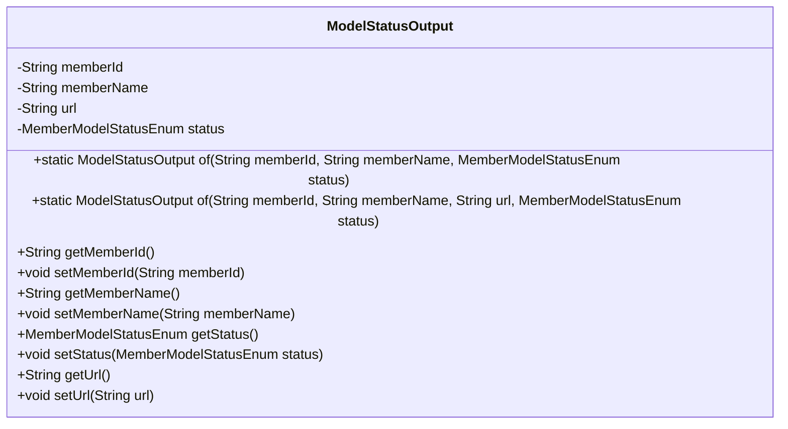

# Basic Information

|      |      |
|------|------|
| Name | ModelStatusOutput |
| Language | .java |
| Code Path | WeFe/serving/serving-service/src/main/java/com/welab/wefe/serving/service/dto/ModelStatusOutput.java |
| Package Name | com.welab.wefe.serving.service.dto |
| Dependencies | ['com.welab.wefe.serving.service.enums.MemberModelStatusEnum'] |
| Brief Description | The ModelStatusOutput class includes member fields for ID, name, URL, and status, providing two static construction methods along with corresponding getter/setter methods. |

# Description

The `ModelStatusOutput` class is used to represent member model status information, including member ID, name, URL, and status enumeration attributes. It provides two static factory methods, `of`, which support instance creation with or without a URL. The class includes getter and setter methods for each attribute, facilitating access and modification of member variables.

# Class Summary

| Name   | Type  | Description |
|-------|------|-------------|
| ModelStatusOutput | class | The ModelStatusOutput class contains member fields ID, name, URL, and status enumeration, providing two static factory methods along with corresponding getter/setter methods. |

## Class ModelStatusOutput

|      |      |
|------|------|
| Access Modifier | public |
| Type | class |
| Name | ModelStatusOutput |
| Description | The ModelStatusOutput class contains member fields ID, name, URL, and status enumeration, providing two static factory methods along with corresponding getter/setter methods. |

### UML Class Diagram

This code defines a class named ModelStatusOutput for encapsulating member model status information. The class contains four private fields: memberId, memberName, url, and status, representing member ID, member name, URL link, and status enumeration respectively. It provides two static factory methods, of(), for creating object instances, as well as getter and setter methods for each field. The primary purpose of this class is to uniformly encapsulate and transmit member model status information, supporting object instance creation through different parameter combinations.

### Internal Method Call Graph

```mermaid
graph TD
    A["Class ModelStatusOutput"]
    B["Property: String memberId"]
    C["Property: String memberName"]
    D["Property: String url"]
    E["Property: MemberModelStatusEnum status"]
    F["Static method: of(memberId, memberName, status)"]
    G["Static method: of(memberId, memberName, url, status)"]
    H["Method: getMemberId()"]
    I["Method: setMemberId()"]
    J["Method: getMemberName()"]
    K["Method: setMemberName()"]
    L["Method: getStatus()"]
    M["Method: setStatus()"]
    N["Method: getUrl()"]
    O["Method: setUrl()"]

    A --> B
    A --> C
    A --> D
    A --> E
    A --> F
    A --> G
    A --> H
    A --> I
    A --> J
    A --> K
    A --> L
    A --> M
    A --> N
    A --> O
```

This flowchart illustrates the complete structure of the ModelStatusOutput class, containing 4 private properties and 10 methods. Two static factory methods of() are provided for object creation with different parameter combinations, while 8 standard getter/setter methods enable property access control. The class design adopts the Builder pattern concept, offering flexible object construction through overloaded of() methods while encapsulating properties to ensure data security. All methods focus on member status management, forming a highly cohesive class structure.

### Field List

| Name  | Type  | Description |
|-------|-------|------|
| memberId | String | Member ID string variable |
| memberName | String | The member variable is named memberName, of type String, with private access. |
| url | String | Declare a private string variable url. |
| status | MemberModelStatusEnum | Member status enumeration type private variable. |

### Method List

| Name  | Type  | Description |
|-------|-------|------|
| of | ModelStatusOutput | The static method `of` creates a `ModelStatusOutput` instance, sets the `memberId`, `memberName`, and `status` properties, and then returns it. |
| getMemberName | String | Methods to obtain the member name, returning the value of the member variable `memberName`. |
| of | ModelStatusOutput | The static method `of` creates a `ModelStatusOutput` instance, sets the `memberId`, `memberName`, `url`, and `status` fields, and returns it. |
| setUrl | void | Methods for setting the URL string, assigning the parameter url to the class's url member variable. |
| getMemberId | String | Methods to obtain member ID, returns a memberId of string type. |
| setMemberName | void | Set the value of the member variable memberName. |
| getStatus | MemberModelStatusEnum | Methods for Obtaining Member Status Enumeration Values. |
| setStatus | void | Methods for setting member model status, with the parameter being an enumeration type for status. |
| getUrl | String | Public method to obtain the URL, returning a string-type url variable. |
| setMemberId | void | The method to set the member ID assigns the parameter memberId to the memberId property of the current object. |

