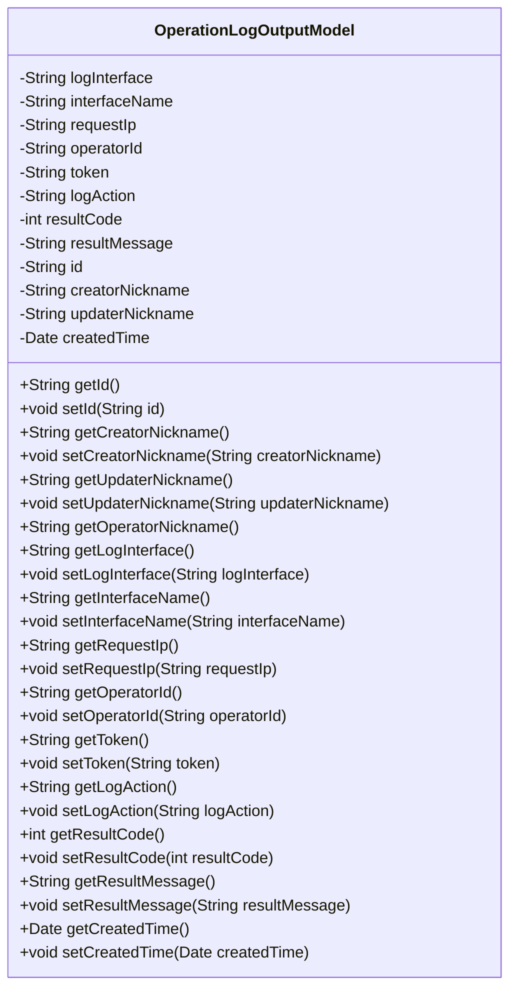

# Basic Information

|      |      |
|------|------|
| Name | OperationLogOutputModel |
| Language | .java |
| Code Path | WeFe/serving/serving-service/src/main/java/com/welab/wefe/serving/service/dto/OperationLogOutputModel.java |
| Package Name | com.welab.wefe.serving.service.dto |
| Dependencies | ['java.util.Date', 'com.welab.wefe.common.fieldvalidate.annotation.Check', 'com.welab.wefe.serving.service.service.CacheObjects'] |
| Brief Description | Operation log output model class, including fields such as interface, IP, operator, action, result, and corresponding getter/setter methods. |

# Description

The OperationLogOutputModel class defines the data model for operation log output, including fields such as request interface, interface name, request IP, operator ID, request token, operation action, request result code, request result, globally unique identifier, creator nickname, modifier nickname, and creation time. Each field has corresponding getter and setter methods for retrieving and setting field values. Among these, the operatorNickname is dynamically obtained through the CacheObjects.getNickname method. This class is used to record and transmit detailed information of operation logs.

# Class Summary

| Name   | Type  | Description |
|-------|------|-------------|
| OperationLogOutputModel | class | Operation log output model class, including fields such as interface, IP, operator, action, result, and corresponding getter/setter methods. |

## Class OperationLogOutputModel

|      |      |
|------|------|
| Access Modifier | public |
| Type | class |
| Name | OperationLogOutputModel |
| Description | Operation log output model class, including fields such as interface, IP, operator, action, result, and corresponding getter/setter methods. |

### UML Class Diagram

This code defines a class named `OperationLogOutputModel`, which serves as an output model for recording operation logs. The class includes multiple private fields such as log interface, interface name, request IP, operator ID, etc., each with corresponding getter and setter methods. The `getOperatorNickname` method retrieves the operator's nickname from the cache using the `operatorId`. This class is primarily used to encapsulate operation log-related information, facilitating the transfer and processing of log data within the system.

### Internal Method Call Graph

```mermaid
graph TD
    A["Class OperationLogOutputModel"]
    B["Attribute: @Check String logInterface"]
    C["Attribute: @Check String interfaceName"]
    D["Attribute: @Check String requestIp"]
    E["Attribute: @Check String operatorId"]
    F["Attribute: @Check String token"]
    G["Attribute: @Check String logAction"]
    H["Attribute: @Check int resultCode"]
    I["Attribute: @Check String resultMessage"]
    J["Attribute: @Check String id"]
    K["Attribute: @Check String creatorNickname"]
    L["Attribute: @Check String updaterNickname"]
    M["Attribute: @Check Date createdTime"]
    N["Method: getOperatorNickname()"]
    O["Method: Other getter/setter methods"]

    A --> B
    A --> C
    A --> D
    A --> E
    A --> F
    A --> G
    A --> H
    A --> I
    A --> J
    A --> K
    A --> L
    A --> M
    A --> N
    A --> O
    N --> P["Invokes CacheObjects.getNickname(operatorId)"]
```

This flowchart illustrates the structure of the OperationLogOutputModel class, containing 12 attributes annotated with @Check and corresponding getter/setter methods. The getOperatorNickname() method retrieves the nickname by calling CacheObjects.getNickname() with operatorId, while other attributes are standard encapsulated fields. The class is designed as a detailed data model for recording operation logs, with each field annotated to indicate its business significance.

### Field List

| Name  | Type  | Description |
|-------|-------|------|
| logAction | String | The code defines a private string variable `logAction` for recording operational behaviors, which is validated through the `@Check` annotation. |
| createdTime | Date | The field `createdTime` is labeled as the check item "Creation Time" with the type `Date`. |
| token | String | Define a private string variable token in the code, and add an annotation to check the request token. |
| resultCode | int | The private integer variable `resultCode` is used to store the request result code, annotated with `@Check`. |
| id | String | The private string variable id, annotated as a globally unique identifier. |
| requestIp | String | The field `requestIp` is used to verify the request IP and is annotated as `@Check`. |
| updaterNickname | String | The field `updaterNickname` is used to store the nickname of the modifier and is validated via the `@Check` annotation. |
| resultMessage | String | The class member variable `resultMessage`, used to store the request result, is annotated with `@Check` for validation. |
| creatorNickname | String | Defined a private string variable `creatorNickname` and added an inspection annotation named "Creator Nickname". |
| interfaceName | String | Define the interface name check annotation field. |
| logInterface | String | The code defines a private string variable named `logInterface` and annotates it with a request interface check annotation. |
| operatorId | String | The field operatorId is annotated with a validation check to verify the operator ID. |

### Method List

| Name  | Type  | Description |
|-------|-------|------|
| getOperatorId | String | Methods to obtain the operator ID, returning a string-type operatorId. |
| getOperatorNickname | String | The method getOperatorNickname retrieves and returns the nickname from the cache based on the operatorId. |
| setUpdaterNickname | void | The method to set the updater's nickname assigns the parameter to the member variable updaterNickname. |
| setId | void | Methods for setting the object ID, assigning the parameter `id` to the `id` property of the current object. |
| getToken | String | The string method to obtain a token. |
| setResultMessage | void | This is a Java method used to set the value of the class's resultMessage property. The method takes a string parameter resultMessage and assigns it to the class's member variable of the same name. |
| setResultCode | void | This is a Java method used to set the value of the class's resultCode property. The method takes an integer parameter resultCode and assigns it to the class's member variable of the same name. |
| getRequestIp | String | Methods to obtain the request IP, returning the value of the requestIp variable. |
| getLogAction | String | This is a Java method that returns the string-type logAction property value. |
| getLogInterface | String | The method to obtain the log interface returns the logInterface variable. |
| setToken | void | Methods for setting token string values. |
| getCreatorNickname | String | Methods to obtain the creator's nickname, returning a string-type creatorNickname value. |
| setCreatorNickname | void | The method to set the creator's nickname assigns the input parameter to the class member variable creatorNickname. |
| getUpdaterNickname | String | Method to obtain the updater's nickname, returns a string-type updaterNickname value. |
| getId | String | Methods to obtain the object ID, returning the ID value as a string type. |
| getResultMessage | String | Methods to obtain the result message, returns a string-type variable `resultMessage`. |
| setRequestIp | void | This is a Java method used to set the request IP address, which assigns the incoming requestIp parameter to the class's member variable requestIp. |
| setLogAction | void | This is a Java method used to set the value of the logAction property. The method accepts a string parameter logAction and assigns it to the class member variable of the same name. |
| getResultCode | int | Methods to obtain the return result code, directly returning the resultCode value. |
| setLogInterface | void | Defined a public method setLogInterface for setting the value of the logInterface property. |
| setOperatorId | void | The method to set the operator ID involves assigning the parameter operatorId to the class member variable of the same name. |
| getInterfaceName | String | Methods to obtain the interface name, returns a string-type variable interfaceName. |
| setInterfaceName | void | The method to set the interface name assigns the parameter interfaceName to the class member variable interfaceName. |
| getCreatedTime | Date | The method to obtain the creation time returns a Date-type variable `createdTime`. |
| setCreatedTime | void | The method to set the creation time, with the parameter being of type Date. |

