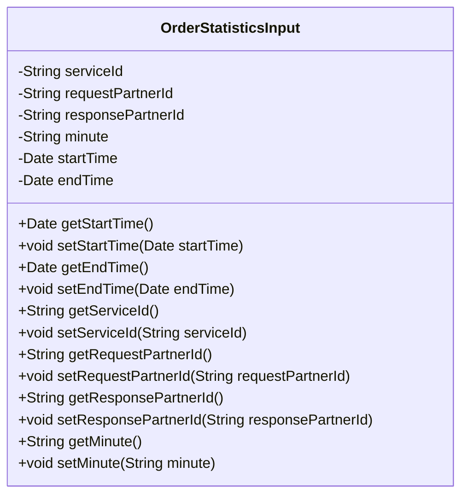

# Basic Information

|      |      |
|------|------|
| Name | OrderStatisticsInput |
| Language | .java |
| Code Path | WeFe/serving/serving-service/src/main/java/com/welab/wefe/serving/service/dto/OrderStatisticsInput.java |
| Package Name | com.welab.wefe.serving.service.dto |
| Dependencies | ['java.util.Date'] |
| Brief Description | The OrderStatisticsInput class includes fields such as service ID, requester ID, responder ID, minute, start time, and end time, and provides getter and setter methods for each field. |

# Description

The `OrderStatisticsInput` class defines the input parameters for order statistics queries, including fields such as service ID, requesting partner ID, responding partner ID, minutes, start time, and end time. Each field has corresponding getter and setter methods for accessing and modifying attribute values.

# Class Summary

| Name   | Type  | Description |
|-------|------|-------------|
| OrderStatisticsInput | class | Order statistics input class, containing fields for service ID, requester ID, responder ID, minutes, start time, and end time, along with their getter and setter methods. |

## Class OrderStatisticsInput

|      |      |
|------|------|
| Access Modifier | public |
| Type | class |
| Name | OrderStatisticsInput |
| Description | Order statistics input class, containing fields for service ID, requester ID, responder ID, minutes, start time, and end time, along with their getter and setter methods. |

### UML Class Diagram

This class diagram illustrates a Java class named OrderStatisticsInput, primarily used to encapsulate input parameters related to order statistics. The class contains six private fields: serviceId (service ID), requestPartnerId (requesting party ID), responsePartnerId (responding party ID), minute (minute), startTime (start time), and endTime (end time). Corresponding getter and setter methods are provided for each field, allowing external code to access and modify the values of these private fields, thereby achieving data encapsulation and security.

### Internal Method Call Graph

```mermaid
graph TD
    A["Class OrderStatisticsInput"]
    B["Attribute: String serviceId"]
    C["Attribute: String requestPartnerId"]
    D["Attribute: String responsePartnerId"]
    E["Attribute: String minute"]
    F["Attribute: Date startTime"]
    G["Attribute: Date endTime"]
    H["Method: Date getStartTime()"]
    I["Method: void setStartTime(Date startTime)"]
    J["Method: Date getEndTime()"]
    K["Method: void setEndTime(Date endTime)"]
    L["Method: String getServiceId()"]
    M["Method: void setServiceId(String serviceId)"]
    N["Method: String getRequestPartnerId()"]
    O["Method: void setRequestPartnerId(String requestPartnerId)"]
    P["Method: String getResponsePartnerId()"]
    Q["Method: void setResponsePartnerId(String responsePartnerId)"]
    R["Method: String getMinute()"]
    S["Method: void setMinute(String minute)"]

    A --> B
    A --> C
    A --> D
    A --> E
    A --> F
    A --> G
    A --> H
    A --> I
    A --> J
    A --> K
    A --> L
    A --> M
    A --> N
    A --> O
    A --> P
    A --> Q
    A --> R
    A --> S
```

This code defines a class named OrderStatisticsInput, primarily used for storing and retrieving input parameters related to order statistics. The class contains seven private attributes: serviceId, requestPartnerId, responsePartnerId, minute, startTime, and endTime, along with corresponding getter and setter methods for each attribute. These methods allow external code to safely access and modify these attribute values, ensuring good encapsulation. The overall class structure is clear and functionally well-defined, making it suitable for passing and processing order statistics data.

### Field List

| Name  | Type  | Description |
|-------|-------|------|
| minute | String | Declare a private string variable named minute. |
| endTime | Date | Private date type variable endTime |
| responsePartnerId | String | Declare a private string variable responsePartnerId. |
| requestPartnerId | String | Declare a private string variable requestPartnerId. |
| serviceId | String | The private string variable serviceId is used to store the service identifier. |
| startTime | Date | The private date-type variable startTime is used to record the start time. |

### Method List

| Name  | Type  | Description |
|-------|-------|------|
| getStartTime | Date | Public method to get the start time, returns a Date type. |
| getResponsePartnerId | String | The method to obtain the response partner ID, with the return value being responsePartnerId. |
| setResponsePartnerId | void | The method to set the response partner ID assigns the input parameter to the class member variable responsePartnerId. |
| getMinute | String | String method for obtaining minute values. |
| setMinute | void | The method to set the minute value assigns the parameter `minute` to the `minute` property of the current object. |
| setEndTime | void | The method to set the end time assigns the passed date parameter to the object's `endTime` property. |
| getServiceId | String | Common method to obtain the serviceId, returns the serviceId as a string. |
| setStartTime | void | The method to set the start time involves assigning the parameter `startTime` to the member variable `startTime` of the class. |
| setRequestPartnerId | void | The method to set the request partner ID assigns the parameter `requestPartnerId` to the class member variable of the same name. |
| getEndTime | Date | The method getEndTime returns the endTime date object. |
| getRequestPartnerId | String | Method to obtain the requesting partner ID, returns a string-type requestPartnerId. |
| setServiceId | void | Method to set the service ID: Assign the input parameter to the serviceId member variable of the class. |

