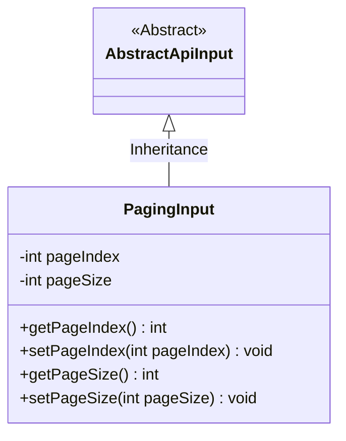
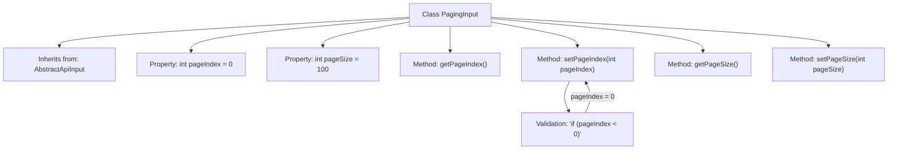

# Basic Information

|      |      |
|------|------|
| Name | PagingInput |
| Language | .java |
| Code Path | WeFe/serving/serving-service/src/main/java/com/welab/wefe/serving/service/dto/PagingInput.java |
| Package Name | com.welab.wefe.serving.service.dto |
| Dependencies | ['com.welab.wefe.common.fieldvalidate.annotation.Check', 'com.welab.wefe.common.web.dto.AbstractApiInput'] |
| Brief Description | Pagination input class, including page number and items per page. The default page number is 0 (minimum is 0), and the default items per page is 100. |

# Description

The PagingInput class inherits from AbstractApiInput and is used to handle pagination input parameters. It contains two attributes: pageIndex represents the page number, with 0 being the first page (default value is 0). If the set value is less than 0, it will automatically be corrected to 0. pageSize indicates the page size, with a default value of 100. It provides getter and setter methods, and the setPageIndex method includes parameter validation logic.

# Class Summary

| Name   | Type  | Description |
|-------|------|-------------|
| PagingInput | class | Pagination input class, containing page number and page size attributes. The page number defaults to 0 (first page), and the page size defaults to 100. It provides getter/setter methods, and automatically sets the page number to 0 if it is less than 0. |

## Class PagingInput

|      |      |
|------|------|
| Access Modifier | public |
| Type | class |
| Name | PagingInput |
| Description | Pagination input class, containing page number and page size attributes. The page number defaults to 0 (first page), and the page size defaults to 100. It provides getter/setter methods, and automatically sets the page number to 0 if it is less than 0. |

### UML Class Diagram

This code demonstrates a paging input class PagingInput, which inherits from the abstract class AbstractApiInput. PagingInput contains two private attributes: pageIndex represents the page number (0 for the first page), and pageSize indicates the number of items per page (default 100). The class provides getter and setter methods for these attributes, where the setPageIndex method includes input validation to ensure the page number is not less than 0. This class is primarily used to encapsulate pagination query parameters and serves as a base implementation for API input parameters.

### Internal Method Call Graph

This flowchart illustrates the structure of the PagingInput class, which is a pagination input parameter class inheriting from AbstractApiInput. It primarily includes two properties: pageIndex and pageSize, representing the page number and page size respectively, with pageIndex defaulting to 0 and ensured to be no less than 0 through setter methods. The flowchart clearly presents the class inheritance relationship, property definitions, method invocations, and parameter validation logic, demonstrating the encapsulation of pagination parameters and basic validation mechanisms.

### Field List

| Name  | Type  | Description |
|-------|-------|------|
| pageSize = 100 | int | Define a private integer variable pageSize with an initial value of 100. |
| pageIndex = 0 | int | Page index, where 0 indicates the first page. |

### Method List

| Name  | Type  | Description |
|-------|-------|------|
| getPageSize | int | A public method to retrieve the pageSize value, returning an integer type. |
| setPageIndex | void | Set the page number, and if it is less than 0, set it to 0. |
| getPageIndex | int | Methods to obtain the current page number, returning the value of the integer variable pageIndex. |
| setPageSize | void | The method to set the number of items displayed per page, with the parameter being pageSize. |

