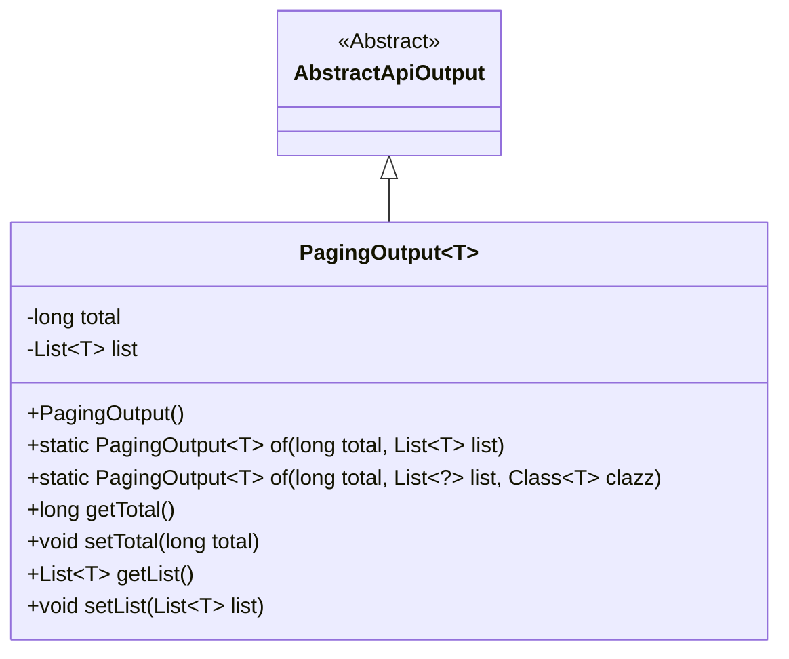
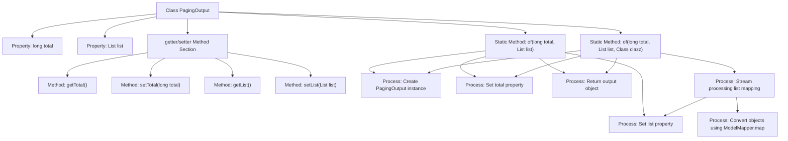

# Basic Information

|      |      |
|------|------|
| Name | PagingOutput |
| Language | .java |
| Code Path | WeFe/serving/serving-service/src/main/java/com/welab/wefe/serving/service/dto/PagingOutput.java |
| Package Name | com.welab.wefe.serving.service.dto |
| Dependencies | ['com.welab.wefe.common.web.dto.AbstractApiOutput', 'com.welab.wefe.common.web.util.ModelMapper', 'java.util.List', 'java.util.stream.Collectors'] |
| Brief Description | Pagination output class, containing total count and list data, provides two creation methods: direct assignment and automatic mapping of database entities to DTO. Supports retrieval and setting of total count and list. |

# Description

PagingOutput is a generic class that inherits from AbstractApiOutput, designed to encapsulate paginated data. It contains two core attributes: `total` represents the total record count, and `list` stores the current page's data list. The class provides two static factory methods: `of(long total, List<T> list)` for directly creating an instance, and `of(long total, List<?> list, Class<T> clazz)` which supports automatic mapping of database entities to DTO objects via ModelMapper. The class also includes standard getter and setter methods for accessing and modifying its attributes.

# Class Summary

| Name   | Type  | Description |
|-------|------|-------------|
| PagingOutput | class | The paging output class `PagingOutput` includes total count and list data, providing two creation methods: direct assignment and automatic mapping of database entities to DTOs. It supports getter/setter operations. |

## Class PagingOutput

|      |      |
|------|------|
| Access Modifier | public |
| Type | class |
| Name | PagingOutput |
| Description | The paging output class `PagingOutput` includes total count and list data, providing two creation methods: direct assignment and automatic mapping of database entities to DTOs. It supports getter/setter operations. |

### UML Class Diagram

Class diagram description:  
PagingOutput<T> is a generic class that inherits from the abstract class AbstractApiOutput, designed for handling paginated data output. It contains two core fields: 'total' representing the total record count, and 'list' storing the data list of the current page. The class provides two static factory methods 'of()', one supporting direct input of a data list, while the other supports mapping the original object list to a specified type via ModelMapper. The class also includes standard getter/setter methods for field access and modification.

### Internal Method Call Graph

This code defines a generic pagination output class inheriting from AbstractApiOutput. It provides two static factory methods: one directly accepts list data, while the other automatically maps database entities to DTOs via ModelMapper. The class contains two core properties (total and list) representing total record count and current page data list respectively, along with corresponding getter/setter methods. The flowchart clearly illustrates the class structure, method invocation relationships, and data processing flow, particularly highlighting the stream mapping process in the second factory method.

### Field List

| Name  | Type  | Description |
|-------|-------|------|
| total | long | Private long integer variable total, used to store the total count. |
| list | List<T> | Private generic list variable `list`. |

### Method List

| Name  | Type  | Description |
|-------|-------|------|
| of | PagingOutput<T> | This is a static factory method used to create a paginated output object, which returns the object after setting the total record count and data list. |
| getTotal | long | A public method to get the total value, returning a long type. |
| of | PagingOutput<T> | This is a static generic method used to create a paginated output object. The method accepts the total record count, a data list, and the target class type. It maps the list elements to the target type through stream processing, ultimately returning a paginated output object containing the total count and the converted list. |
| setTotal | void | This is a Java method used to set the value of the class member variable `total`. The method accepts a parameter of type `long` and assigns it to `this.total`. |
| getList | List<T> | Returns a reference to the list. |
| setList | void | This is a Java method used to set the value of the List-type member variable `list` of a class. The method accepts a generic List parameter and assigns it to the `list` property of the current object. |

