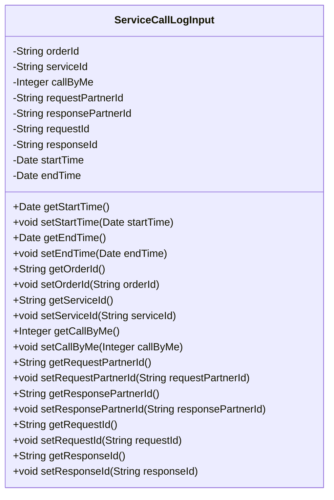

# Basic Information

|      |      |
|------|------|
| Name | ServiceCallLogInput |
| Language | .java |
| Code Path | WeFe/serving/serving-service/src/main/java/com/welab/wefe/serving/service/dto/ServiceCallLogInput.java |
| Package Name | com.welab.wefe.serving.service.dto |
| Dependencies | ['java.util.Date'] |
| Brief Description | The ServiceCallLogInput class includes fields such as order ID, service ID, call identifier, requester/responder ID, request/response ID, and start/end times, which are used to record service call logs. |

# Description

The ServiceCallLogInput class is a Java class designed for recording service call logs, containing multiple attributes: order ID, service ID, caller identifier, request and response partner IDs, request and response IDs, as well as start and end times. Each attribute has corresponding getter and setter methods for retrieving and setting attribute values. This class is primarily used for storing and managing information related to service calls.

# Class Summary

| Name   | Type  | Description |
|-------|------|-------------|
| ServiceCallLogInput | class | The `ServiceCallLogInput` class includes fields such as order ID, service ID, call identifier, requester/responder ID, request/response ID, and start/end times, which are used to record service call logs. |

## Class ServiceCallLogInput

|      |      |
|------|------|
| Access Modifier | public |
| Type | class |
| Name | ServiceCallLogInput |
| Description | The `ServiceCallLogInput` class includes fields such as order ID, service ID, call identifier, requester/responder ID, request/response ID, and start/end times, which are used to record service call logs. |

### UML Class Diagram

This code defines a class named `ServiceCallLogInput`, primarily used for logging service call information. The class includes multiple private fields such as order ID, service ID, caller identifier, request and response partner IDs, request and response IDs, as well as start and end times. It also provides corresponding getter and setter methods for accessing and modifying these field values. This class may be utilized in distributed systems to track detailed service call information, facilitating subsequent log analysis and issue troubleshooting.

### Internal Method Call Graph

```mermaid
graph TD
    A["Class ServiceCallLogInput"]
    B["Attribute: String orderId"]
    C["Attribute: String serviceId"]
    D["Attribute: Integer callByMe"]
    E["Attribute: String requestPartnerId"]
    F["Attribute: String responsePartnerId"]
    G["Attribute: String requestId"]
    H["Attribute: String responseId"]
    I["Attribute: Date startTime"]
    J["Attribute: Date endTime"]
    K["Method: getStartTime/setStartTime"]
    L["Method: getEndTime/setEndTime"]
    M["Method: getOrderId/setOrderId"]
    N["Method: getServiceId/setServiceId"]
    O["Method: getCallByMe/setCallByMe"]
    P["Method: getRequestPartnerId/setRequestPartnerId"]
    Q["Method: getResponsePartnerId/setResponsePartnerId"]
    R["Method: getRequestId/setRequestId"]
    S["Method: getResponseId/setResponseId"]

    A --> B
    A --> C
    A --> D
    A --> E
    A --> F
    A --> G
    A --> H
    A --> I
    A --> J
    A --> K
    A --> L
    A --> M
    A --> N
    A --> O
    A --> P
    A --> Q
    A --> R
    A --> S
```

This flowchart illustrates the complete structure of the ServiceCallLogInput class, comprising 9 private attributes and 16 public methods (8 pairs of getter/setter). All attributes are key fields for service call logs, such as order ID, service ID, caller identifier, partner IDs, etc. The methods are designed for reading and writing these attributes. The class adheres to JavaBean specifications, ensuring data security through encapsulation, and is suitable for service call logging and transmission scenarios.

### Field List

| Name  | Type  | Description |
|-------|-------|------|
| responsePartnerId | String | Private string type variable, storing the response partner ID. |
| serviceId | String | The private string variable serviceId is used to store the service identifier. |
| callByMe | Integer | Private integer variable callByMe |
| orderId | String | The private string-type variable orderId is used to store the order ID. |
| requestPartnerId | String | Private string variable, storing the requested partner ID. |
| startTime | Date | Private date type variable startTime |
| requestId | String | The private string variable requestId is used to identify the request. |
| endTime | Date | Private date type variable endTime |
| responseId | String | Declare a private string variable responseId. |

### Method List

| Name  | Type  | Description |
|-------|-------|------|
| getRequestId | String | Methods to obtain the request ID, which returns a requestId of string type. |
| getServiceId | String | Common method to obtain the serviceId, returns the serviceId as a string type. |
| getEndTime | Date | This is a Java method that returns a Date type object named endTime. |
| setStartTime | void | Java method: Sets the startTime property with a parameter of type Date. |
| setOrderId | void | Methods for setting the order ID, assigning the passed string parameter to the class's orderId member variable. |
| setResponsePartnerId | void | The method to set the response partner ID assigns the input parameter to the class member variable `responsePartnerId`. |
| getResponseId | String | The method returns a responseId string. |
| getResponsePartnerId | String | Method to obtain the response partner ID, returns a string-type responsePartnerId. |
| setRequestPartnerId | void | The method to set the request partner ID assigns the passed string to the class member variable `requestPartnerId`. |
| getOrderId | String | Methods to obtain the order ID, returns the orderId as a string type. |
| getStartTime | Date | The method to obtain the start time, which returns a Date type variable `startTime`. |
| getRequestPartnerId | String | The method to obtain the requesting partner ID returns a requestPartnerId string. |
| getCallByMe | Integer | Get the integer value of callByMe. |
| setRequestId | void | Methods for setting the request ID: Assign the passed requestId to the requestId property of the current object. |
| setServiceId | void | Method to set the service ID, which assigns the input parameter to the serviceId member variable of the class. |
| setResponseId | void | The method to set the response ID assigns the incoming responseId to the responseId property of the current object. |
| setEndTime | void | The method to set the end time assigns the passed date parameter to the object's endTime property. |
| setCallByMe | void | Java Method: Set the callByMe attribute value, with the parameter being of Integer type. |

