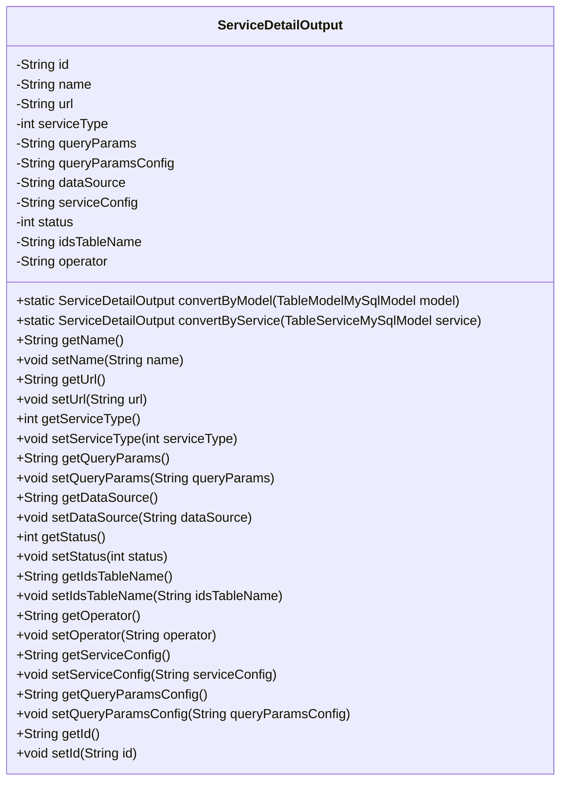

# Basic Information

|      |      |
|------|------|
| Name | ServiceDetailOutput |
| Language | .java |
| Code Path | WeFe/serving/serving-service/src/main/java/com/welab/wefe/serving/service/dto/ServiceDetailOutput.java |
| Package Name | com.welab.wefe.serving.service.dto |
| Dependencies | ['javax.persistence.Column', 'com.welab.wefe.common.web.util.ModelMapper', 'com.welab.wefe.serving.service.database.entity.TableModelMySqlModel', 'com.welab.wefe.serving.service.database.entity.TableServiceMySqlModel'] |
| Brief Description | The ServiceDetailOutput class contains fields such as service ID, name, address, type, query parameters, data source, and status, providing model conversion and field access methods. |

# Description

The ServiceDetailOutput class is a Java entity class used to encapsulate service details information. It includes the following fields: unique identifier id, service name name, service URL url, service type serviceType (1 for anonymous query, 2 for intersection query, 3 for secure aggregation queried party, 4 for secure aggregation querying party), query parameter configuration queryParams, query parameter description queryParamsConfig, data source configuration dataSource (in JSON format), service configuration serviceConfig (in JSON format), status status (1 for online, 0 for offline), associated table name idsTableName, and operator operator. It provides getter and setter methods for the fields, as well as two static methods convertByModel and convertByService for model conversion.

# Class Summary

| Name   | Type  | Description |
|-------|------|-------------|
| ServiceDetailOutput | class | The ServiceDetailOutput class includes fields such as service ID, name, address, type, query parameters, data source, and status, providing model conversion and field access methods. |

## Class ServiceDetailOutput

|      |      |
|------|------|
| Access Modifier | public |
| Type | class |
| Name | ServiceDetailOutput |
| Description | The ServiceDetailOutput class includes fields such as service ID, name, address, type, query parameters, data source, and status, providing model conversion and field access methods. |

### UML Class Diagram

This code defines a class named `ServiceDetailOutput`, primarily used for storing and converting service detail information. The class includes multiple private fields such as service ID, name, URL, type, query parameter configuration, data source, etc., and provides access and modification to these fields through public getter and setter methods. Additionally, it offers two static methods, `convertByModel` and `convertByService`, which convert `TableModelMySqlModel` and `TableServiceMySqlModel` objects into `ServiceDetailOutput` objects. This class is mainly used for outputting and converting service details, suitable for scenarios requiring service information processing.

### Internal Method Call Graph

```mermaid
graph TD
    A["Class ServiceDetailOutput"]
    B["Property: String id"]
    C["Property: String name"]
    D["Property: String url"]
    E["Property: int serviceType"]
    F["Property: String queryParams"]
    G["Property: String queryParamsConfig"]
    H["Property: String dataSource"]
    I["Property: String serviceConfig"]
    J["Property: int status"]
    K["Property: String idsTableName"]
    L["Property: String operator"]
    M["Static Method: convertByModel(TableModelMySqlModel)"]
    N["Static Method: convertByService(TableServiceMySqlModel)"]
    O["Getter/Setter Method Group: 16 property operations"]

    A --> B
    A --> C
    A --> D
    A --> E
    A --> F
    A --> G
    A --> H
    A --> I
    A --> J
    A --> K
    A --> L
    A --> M
    A --> N
    A -.-> O
```

This flowchart illustrates the complete structure of the ServiceDetailOutput class, comprising 12 private properties (with JPA annotations), 2 static conversion methods, and 16 standard Getter/Setter methods. The class primarily functions to encapsulate service detail data, supporting model conversion (TableModelMySqlModel and TableServiceMySqlModel) via ModelMapper. All properties are mapped to database table fields through annotations, embodying a typical Data Transfer Object (DTO) design pattern.

### Field List

| Name  | Type  | Description |
|-------|-------|------|
| idsTableName | String | Database field mapping: The private string variable `idsTableName` corresponds to the table column name `ids_table_name`. |
| name | String | Declare a private string variable name. |
| queryParamsConfig | String | Database field mapping: queryParamsConfig corresponds to the table column query_params_config, with the type String. |
| status = 0 | int | Java entity class field, database column name "status", default value 0, integer type storing status information. |
| operator | String | Database field mapping: operator corresponds to the private string operator. |
| serviceConfig | String | Database field mapping: serviceConfig corresponds to the table column service_config, with a string type. |
| queryParams | String | Database field mapping: queryParams corresponds to the table column query_params, with the type String. |
| url | String | Declare a private string variable url. |
| dataSource | String | Database field mapping: The private string-type variable `dataSource` corresponds to the table column `data_source`. |
| id | String | Private string type variable id. |
| serviceType | int | Database field mapping: service_type corresponds to the integer variable serviceType. |

### Method List

| Name  | Type  | Description |
|-------|-------|------|
| getOperator | String | Get the string value of the operator attribute. |
| getName | String | The method getName returns the value of the string name. |
| setServiceType | void | This is a Java method used to set the value of the serviceType property of a class. The method accepts an integer parameter serviceType and assigns it to the member variable of the same name in the class. |
| getStatus | int | The method returns a status value named status. |
| setOperator | void | Methods for setting operators, assigning input parameters to the operator member variables of the class. |
| setUrl | void | The method to set the URL address is to assign the parameter `url` to the `url` property of the current object. |
| setStatus | void | The method `setStatus` is used to set the status value, with the parameter being an integer `status`, which is assigned to the `status` property of the current object. |
| setServiceConfig | void | Java Method: Set service configuration parameters, assigning the input string to the class variable serviceConfig. |
| getUrl | String | This is a Java method that returns the value of the string-type url variable. |
| setId | void | Methods for setting the object ID: Assign the parameter `id` to the `id` property of the current object. |
| getQueryParams | String | Methods to obtain the query parameter string. |
| getServiceConfig | String | Get the string value of serviceConfig. |
| getDataSource | String | Method to obtain the data source, returns a string-type data source value. |
| convertByService | ServiceDetailOutput | This method converts the TableServiceMySqlModel object into a ServiceDetailOutput object using ModelMapper for mapping. |
| getServiceType | int | Methods for obtaining the service type, returning the value of the integer variable serviceType. |
| getId | String | Public method to obtain ID, returns a string-type id. |
| setQueryParams | void | This is a Java method used to set the value of the queryParams property of a class. The method accepts a string parameter and assigns it to the member variable queryParams of the class. |
| convertByModel | ServiceDetailOutput | This method converts a TableModelMySqlModel object into a ServiceDetailOutput object, using ModelMapper for mapping and returning the result. |
| setIdsTableName | void | The method to set the ID table name assigns the parameter value to the class member variable `idsTableName`. |
| setQueryParamsConfig | void | The method for setting query parameter configuration assigns the input parameters to the class member variable `queryParamsConfig`. |
| getQueryParamsConfig | String | Method to obtain the query parameter configuration, returns a string-type queryParamsConfig. |
| setName | void | Methods for setting the object name, assigning the parameter `name` to the `name` property of the object. |
| getIdsTableName | String | Method to obtain idsTableName, returns a string-type table name. |
| setDataSource | void | Defined a public method `setDataSource` for setting the value of the class's `dataSource` property. |

