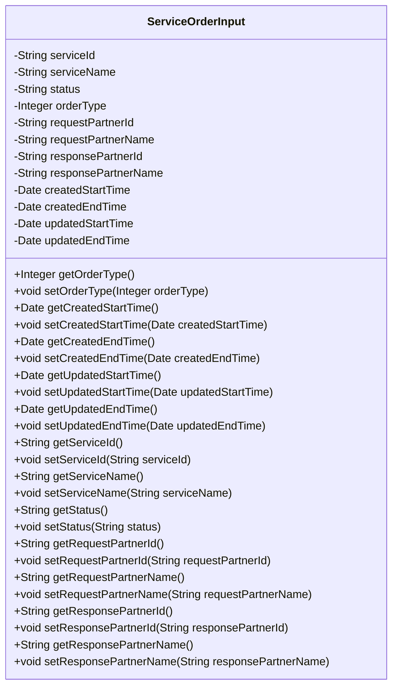

# Basic Information

|      |      |
|------|------|
| Name | ServiceOrderInput |
| Language | .java |
| Code Path | WeFe/serving/serving-service/src/main/java/com/welab/wefe/serving/service/dto/ServiceOrderInput.java |
| Package Name | com.welab.wefe.serving.service.dto |
| Dependencies | ['java.util.Date'] |
| Brief Description | Service order input class, containing service ID, name, status, type, requester and responder information, and time range fields. |

# Description

The ServiceOrderInput class defines the input parameters for service order queries, including service ID, name, status, and order type. It involves the partner ID and name of both the requester and responder. It provides creation time and update time range fields for filtering. All fields are accessed and modified via getter and setter methods.

# Class Summary

| Name   | Type  | Description |
|-------|------|-------------|
| ServiceOrderInput | class | The ServiceOrderInput class includes fields such as service ID, name, status, order type, request and response partner information, and creation/update time range. |

## Class ServiceOrderInput

|      |      |
|------|------|
| Access Modifier | public |
| Type | class |
| Name | ServiceOrderInput |
| Description | The ServiceOrderInput class includes fields such as service ID, name, status, order type, request and response partner information, and creation/update time range. |

### UML Class Diagram

This code defines a class named ServiceOrderInput, primarily used to encapsulate input parameters for service order queries. The class includes multiple private fields such as service ID, service name, status, order type, requester and responder IDs and names, as well as creation and update time ranges. Each field has corresponding getter and setter methods for retrieving and setting field values. This class is typically used to pass query conditions when searching for service orders, facilitating the filtering and retrieval of service orders.

### Internal Method Call Graph

```mermaid
graph TD
    A["Class ServiceOrderInput"]
    B["Attribute: String serviceId"]
    C["Attribute: String serviceName"]
    D["Attribute: String status"]
    E["Attribute: Integer orderType"]
    F["Attribute: String requestPartnerId"]
    G["Attribute: String requestPartnerName"]
    H["Attribute: String responsePartnerId"]
    I["Attribute: String responsePartnerName"]
    J["Attribute: Date createdStartTime"]
    K["Attribute: Date createdEndTime"]
    L["Attribute: Date updatedStartTime"]
    M["Attribute: Date updatedEndTime"]
    N["Method: get/setOrderType"]
    O["Method: get/setCreatedStartTime"]
    P["Method: get/setCreatedEndTime"]
    Q["Method: get/setUpdatedStartTime"]
    R["Method: get/setUpdatedEndTime"]
    S["Method: get/setServiceId"]
    T["Method: get/setServiceName"]
    U["Method: get/setStatus"]
    V["Method: get/setRequestPartnerId"]
    W["Method: get/setRequestPartnerName"]
    X["Method: get/setResponsePartnerId"]
    Y["Method: get/setResponsePartnerName"]

    A --> B
    A --> C
    A --> D
    A --> E
    A --> F
    A --> G
    A --> H
    A --> I
    A --> J
    A --> K
    A --> L
    A --> M
    A --> N
    A --> O
    A --> P
    A --> Q
    A --> R
    A --> S
    A --> T
    A --> U
    A --> V
    A --> W
    A --> X
    A --> Y
```

This flowchart illustrates the complete structure of the ServiceOrderInput class, comprising 12 private attributes and corresponding 22 getter/setter methods. The class primarily encapsulates service order query parameters, including fields such as service ID/name, status, order type, partner information, and time ranges. Each attribute is equipped with standard access methods, forming a typical Java Bean pattern suitable for data transfer and conditional filtering scenarios.

### Field List

| Name  | Type  | Description |
|-------|-------|------|
| serviceName | String | Private string variable used to store the service name. |
| status | String | The private string variable `status` is used to store status information. |
| responsePartnerId | String | Private string variable, stores the response partner ID. |
| createdEndTime | Date | Private date type variable, recording the creation end time. |
| orderType | Integer | Private integer variable indicating the order type. |
| updatedStartTime | Date | Private date type variable, recording the start time of updates. |
| requestPartnerId | String | Define a private string variable requestPartnerId. |
| requestPartnerName | String | Private string variable, stores the name of the requesting partner. |
| updatedEndTime | Date | Private Date type variable updatedEndTime |
| serviceId | String | Declare a private string variable serviceId. |
| createdStartTime | Date | Private date type variable, records the creation start time. |
| responsePartnerName | String | Private string variable storing the name of the response partner. |

### Method List

| Name  | Type  | Description |
|-------|-------|------|
| setStatus | void | This is a Java method used to set the value of the object's status property. The method takes a string parameter named status and assigns it to the object's property of the same name. |
| setUpdatedEndTime | void | Set the updated end time. |
| getResponsePartnerId | String | Method to obtain the response partner ID, returns a string-type responsePartnerId. |
| getServiceName | String | This is a Java method that returns the value of the member variable serviceName. |
| getRequestPartnerName | String | Method to obtain the requesting partner's name, which returns a string-type requestPartnerName. |
| getRequestPartnerId | String | The method returns the requested partner ID. |
| setCreatedStartTime | void | The method for setting the creation start time assigns the parameter value to the class member variable `createdStartTime`. |
| getCreatedStartTime | Date | Method to obtain the creation start time, returns a Date type value createdStartTime. |
| setServiceId | void | This is a Java method used to set the serviceId property value of a class. The method takes a string parameter serviceId and assigns it to the member variable of the same name in the class. |
| getServiceId | String | Methods to obtain the serviceId, directly returning the value of serviceId. |
| getUpdatedEndTime | Date | The method returns the updatedEndTime date object. |
| setUpdatedStartTime | void | Method for setting the updated start time, which assigns the parameter to the class member variable updatedStartTime. |
| setServiceName | void | This is a Java method used to set the value of the class's serviceName property. The method takes a string parameter serviceName and assigns it to the class's member variable of the same name. |
| setOrderType | void | This is a Java method used to set the order type, which takes an Integer parameter orderType and assigns it to the class member variable orderType. |
| getResponsePartnerName | String | This method returns a string value representing the name of the response partner. |
| setRequestPartnerName | void | The method to set the requesting partner name assigns the parameter value to the class member variable requestPartnerName. |
| getOrderType | Integer | Methods to obtain the order type, returns an integer value orderType. |
| getUpdatedStartTime | Date | Get the updated start time. |
| setRequestPartnerId | void | The method to set the request partner ID assigns the input parameter to the class member variable `requestPartnerId`. |
| setResponsePartnerId | void | Method to set the response partner ID, which assigns the input parameter to the class member variable `responsePartnerId`. |
| setCreatedEndTime | void | The method to set the creation end time assigns the parameter to the class member variable `createdEndTime`. |
| getCreatedEndTime | Date | Method to get the creation end time, returns a Date type value createdEndTime. |
| setResponsePartnerName | void | The method to set the response partner name assigns the input parameter to the member variable of the class. |
| getStatus | String | Get the string value of the current state. |

