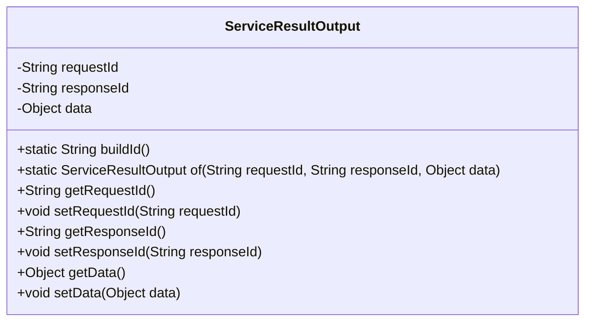
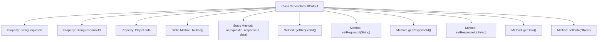

# Basic Information

|      |      |
|------|------|
| Name | ServiceResultOutput |
| Language | .java |
| Code Path | WeFe/serving/serving-service/src/main/java/com/welab/wefe/serving/service/dto/ServiceResultOutput.java |
| Package Name | com.welab.wefe.serving.service.dto |
| Dependencies | ['java.util.UUID'] |
| Brief Description | The ServiceResultOutput class encapsulates request ID, response ID, and data, providing static methods for building IDs and factory methods for creating instances. |

# Description

The `ServiceResultOutput` class is a Java class designed to encapsulate service invocation results, containing three primary attributes: `requestId` represents the request identifier, `responseId` denotes the response identifier, and `data` stores a data object of any type. This class provides a static method `buildId` for generating hyphen-free UUID strings, as well as a static factory method `of` for quick instance creation. It also includes standard getter and setter methods for each attribute, supporting read and write operations for the request ID, response ID, and data object.

# Class Summary

| Name   | Type  | Description |
|-------|------|-------------|
| ServiceResultOutput | class | The ServiceResultOutput class encapsulates the request ID, response ID, and data object, providing static methods for building IDs and factory methods for creating instances. |

## Class ServiceResultOutput

|      |      |
|------|------|
| Access Modifier | public |
| Type | class |
| Name | ServiceResultOutput |
| Description | The ServiceResultOutput class encapsulates the request ID, response ID, and data object, providing static methods for building IDs and factory methods for creating instances. |

### UML Class Diagram

This code defines a class named `ServiceResultOutput` for encapsulating service invocation result data. The class contains three private fields: `requestId`, `responseId`, and `data`, representing the request ID, response ID, and returned data object respectively. It provides a static method `buildId()` for generating UUID-formatted IDs and a static factory method `of()` for creating instances. Getter and setter methods are also provided for each field, allowing external access and modification of these values. This class is primarily used to standardize the output format of service invocations.

### Internal Method Call Graph

This flowchart illustrates the complete structure of the ServiceResultOutput class, containing 3 private properties, 2 static methods, and 6 instance methods. The core static method buildId() generates formatted UUIDs, while the of() method provides an object creation entry point. All properties are equipped with getter/setter methods supporting chained operations. The class design adheres to POJO specifications, featuring data encapsulation and static construction capabilities, making it suitable for standardized result transmission scenarios between services.

### Field List

| Name  | Type  | Description |
|-------|-------|------|
| data | Object | Private data objects. |
| requestId | String | The private string variable requestId is used to uniquely identify a request. |
| responseId | String | The private string variable `responseId` is used to store the response identifier. |

### Method List

| Name  | Type  | Description |
|-------|-------|------|
| getResponseId | String | Methods to obtain the response ID, returns a string-type responseId. |
| setResponseId | void | This is a Java method used to set the value of the class's responseId property. The method accepts a string parameter responseId and assigns it to the member variable of the same name in the class. |
| getRequestId | String | The method returns the request ID string. |
| buildId | String | Generate a random UUID string without hyphens. |
| of | ServiceResultOutput | Create a ServiceResultOutput instance, set the requestId, responseId, and data properties, and return it. |
| setRequestId | void | Methods for setting the request ID: Assign the input parameter `requestId` to the `requestId` property of the current object. |
| setData | void | Methods for setting object data, assigning the parameter `data` to the `data` property of the current object. |
| getData | Object | The method getData returns the data object. |

