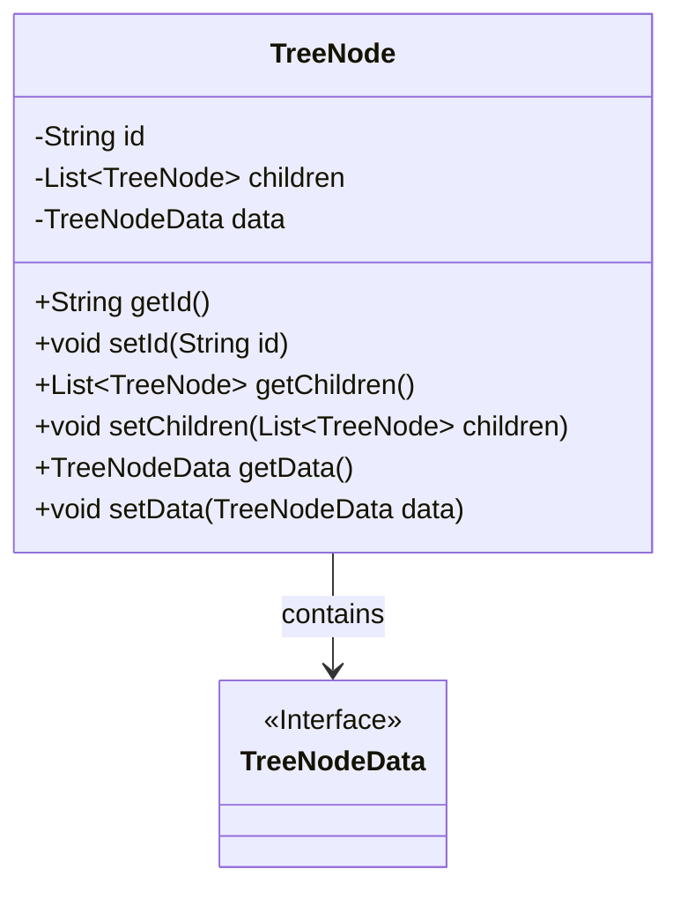
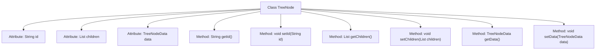

# Basic Information

|      |      |
|------|------|
| Name | TreeNode |
| Language | .java |
| Code Path | WeFe/serving/serving-service/src/main/java/com/welab/wefe/serving/service/dto/TreeNode.java |
| Package Name | com.welab.wefe.serving.service.dto |
| Dependencies | ['java.util.List'] |
| Brief Description | The TreeNode class contains id, children list, and data attributes, providing getter and setter methods. |

# Description

The code defines a class named TreeNode, which represents a node in a tree structure. This class contains three main attributes: id is used to store the unique identifier of the node, children is a list of TreeNode type for storing child nodes, and data is an object of TreeNodeData type for storing node-related data. The class provides getter and setter methods for these three attributes to retrieve and set their values. The TreeNode class implements recursive nesting of the tree structure through the children attribute, making it suitable for representing hierarchical data.

# Class Summary

| Name   | Type  | Description |
|-------|------|-------------|
| TreeNode | class | The TreeNode class includes an id, a list of child nodes (children), and a data object (data), providing getter and setter methods for each attribute. |

## Class TreeNode

|      |      |
|------|------|
| Access Modifier | public |
| Type | class |
| Name | TreeNode |
| Description | The TreeNode class includes an id, a list of child nodes (children), and a data object (data), providing getter and setter methods for each attribute. |

### UML Class Diagram

This class diagram illustrates the design of a tree node (TreeNode) with three core attributes: node ID, child node list, and node data. The TreeNode class manages child nodes through the generic List~TreeNode~, demonstrating the Composite design pattern. TreeNodeData is defined as an interface to provide extensibility for different data types. The diagram clearly shows the containment relationship between TreeNode and TreeNodeData. The overall structure is concise yet highly extensible, making it suitable for constructing various tree-based data structures.

### Internal Method Call Graph

This code defines a class named TreeNode, which represents a node in a tree structure. The class contains three private attributes: id (node identifier), children (list of child nodes), and data (node data), along with corresponding getter and setter methods. The flowchart clearly illustrates the hierarchical relationship between the class and its attributes/methods, with all methods directly associated with the TreeNode class for managing basic node information and structural relationships.

### Field List

| Name  | Type  | Description |
|-------|-------|------|
| children | List<TreeNode> | Private member variable, storing the list of child nodes of the tree node. |
| data | TreeNodeData | Private tree node data object. |
| id | String | Declare a private string variable id. |

### Method List

| Name  | Type  | Description |
|-------|-------|------|
| setChildren | void | Set the child node list. Assign the input child node list to the children property of the current object. |
| setId | void | Methods for setting the object ID, assigning the parameter id to the id property of the current object. |
| setData | void | Set TreeNodeData type data to the current object. |
| getId | String | This is a Java method that returns the value of the id field as a string. |
| getData | TreeNodeData | The method getData returns a data object of type TreeNodeData. |
| getChildren | List<TreeNode> | Methods for obtaining a list of child nodes. |

