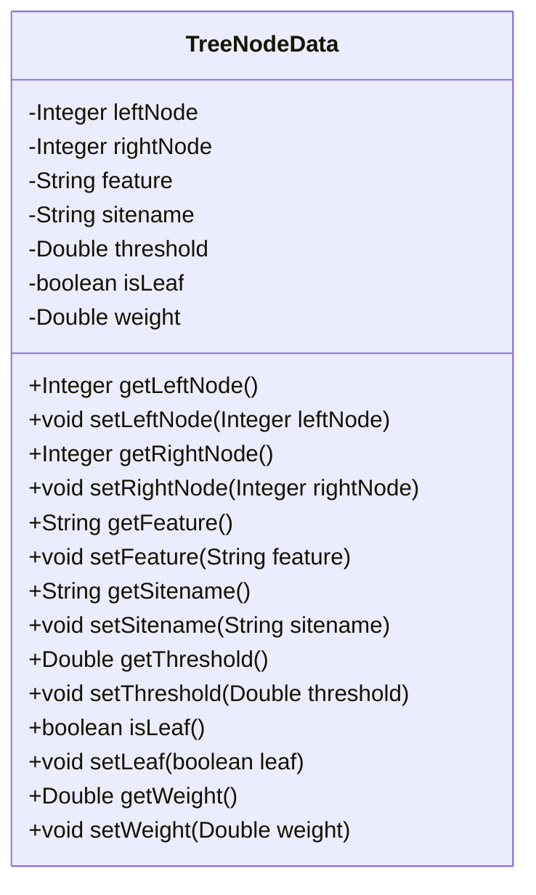

# Basic Information

|      |      |
|------|------|
| Name | TreeNodeData |
| Language | .java |
| Code Path | WeFe/serving/serving-service/src/main/java/com/welab/wefe/serving/service/dto/TreeNodeData.java |
| Package Name | com.welab.wefe.serving.service.dto |
| Dependencies | [] |
| Brief Description | Tree node data structure, including attributes such as left and right child nodes, feature, site name, split threshold, whether it is a leaf node, and weight, along with their access methods. |

# Description

The TreeNodeData class is a data structure representing a tree node, containing attributes such as left and right child node indices, feature name, site name, split threshold, leaf node flag, and node weight. This class provides getter and setter methods for all attributes to retrieve and set the values of each field.

# Class Summary

| Name   | Type  | Description |
|-------|------|-------------|
| TreeNodeData | class | The TreeNodeData class defines the tree node data structure, which includes attributes such as left and right child nodes, features, site names, split thresholds, whether it is a leaf node, weights, and their corresponding access methods. |

## Class TreeNodeData

|      |      |
|------|------|
| Access Modifier | public |
| Type | class |
| Name | TreeNodeData |
| Description | The TreeNodeData class defines the tree node data structure, which includes attributes such as left and right child nodes, features, site names, split thresholds, whether it is a leaf node, weights, and their corresponding access methods. |

### UML Class Diagram

This code defines a class named TreeNodeData, which represents node data in a tree structure. The class contains multiple private attributes such as left/right child node identifiers (leftNode/rightNode), feature name (feature), site name (sitename), split threshold (threshold), whether it is a leaf node (isLeaf), and node weight (weight). It also provides corresponding getter and setter methods for each attribute. This class is primarily used for storing and manipulating various attributes and states of nodes in decision trees or similar tree-like structures, offering comprehensive management capabilities for tree node information through encapsulation.

### Internal Method Call Graph

```mermaid
graph TD
    A["Class TreeNodeData"]
    B["Attribute: Integer leftNode"]
    C["Attribute: Integer rightNode"]
    D["Attribute: String feature"]
    E["Attribute: String sitename"]
    F["Attribute: Double threshold"]
    G["Attribute: boolean isLeaf"]
    H["Attribute: Double weight"]
    I["Method: getLeftNode()"]
    J["Method: setLeftNode(Integer)"]
    K["Method: getRightNode()"]
    L["Method: setRightNode(Integer)"]
    M["Method: getFeature()"]
    N["Method: setFeature(String)"]
    O["Method: getSitename()"]
    P["Method: setSitename(String)"]
    Q["Method: getThreshold()"]
    R["Method: setThreshold(Double)"]
    S["Method: isLeaf()"]
    T["Method: setLeaf(boolean)"]
    U["Method: getWeight()"]
    V["Method: setWeight(Double)"]

    A --> B
    A --> C
    A --> D
    A --> E
    A --> F
    A --> G
    A --> H
    A --> I
    A --> J
    A --> K
    A --> L
    A --> M
    A --> N
    A --> O
    A --> P
    A --> Q
    A --> R
    A --> S
    A --> T
    A --> U
    A --> V
```

This code defines a class named TreeNodeData, which represents the data structure of tree nodes. The class contains 7 private attributes: leftNode and rightNode represent left and right child nodes, feature and sitename are string-type features and site names, threshold is the splitting threshold, isLeaf identifies whether it is a leaf node, and weight represents the node weight. Each attribute has corresponding getter and setter methods for encapsulating attribute access and modification. This class is primarily used for building tree-structured data models and is suitable for implementing machine learning algorithms such as decision trees.

### Field List

| Name  | Type  | Description |
|-------|-------|------|
| isLeaf | boolean | The boolean variable isLeaf indicates whether it is a leaf node. |
| rightNode | Integer | Private integer variable rightNode, used to store right node information. |
| threshold | Double | Declare a private Double variable named threshold. |
| leftNode | Integer | The private integer variable leftNode is used to store left node information. |
| sitename | String | Defined a private string variable sitename. |
| feature | String | Private string type variable feature. |
| weight | Double | Declare a private Double type variable named weight. |

### Method List

| Name  | Type  | Description |
|-------|-------|------|
| isLeaf | boolean | This method returns a boolean value indicating whether the current node is a leaf node. |
| getLeftNode | Integer | Method to get the left node value, returns an integer type. |
| setWeight | void | Methods for setting the weight property of an object, with parameters of type Double. |
| setFeature | void | This is a Java method used to set the value of the feature property of an object. The method takes a string parameter named feature and assigns it to the property of the same name in the current object. |
| getThreshold | Double | Methods for obtaining thresholds, returns a Double type value. |
| getSitename | String | Methods to obtain the site name, returns a string `sitename`. |
| getFeature | String | This is a Java method that returns the value of the member variable `feature` of type String. |
| setThreshold | void | Set the threshold method, which accepts a parameter of type Double and assigns it to the class member variable threshold. |
| getRightNode | Integer | Method to obtain the right node value, returns Integer type. |
| setLeftNode | void | Set the left node value to the input parameter. |
| setSitename | void | The method to set the site name involves assigning the parameter `sitename` to the `sitename` property of the current object. |
| setRightNode | void | Set the right node value to the input parameter. |
| setLeaf | void | The method to set whether a node is in a leaf state assigns the incoming boolean value `leaf` to the `isLeaf` variable. |
| getWeight | Double | This is a Java method that returns a Double-type weight value. |

