# Basic Information

|      |      |
|------|------|
| Name | dto |
| Language | .java |
| Code Path | WeFe/serving/serving-service/src/main/java/com/welab/wefe/serving/service/dto |
| Package Name | docs.serving.serving-service.src.main.java.com.welab.wefe.serving.service.dto |
| Brief Description | Annotation-driven global configuration management module, automatically collects and categorizes configuration models, supports grouped retrieval. Includes multiple DTO classes such as ServiceOrderInput, TreeNode, etc., for handling service orders, tree structures, model states, and other data. Provides pagination, logging, and member parameter management functionalities. |

# Description

## Overview  
This module implements multi-scenario DTO management, with its core responsibility being the unified encapsulation of business data interaction models. It supports scenarios such as configuration management, service invocation, and paginated queries. The interface specifications cover static factory methods (e.g., of/buildId) and standard getter/setter methods. Key data structures include the paginated generic class PagingOutput, tree node TreeNode, and various input/output DTOs. External dependencies are limited to the ModelMapper and CacheObjects utility classes. For example, ServiceDetailOutput encapsulates service types and configurations, while TreeNodeData implements decision tree feature storage.  

## Core Business Scenarios  
The module adopts a data bus-like pattern, with business processes including service order queries (ServiceOrderInput), batch predictions (BatchPredictInput), and operation log recording (OperationLogOutputModel). Typical interactions achieve standardized data exchange through pagination parameters (PagingInput) and generic responses (PagingOutput). Functionality spans member management (MemberParams), fee statistics (FeeDetailInput), and model status tracking (ModelStatusOutput). For instance, AccountListAllOutputModel implements hierarchical permission control, while ServiceCallLogInput records call chains. API types focus on CRUD operations, with integration cases exemplified by the collaboration between ModelSqlConfigOutput and SQL execution.

### Package Internal Structure View

```mermaid
graph TD
    dto --> globalconfig
    dto --> ServiceOrderInput.java
    dto --> ModelSqlConfigOutput.java
    dto --> TreeNode.java
    dto --> ModelStatusOutput.java
    dto --> ServiceDetailOutput.java
    dto --> TreeNodeData.java
    dto --> OperationLogOutputModel.java
    dto --> OrderStatisticsInput.java
    dto --> FeeDetailInput.java
    dto --> BatchPredictInput.java
    dto --> AccountListAllOutputModel.java
    dto --> PagingOutput.java
    dto --> ServiceCallLogInput.java
    dto --> ServiceResultOutput.java
    dto --> MemberParams.java
    dto --> PagingInput.java
    globalconfig --> base
    globalconfig --> CaptchaSendChannelConfigModel.java
    globalconfig --> MailServerModel.java
    globalconfig --> UnionInfoModel.java
    globalconfig --> ServiceCacheConfigModel.java
    globalconfig --> GlobalConfigFlag.java
    globalconfig --> AliyunSmsConfigModel.java
    globalconfig --> GlobalConfigModel.java
    globalconfig --> IdentityInfoModel.java
    base --> AbstractConfigModel.java
    base --> GlobalConfigInput.java
    base --> ConfigModel.java
    base --> ConfigGroupConstant.java
```

This flowchart illustrates the complete structure of the DTO layer in the WeFe service module, including the globalconfig configuration subdirectory and multiple data transfer object files. The globalconfig directory is further divided into base configuration classes and various specific configuration models, forming a clear hierarchical relationship. Meanwhile, the main directory contains various service-related input/output DTOs such as ServiceOrderInput, ModelStatusOutput, etc., collectively constituting a comprehensive system for inter-service data transmission.

# File List

| Name   | Type  | Description |
|-------|------|-------------|
| [ServiceOrderInput.java](ServiceOrderInput.md) | file | Service order input class, containing service ID, name, status, type, requester and responder information, and time range fields. |
| [ModelSqlConfigOutput.java](ModelSqlConfigOutput.md) | file | The ModelSqlConfigOutput class contains fields such as sqlScript, sqlConditionField, and dataSourceId, providing getter/setter methods and a static factory method named of. |
| [TreeNode.java](TreeNode.md) | file | The TreeNode class includes id, children list, and data attributes, providing getter and setter methods. |
| [ModelStatusOutput.java](ModelStatusOutput.md) | file | The ModelStatusOutput class includes member fields for ID, name, URL, and status, providing two static construction methods along with corresponding getter/setter methods. |
| [ServiceDetailOutput.java](ServiceDetailOutput.md) | file | The ServiceDetailOutput class includes fields such as service ID, name, address, type, query parameters, data source, and status, providing model conversion and field access methods. |
| [TreeNodeData.java](TreeNodeData.md) | file | Tree node data structure, including attributes such as left and right child nodes, features, site name, split threshold, whether it is a leaf node, and weight, along with their access methods. |
| [OperationLogOutputModel.java](OperationLogOutputModel.md) | file | Operation log output model class, including fields such as interface, IP, operator, action, result, and corresponding getter/setter methods. |
| [OrderStatisticsInput.java](OrderStatisticsInput.md) | file | The OrderStatisticsInput class includes fields such as service ID, requester ID, responder ID, minute, start time, and end time, and provides getter and setter methods for each field. |
| [FeeDetailInput.java](FeeDetailInput.md) | file | The FeeDetailInput class includes fields for ID, service ID, customer ID, total request count, and total fee, providing getter and setter methods. |
| [BatchPredictInput.java](BatchPredictInput.md) | file | The BatchPredictInput class includes fields such as userId, featureData, and params, and provides getter and setter methods. |
| [AccountListAllOutputModel.java](AccountListAllOutputModel.md) | file | The AccountListAllOutputModel class includes attributes such as nickname, super administrator, administrator, audit status, availability, and cancellation status, along with their corresponding getter/setter methods. |
| [PagingOutput.java](PagingOutput.md) | file | Pagination output class, containing total count and list data, providing two creation methods: direct assignment and automatic mapping of database entities to DTO. Supports getting and setting total count and list. |
| [ServiceCallLogInput.java](ServiceCallLogInput.md) | file | The ServiceCallLogInput class includes fields such as order ID, service ID, call identifier, requester/responder ID, request/response ID, and start/end time, which are used to record service call logs. |
| [ServiceResultOutput.java](ServiceResultOutput.md) | file | The ServiceResultOutput class encapsulates request IDs, response IDs, and data, providing static methods for constructing IDs and factory methods for creating instances. |
| [MemberParams.java](MemberParams.md) | file | The MemberParams class includes attributes such as member ID, name, role, public key, URL, and key type, and provides getter and setter methods for each attribute. |
| [PagingInput.java](PagingInput.md) | file | Pagination input class, including page number and items per page, with the page number defaulting to 0 (minimum 0) and items per page defaulting to 100. |
| [globalconfig](globalconfig/_module.md) | package | This module implements annotation-driven global configuration management, storing configuration classes in a static Map and supporting grouped retrieval. It includes configuration model classes for SMS, email, caching, etc., with each model inheriting AbstractConfigModel and annotated with a group. The core functionality involves configuration registration and querying, relying on reflection tools to achieve automatic loading. |

