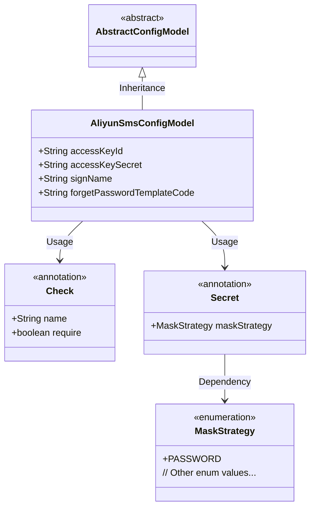
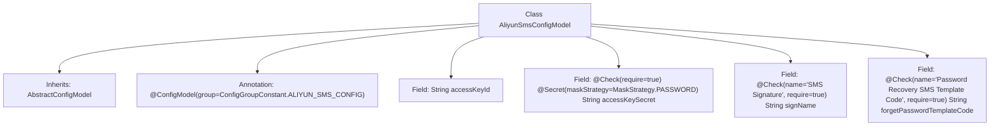

# Basic Information

|      |      |
|------|------|
| Name | AliyunSmsConfigModel |
| Language | .java |
| Code Path | WeFe/serving/serving-service/src/main/java/com/welab/wefe/serving/service/dto/globalconfig/AliyunSmsConfigModel.java |
| Package Name | com.welab.wefe.serving.service.dto.globalconfig |
| Dependencies | ['com.welab.wefe.common.fieldvalidate.annotation.Check', 'com.welab.wefe.common.fieldvalidate.secret.MaskStrategy', 'com.welab.wefe.common.fieldvalidate.secret.Secret', 'com.welab.wefe.serving.service.dto.globalconfig.base.AbstractConfigModel', 'com.welab.wefe.serving.service.dto.globalconfig.base.ConfigGroupConstant', 'com.welab.wefe.serving.service.dto.globalconfig.base.ConfigModel'] |
| Brief Description | Alibaba Cloud SMS configuration class, including required key ID, secret key, SMS signature, and password recovery template code. |

# Description

The content describes a configuration model class named AliyunSmsConfigModel, which is used for Alibaba Cloud SMS service configuration. This class inherits from AbstractConfigModel and is annotated with the ConfigModel annotation, specifying the configuration group as ALIYUN_SMS_CONFIG. The class contains four fields: accessKeyId (access key ID), accessKeySecret (access key, marked as required with a password masking strategy), signName (SMS signature, marked as required), and forgetPasswordTemplateCode (password recovery SMS template code, marked as required). These fields are validated using the Check annotation to ensure the completeness and correctness of the configuration.

# Class Summary

| Name   | Type  | Description |
|-------|------|-------------|
| AliyunSmsConfigModel | class | Alibaba Cloud SMS configuration class, including the required accessKeyId, encrypted accessKeySecret, SMS signature, and password recovery template code. |

## Class AliyunSmsConfigModel

|      |      |
|------|------|
| Access Modifier | @ConfigModel(group = ConfigGroupConstant.ALIYUN_SMS_CONFIG);public |
| Type | class |
| Name | AliyunSmsConfigModel |
| Description | Alibaba Cloud SMS configuration class, including the required accessKeyId, encrypted accessKeySecret, SMS signature, and password recovery template code. |

### UML Class Diagram

This class diagram illustrates the structure of the Alibaba Cloud SMS configuration model. AliyunSmsConfigModel inherits from the abstract base class AbstractConfigModel and contains four public fields: accessKeyId, accessKeySecret (annotated with sensitive data masking), signName, and forgetPasswordTemplateCode. Field validation and desensitization are implemented through Check and Secret annotations, where the Secret annotation relies on the MaskStrategy enum to define masking strategies. This design achieves an extensible configuration model that supports field-level validation rules and sensitive information protection mechanisms.

### Internal Method Call Graph

This flowchart illustrates the structure of the AliyunSmsConfigModel class, which is a configuration model class inheriting from AbstractConfigModel and annotated with @ConfigModel. The class contains four fields: accessKeyId, accessKeySecret (with security check annotation and masking strategy), signName (a required SMS signature), and forgetPasswordTemplateCode (a mandatory password recovery template code). All fields implement configuration validation and business semantic marking through annotations.

### Field List

| Name  | Type  | Description |
|-------|-------|------|
| accessKeySecret | String | The code defines a mandatory string field named accessKeySecret, which employs a password masking strategy for sensitive information protection. |
| accessKeyId | String | Declare a public string variable accessKeyId. |
| signName | String | SMS signature field, mandatory. |
| forgetPasswordTemplateCode | String | The check item is the SMS template code for password recovery, a mandatory field with the variable name forgetPasswordTemplateCode. |

### Method List

| Name  | Type  | Description |
|-------|-------|------|

