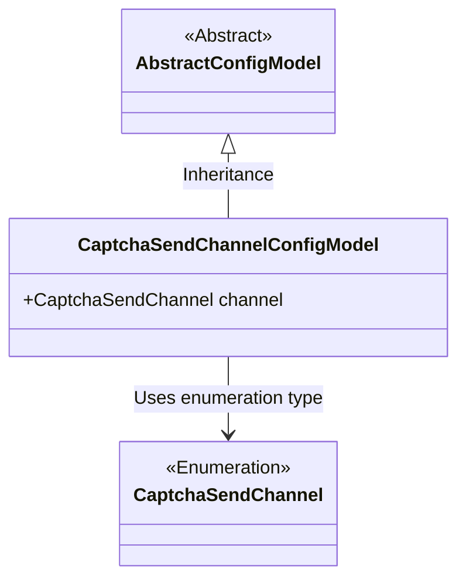
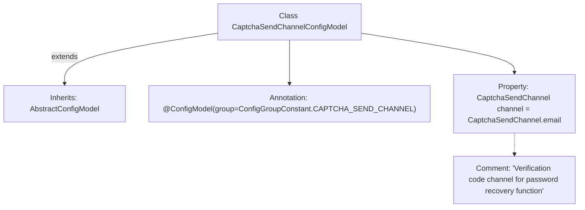

# Basic Information

|      |      |
|------|------|
| Name | CaptchaSendChannelConfigModel |
| Language | .java |
| Code Path | WeFe/serving/serving-service/src/main/java/com/welab/wefe/serving/service/dto/globalconfig/CaptchaSendChannelConfigModel.java |
| Package Name | com.welab.wefe.serving.service.dto.globalconfig |
| Dependencies | ['com.welab.wefe.common.verification.code.common.CaptchaSendChannel', 'com.welab.wefe.serving.service.dto.globalconfig.base.AbstractConfigModel', 'com.welab.wefe.serving.service.dto.globalconfig.base.ConfigGroupConstant', 'com.welab.wefe.serving.service.dto.globalconfig.base.ConfigModel'] |
| Brief Description | The configuration class CaptchaSendChannelConfigModel defines the password recovery verification code sending channel, with the email channel used by default. |

# Description

The content defines a configuration model class named CaptchaSendChannelConfigModel, which belongs to the captcha sending channel configuration group. The class contains a channel field with a default value of email, used to specify the captcha sending channel for the password recovery function. This class inherits from the AbstractConfigModel base class and is marked with annotations to indicate its configuration group affiliation.

# Class Summary

| Name   | Type  | Description |
|-------|------|-------------|
| CaptchaSendChannelConfigModel | class | Configuration class `CaptchaSendChannelConfigModel`, defines the password recovery verification code sending channel, with `email` as the default. |

## Class CaptchaSendChannelConfigModel

|      |      |
|------|------|
| Access Modifier | @ConfigModel(group = ConfigGroupConstant.CAPTCHA_SEND_CHANNEL);public |
| Type | class |
| Name | CaptchaSendChannelConfigModel |
| Description | Configuration class `CaptchaSendChannelConfigModel`, defines the password recovery verification code sending channel, with `email` as the default. |

### UML Class Diagram

This class diagram illustrates that CaptchaSendChannelConfigModel inherits from AbstractConfigModel and contains a channel field of the CaptchaSendChannel enumeration type. CaptchaSendChannel is separately represented as an enumeration type, with the ConfigModel annotation indicating this is a configuration model class specifically designed for managing captcha sending channel configurations. The diagram clearly presents the inheritance relationship and type dependency, where the abstract base class and concrete implementation class are connected via a generalization relationship, while the enumeration type is referenced as an independent component.

### Internal Method Call Graph

This flowchart illustrates the structure of the CaptchaSendChannelConfigModel class, which is a configuration model class inheriting from AbstractConfigModel. It carries the @ConfigModel annotation with a specified configuration group. The class contains a property 'channel' of type CaptchaSendChannel with a default value of 'email', used to configure the verification code sending channel for the password recovery function. The property is accompanied by clear comments explaining its purpose. The overall class structure is concise and adheres to the design specifications of configuration models.

### Field List

| Name  | Type  | Description |
|-------|-------|------|
| channel = CaptchaSendChannel.email | CaptchaSendChannel | The verification code delivery channel is set to email. |

### Method List

| Name  | Type  | Description |
|-------|-------|------|

