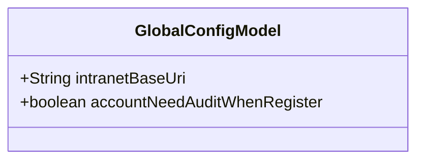
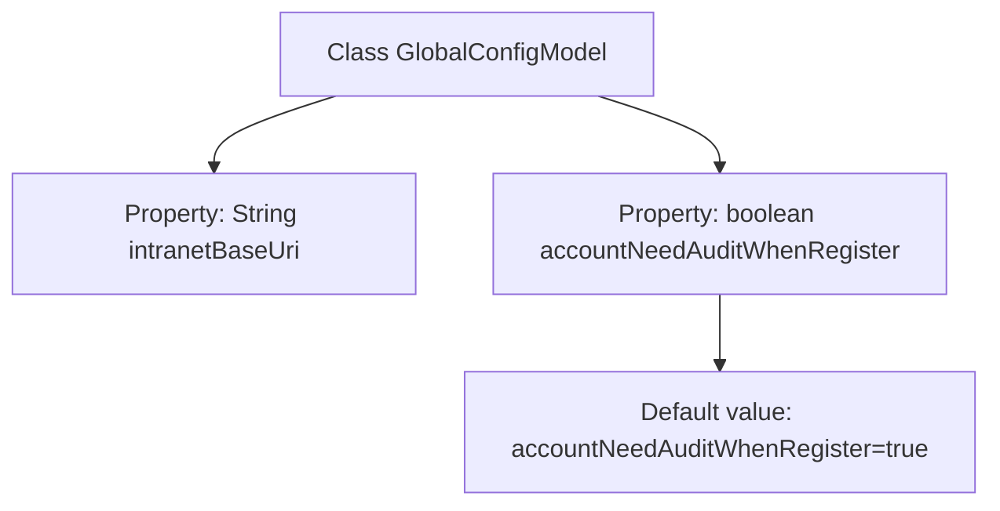

# Basic Information

|      |      |
|------|------|
| Name | GlobalConfigModel |
| Language | .java |
| Code Path | WeFe/serving/serving-service/src/main/java/com/welab/wefe/serving/service/dto/globalconfig/GlobalConfigModel.java |
| Package Name | com.welab.wefe.serving.service.dto.globalconfig |
| Dependencies | [] |
| Brief Description | The GlobalConfigModel class contains the intranet service address and a boolean configuration item for whether account registration requires approval. |

# Description

The GlobalConfigModel class contains two configuration items: intranetBaseUri represents the internal network base URL of the fusion service; accountNeedAuditWhenRegister is a boolean value, defaulting to true, which controls whether newly registered accounts require administrator approval.

# Class Summary

| Name   | Type  | Description |
|-------|------|-------------|
| GlobalConfigModel | class | The GlobalConfigModel class contains two configuration items: intranetBaseUri (intranet service address) and accountNeedAuditWhenRegister (new account registration requires audit, default true). |

## Class GlobalConfigModel

|      |      |
|------|------|
| Access Modifier | public |
| Type | class |
| Name | GlobalConfigModel |
| Description | The GlobalConfigModel class contains two configuration items: intranetBaseUri (intranet service address) and accountNeedAuditWhenRegister (new account registration requires audit, default true). |

### UML Class Diagram

This code defines a configuration class named GlobalConfigModel, containing two public fields: intranetBaseUri stores the intranet base URL address (string type), and accountNeedAuditWhenRegister is a boolean configuration item with a default value of true, indicating whether newly registered accounts require administrator approval. Serving as a data carrier for global configurations, this class has no defined methods and adopts a direct field exposure design pattern, making it suitable for scenarios requiring rapid access to configuration parameters.

### Internal Method Call Graph

This flowchart illustrates the structure of the GlobalConfigModel class, containing two main properties: intranetBaseUri (String type) for storing the intranet base URL, and accountNeedAuditWhenRegister (boolean type) with a default value of true indicating newly registered accounts require administrator approval. The diagram clearly presents the containment relationship between the class and its properties, along with special notation for default values, facilitating understanding of the configuration model's initial state and key parameter definitions.

### Field List

| Name  | Type  | Description |
|-------|-------|------|
| intranetBaseUri | String | Class member variable, string type, representing the intranet base URI. |
| accountNeedAuditWhenRegister = true | boolean | Account requires approval upon registration. |

### Method List

| Name  | Type  | Description |
|-------|-------|------|

