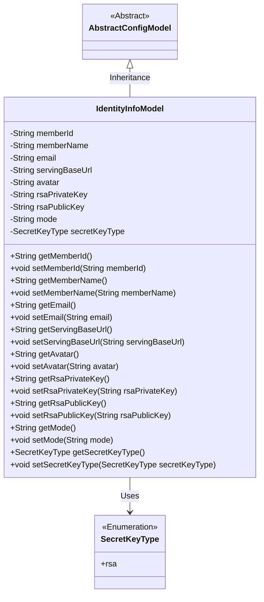

# Basic Information

|      |      |
|------|------|
| Name | IdentityInfoModel |
| Language | .java |
| Code Path | WeFe/serving/serving-service/src/main/java/com/welab/wefe/serving/service/dto/globalconfig/IdentityInfoModel.java |
| Package Name | com.welab.wefe.serving.service.dto.globalconfig |
| Dependencies | ['com.welab.wefe.common.constant.SecretKeyType', 'com.welab.wefe.common.fieldvalidate.annotation.Check', 'com.welab.wefe.common.fieldvalidate.secret.MaskStrategy', 'com.welab.wefe.common.fieldvalidate.secret.Secret', 'com.welab.wefe.serving.service.dto.globalconfig.base.AbstractConfigModel', 'com.welab.wefe.serving.service.dto.globalconfig.base.ConfigGroupConstant', 'com.welab.wefe.serving.service.dto.globalconfig.base.ConfigModel'] |
| Brief Description | The IdentityInfoModel class stores identity information, including fields such as member ID, name, email, URL, avatar, RSA key, system mode, and key type. |

# Description

The `IdentityInfoModel` class is a configuration model that belongs to the identity information configuration group. It contains basic information such as member ID, name, email, system domain path, and avatar. The member ID defaults to a UUID in standalone mode and to `memberId` in federated mode. This class also includes RSA public and private keys, with the private key being desensitized using the BLOCK strategy. The system mode is divided into standalone mode and federated mode, and the key type defaults to RSA. All fields have corresponding getter and setter methods.

# Class Summary

| Name   | Type  | Description |
|-------|------|-------------|
| IdentityInfoModel | class | The IdentityInfoModel class contains configuration information such as member ID, name, email, system path, avatar, RSA key, operation mode, and key type. |

## Class IdentityInfoModel

|      |      |
|------|------|
| Access Modifier | @ConfigModel(group = ConfigGroupConstant.IDENTITY_INFO);public |
| Type | class |
| Name | IdentityInfoModel |
| Description | The IdentityInfoModel class contains configuration information such as member ID, name, email, system path, avatar, RSA key, operation mode, and key type. |

### UML Class Diagram

This class diagram illustrates that IdentityInfoModel inherits from AbstractConfigModel and contains multiple private fields with corresponding getter/setter methods. The class is used to store identity information configurations, including basic details such as member ID, name, email, as well as security-related configurations like RSA key pairs and system mode. SecretKeyType serves as an enumeration type defining key type options. The annotations @ConfigModel and @Check indicate this is a configuration model class with field validation capabilities.

### Internal Method Call Graph

```mermaid
graph TD
    A["Class IdentityInfoModel"]
    B["Inherits: AbstractConfigModel"]
    C["Annotation: @ConfigModel(group=ConfigGroupConstant.IDENTITY_INFO)"]
    D["Property: String memberId"]
    E["Property: String memberName"]
    F["Property: String email"]
    G["Property: String servingBaseUrl"]
    H["Property: String avatar"]
    I["Property: String rsaPrivateKey"]
    J["Property: String rsaPublicKey"]
    K["Property: String mode"]
    L["Property: SecretKeyType secretKeyType"]
    M["Method: getMemberId/setMemberId"]
    N["Method: getMemberName/setMemberName"]
    O["Method: getEmail/setEmail"]
    P["Method: getServingBaseUrl/setServingBaseUrl"]
    Q["Method: getAvatar/setAvatar"]
    R["Method: getRsaPrivateKey/setRsaPrivateKey"]
    S["Method: getRsaPublicKey/setRsaPublicKey"]
    T["Method: getMode/setMode"]
    U["Method: getSecretKeyType/setSecretKeyType"]

    A --> B
    A --> C
    A --> D
    A --> E
    A --> F
    A --> G
    A --> H
    A --> I
    A --> J
    A --> K
    A --> L
    A --> M
    A --> N
    A --> O
    A --> P
    A --> Q
    A --> R
    A --> S
    A --> T
    A --> U
```

This code defines a configuration model class named IdentityInfoModel, which inherits from AbstractConfigModel and is used to store authentication-related information. The class contains multiple properties annotated with @Check, such as memberId, memberName, email, etc., along with corresponding getter and setter methods. Notably, the rsaPrivateKey property is protected with the @Secret annotation for sensitive information. The class specifies its configuration group via the @ConfigModel annotation and is suitable for identity information management scenarios in both standalone and federated modes.

### Field List

| Name  | Type  | Description |
|-------|-------|------|
| memberId | String | System ID, globally unique, defaults to UUID in standalone mode and memberId in federated mode. |
| servingBaseUrl | String | System domain path check, private string variable servingBaseUrl. |
| secretKeyType = SecretKeyType.rsa | SecretKeyType | The code defines a private field `secretKeyType` with a default value of `rsa`, and marks the field name as "Key Type" using the `@Check` annotation. |
| rsaPublicKey | String | The code defines a private string variable named rsaPublicKey, which is annotated with @Check and labeled as "Public Key". |
| email | String | Define a private String variable named email, and validate its format using the @Check annotation. |
| memberName | String | The code defines a private string variable named memberName and marks it with the @Check annotation, specifying its name as "Name". |
| avatar | String | The field `avatar` is validated using the `@Check` annotation, with the parameter `name` set to "avatar". |
| mode | String | Define a private string variable named mode, with annotations indicating its possible values: standalone (standalone mode) or union (federated mode). |
| rsaPrivateKey | String | Java Field Annotation: The private key field uses the BLOCK strategy for desensitization processing. |

### Method List

| Name  | Type  | Description |
|-------|-------|------|
| setSecretKeyType | void | The method for setting the secret key type assigns the parameter secretKeyType to the class property of the same name. |
| setMode | void | The method `setMode` accepts a string parameter `mode` and assigns it to the `mode` property of the current object. |
| getAvatar | String | Public method to get the avatar URL, returns the value of the string variable avatar. |
| getServingBaseUrl | String | Methods to obtain the service base URL, returns the value of the servingBaseUrl variable. |
| getMemberName | String | Methods to obtain the member name, which returns the value of the member variable `memberName`. |
| setRsaPublicKey | void | Set the string value of the RSA public key. |
| setAvatar | void | The method to set the user avatar is to assign the parameter `avatar` to the `avatar` property of the current object. |
| setRsaPrivateKey | void | The method to set the RSA private key assigns the input string to the class variable rsaPrivateKey. |
| setMemberName | void | Set the value of the member variable memberName. |
| getSecretKeyType | SecretKeyType | The method returns the value of secretKeyType. |
| getRsaPublicKey | String | Methods to Obtain an RSA Public Key. |
| getEmail | String | Public method to get the email value. |
| getMode | String | The method returns the value of the string variable mode. |
| getRsaPrivateKey | String | Methods to obtain an RSA private key, returning the private key value as a string. |
| setMemberId | void | The method to set the member ID assigns the input parameter to the class's member variable memberId. |
| setServingBaseUrl | void | Method for setting the service base URL, which assigns the input parameter to the class variable servingBaseUrl. |
| getMemberId | String | This is a Java method that returns a member ID string. The method is named getMemberId, takes no parameters, and directly returns the value of the member variable memberId. |
| setEmail | void | This is a Java method used to set the email property of an object, assigning the passed string parameter to the member variable email. |

