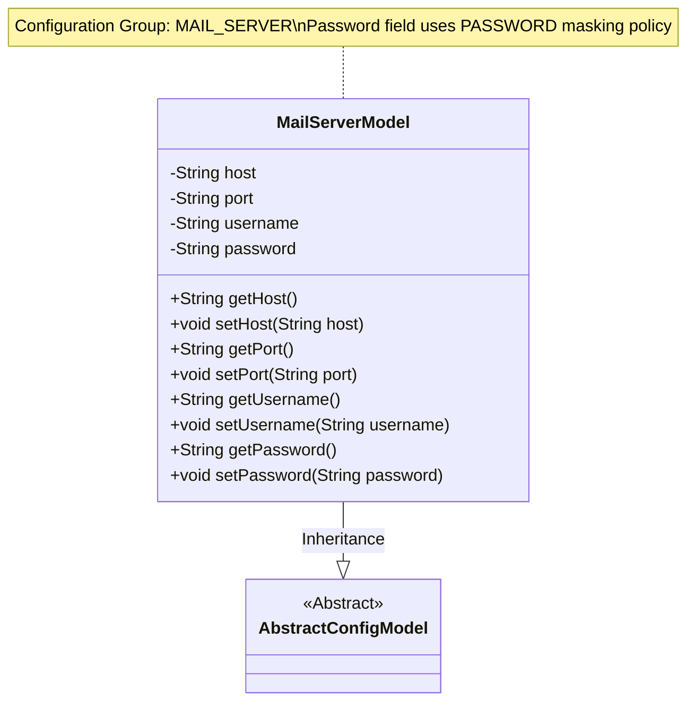
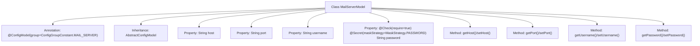

# Basic Information

|      |      |
|------|------|
| Name | MailServerModel |
| Language | .java |
| Code Path | WeFe/serving/serving-service/src/main/java/com/welab/wefe/serving/service/dto/globalconfig/MailServerModel.java |
| Package Name | com.welab.wefe.serving.service.dto.globalconfig |
| Dependencies | ['com.welab.wefe.common.fieldvalidate.annotation.Check', 'com.welab.wefe.common.fieldvalidate.secret.MaskStrategy', 'com.welab.wefe.common.fieldvalidate.secret.Secret', 'com.welab.wefe.serving.service.dto.globalconfig.base.AbstractConfigModel', 'com.welab.wefe.serving.service.dto.globalconfig.base.ConfigGroupConstant', 'com.welab.wefe.serving.service.dto.globalconfig.base.ConfigModel'] |
| Brief Description | Email server configuration class, including fields for host, port, username, and password. The password must be encrypted and is a required field. |

# Description

This is a configuration model class named MailServerModel, belonging to the mail server configuration group. The class contains four key attributes: host represents the server address, port represents the port number, username represents the username, and password represents the password. Among them, the password field is marked as required and employs a password masking strategy for sensitive information protection. The class provides standard getter and setter methods for attribute access and modification. This class inherits from the AbstractConfigModel base class, indicating it is a configuration model.

# Class Summary

| Name   | Type  | Description |
|-------|------|-------------|
| MailServerModel | class | Email server configuration class, including fields for host, port, username, and password. The password requires validation and must be stored encrypted. |

## Class MailServerModel

|      |      |
|------|------|
| Access Modifier | @ConfigModel(group = ConfigGroupConstant.MAIL_SERVER);public |
| Type | class |
| Name | MailServerModel |
| Description | Email server configuration class, including fields for host, port, username, and password. The password requires validation and must be stored encrypted. |

### UML Class Diagram

This code demonstrates a mail server configuration model class MailServerModel, which inherits from the abstract base class AbstractConfigModel. The class contains four private fields: host, port, username, and password, where the password field is marked as sensitive data (using password masking policy) via the @Secret annotation and designated as a required field via the @Check annotation. All fields follow standard getter/setter methods in compliance with JavaBean specifications. The class-level @ConfigModel annotation specifies that this configuration belongs to the MAIL_SERVER group.

### Internal Method Call Graph

This code defines a mail server configuration model class MailServerModel, which inherits from AbstractConfigModel. The class contains four properties: host, port, username, and password, where the password property is annotated with @Check and @Secret for validation and desensitization. Each property has corresponding getter and setter methods. The model is marked with the @ConfigModel annotation as part of the mail server configuration group, used for centralized management of mail service-related configuration parameters.

### Field List

| Name  | Type  | Description |
|-------|-------|------|
| host | String | Declare a private string variable host. |
| port | String | Declare a private string variable port. |
| username | String | Declare a private string variable username. |
| password | String | The field password must be validated and masked with a password-type processing strategy. |

### Method List

| Name  | Type  | Description |
|-------|-------|------|
| getPort | String | Methods to obtain the port number, directly return the value of the port variable. |
| setHost | void | The method to set the host address assigns the input parameter to the host variable of the class. |
| getHost | String | Methods to obtain the host address, returning a string-type host variable. |
| setPort | void | The method to set the port value assigns the input string to the class variable port. |
| getUsername | String | Methods to obtain the username string. |
| setUsername | void | This is a Java method used to set the username property of a class, which takes a string parameter and assigns it to a member variable. |
| getPassword | String | This is a Java method that returns the value of a string-type variable named password. |
| setPassword | void | Method for setting password, assigns the input string to the class member variable password. |

