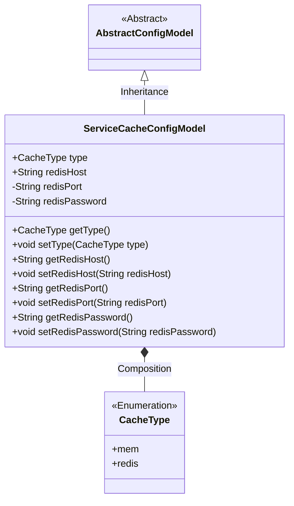
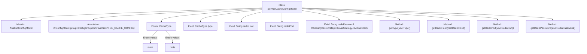

# Basic Information

|      |      |
|------|------|
| Name | ServiceCacheConfigModel |
| Language | .java |
| Code Path | WeFe/serving/serving-service/src/main/java/com/welab/wefe/serving/service/dto/globalconfig/ServiceCacheConfigModel.java |
| Package Name | com.welab.wefe.serving.service.dto.globalconfig |
| Dependencies | ['com.welab.wefe.common.fieldvalidate.secret.MaskStrategy', 'com.welab.wefe.common.fieldvalidate.secret.Secret', 'com.welab.wefe.serving.service.dto.globalconfig.base.AbstractConfigModel', 'com.welab.wefe.serving.service.dto.globalconfig.base.ConfigGroupConstant', 'com.welab.wefe.serving.service.dto.globalconfig.base.ConfigModel'] |
| Brief Description | Service cache configuration class, including cache type (in-memory or Redis), Redis host, port, and password (encrypted). Provides getter and setter methods for each field. |

# Description

The content describes a Java configuration class named ServiceCacheConfigModel, which extends AbstractConfigModel and is used to define service cache configurations. The class includes a cache type enumeration CacheType (mem and redis), as well as redis-related configuration items: host address redisHost, port redisPort, and password redisPassword. The password field is marked as sensitive information using the @Secret annotation and employs a password masking strategy. The class provides getter and setter methods for each field and specifies the configuration group as SERVICE_CACHE_CONFIG through the @ConfigModel annotation.

# Class Summary

| Name   | Type  | Description |
|-------|------|-------------|
| ServiceCacheConfigModel | class | Service caching configuration class, supporting both memory and Redis types, including Redis host, port, and password fields, with the password field encrypted. |

## Class ServiceCacheConfigModel

|      |      |
|------|------|
| Access Modifier | @ConfigModel(group = ConfigGroupConstant.SERVICE_CACHE_CONFIG);public |
| Type | class |
| Name | ServiceCacheConfigModel |
| Description | Service caching configuration class, supporting both memory and Redis types, including Redis host, port, and password fields, with the password field encrypted. |

### UML Class Diagram

This code defines a service cache configuration model ServiceCacheConfigModel, which inherits from the abstract configuration class AbstractConfigModel. The class includes a cache type enumeration CacheType (supporting mem and redis types) and Redis connection-related configuration items (host, port, password). The redisPassword field is marked with the @Secret annotation for sensitive information desensitization. The class diagram clearly illustrates the inheritance and composition relationships, reflecting the core data structure of the configuration model.

### Internal Method Call Graph

This flowchart illustrates the complete structure of the ServiceCacheConfigModel class, including inheritance relationships, configuration annotations, enum definitions, field declarations, and method compositions. The core depicts a configuration model for caching services, containing Redis connection parameters (host, port, encrypted password) and cache type enum (memory/Redis), with all fields equipped with getter/setter methods. Special attention is given to the redisPassword field which uses a security masking annotation, reflecting design considerations for sensitive information handling.

### Field List

| Name  | Type  | Description |
|-------|-------|------|
| type | CacheType | Cache type field. |
| redisPassword | String | The private string redisPassword is kept confidential using a password masking strategy. |
| redisHost | String | Declare a public string variable redisHost to store the Redis host address. |
| redisPort | String | Declare a private string variable redisPort |

### Method List

| Name  | Type  | Description |
|-------|-------|------|
| setType | void | The method for setting the cache type assigns the parameter `type` to the `type` property of the current object. |
| getRedisPort | String | Methods to obtain the Redis port, returning the redisPort string. |
| getType | CacheType | The method returns an object type of CacheType. |
| setRedisHost | void | Method to set the Redis host address, with the parameter being redisHost. |
| getRedisHost | String | Methods to obtain the Redis host address. |
| setRedisPort | void | The method to set the Redis port assigns the input parameter to the `redisPort` member variable of the class. |
| getRedisPassword | String | Methods to obtain the Redis password, returning a string-type password value. |
| setRedisPassword | void | The method to set the Redis password involves assigning the input parameter to the class member variable redisPassword. |

