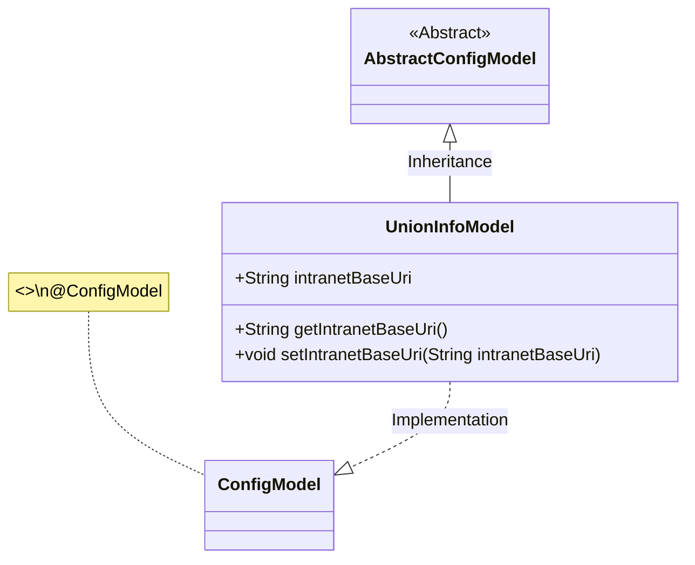
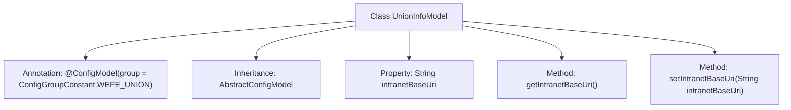

# Basic Information

|      |      |
|------|------|
| Name | UnionInfoModel |
| Language | .java |
| Code Path | WeFe/serving/serving-service/src/main/java/com/welab/wefe/serving/service/dto/globalconfig/UnionInfoModel.java |
| Package Name | com.welab.wefe.serving.service.dto.globalconfig |
| Dependencies | ['com.welab.wefe.serving.service.dto.globalconfig.base.AbstractConfigModel', 'com.welab.wefe.serving.service.dto.globalconfig.base.ConfigGroupConstant', 'com.welab.wefe.serving.service.dto.globalconfig.base.ConfigModel'] |
| Brief Description | The UnionInfoModel class, with the configuration group WEFE_UNION, includes the intranet base URL property intranetBaseUri and its getter/setter methods. |

# Description

The code defines a configuration model class named `UnionInfoModel`, which inherits from `AbstractConfigModel`. The class is annotated with `@ConfigModel`, specifying the configuration group as `WEFE_UNION`. It contains a string-type field `intranetBaseUri` for storing the intranet base URL of the federation service, along with corresponding getter and setter methods. This model is used to manage configuration information for the federation service.

# Class Summary

| Name   | Type  | Description |
|-------|------|-------------|
| UnionInfoModel | class | The UnionInfoModel configuration class includes getter/setter methods for the intranet base URI and belongs to the WEFE_UNION group. |

## Class UnionInfoModel

|      |      |
|------|------|
| Access Modifier | @ConfigModel(group = ConfigGroupConstant.WEFE_UNION);public |
| Type | class |
| Name | UnionInfoModel |
| Description | The UnionInfoModel configuration class includes getter/setter methods for the intranet base URI and belongs to the WEFE_UNION group. |

### UML Class Diagram

This class diagram illustrates that UnionInfoModel inherits from the AbstractConfigModel abstract class and implements the ConfigModel interface (marked by the @ConfigModel annotation). UnionInfoModel contains a public String field intranetBaseUri along with its getter/setter methods, which are used to manage configuration information for the intranet base URI. This model belongs to the WEFE_UNION configuration group, demonstrating a typical implementation approach for Java configuration models.

### Internal Method Call Graph

This code defines a configuration model class named UnionInfoModel, which inherits from AbstractConfigModel and is annotated with @ConfigModel to specify the configuration group. The class contains a String property intranetBaseUri for storing the intranet base URL, along with corresponding getter and setter methods. This design is used to centrally manage network configurations for federation services, ensuring data encapsulation through standardized access methods.

### Field List

| Name  | Type  | Description |
|-------|-------|------|
| intranetBaseUri | String | Declare a public string variable intranetBaseUri to store the intranet base URI. |

### Method List

| Name  | Type  | Description |
|-------|-------|------|
| getIntranetBaseUri | String | This method returns the string value of the private member variable intranetBaseUri. |
| setIntranetBaseUri | void | Method to set the intranet base URI, with the parameter being the string intranetBaseUri. |

