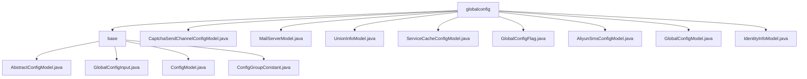

# Basic Information

|      |      |
|------|------|
| Name | globalconfig |
| Language | .java |
| Code Path | WeFe/serving/serving-service/src/main/java/com/welab/wefe/serving/service/dto/globalconfig |
| Package Name | docs.serving.serving-service.src.main.java.com.welab.wefe.serving.service.dto.globalconfig |
| Brief Description | This module implements annotation-driven global configuration management, storing configuration classes in a static Map and supporting grouped retrieval. It includes configuration model classes for SMS, email, caching, etc., with each model inheriting AbstractConfigModel and annotated with a group. The core functionality involves configuration registration and querying, relying on reflection tools to achieve automatic loading. |

# Description

## Overview  
This module implements annotation-driven global configuration management, with its core responsibility being the automatic collection and categorized management of various configuration models, providing group-based retrieval capabilities. The interface specifications include the getModelClass(group) and getModelClasses() methods, with key data structures encompassing the MODEL_CLASSES mapping table, GlobalConfigInput DTO, and ConfigGroupConstant grouping constants. External dependencies only require the ReflectionsUtil reflection tool. For example, the MailServerModel marked with @ConfigModel will be automatically registered to the mail server group.  

## Primary Business Scenarios  
The module adopts a pattern similar to a service registry, with business processes including configuration registration, group-based queries, and value passing. Typical interactions involve binding configuration groups (e.g., ALIYUN_SMS_CONFIG) via annotations, coupled with constant classes to achieve type-safe access. Functionality covers scenarios such as SMS, email, and caching—for instance, managing identity information via IdentityInfoModel or configuring Redis parameters with ServiceCacheConfigModel. The API type focuses on configuration retrieval, with integration examples demonstrating the collaboration between AliyunSmsConfigModel and verification code delivery services.

### Package Internal Structure View

This flowchart illustrates the hierarchical structure under the globalconfig directory, which includes a base subdirectory and multiple configuration files. The base directory contains 4 abstract configuration class files, while the root globalconfig directory holds 8 concrete configuration model files. The overall tree-like structure clearly reflects the file organization method of the configuration management module.

# File List

| Name   | Type  | Description |
|-------|------|-------------|
| [CaptchaSendChannelConfigModel.java](CaptchaSendChannelConfigModel.md) | file | The configuration class CaptchaSendChannelConfigModel defines the password recovery verification code sending channel, with the email channel being the default. |
| [MailServerModel.java](MailServerModel.md) | file | Email server configuration class, including fields for host, port, username, and password. The password must be encrypted and is a required field. |
| [UnionInfoModel.java](UnionInfoModel.md) | file | The UnionInfoModel class, with the configuration group WEFE_UNION, includes the intranet base URL property intranetBaseUri and its corresponding getter/setter methods. |
| [ServiceCacheConfigModel.java](ServiceCacheConfigModel.md) | file | Service cache configuration class, including cache type (in-memory or Redis), Redis host, port, and password (encrypted). Provides getter and setter methods for each field. |
| [GlobalConfigFlag.java](GlobalConfigFlag.md) | file | GlobalConfigFlag is an empty public class, possibly used for global configuration flags. |
| [AliyunSmsConfigModel.java](AliyunSmsConfigModel.md) | file | Alibaba Cloud SMS configuration class, including required key ID, secret key, SMS signature, and password recovery template code. |
| [GlobalConfigModel.java](GlobalConfigModel.md) | file | The GlobalConfigModel class contains the intranet service address and a boolean configuration item for whether registration accounts require approval. |
| [IdentityInfoModel.java](IdentityInfoModel.md) | file | The IdentityInfoModel class stores identity information, including fields such as member ID, name, email, URL, avatar, RSA key, system mode, and key type. |
| [base](base/_module.md) | package | AbstractConfigModel is an abstract class that inherits from AbstractCheckModel, which retrieves classes annotated with ConfigModel via reflection and stores them by group. GlobalConfigInput encapsulates global configuration input information. ConfigModel is a runtime annotation used to mark configuration classes. ConfigGroupConstant defines configuration group constants. |

