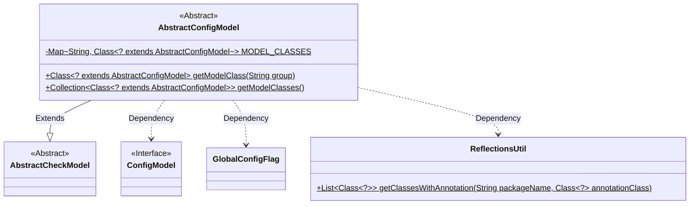
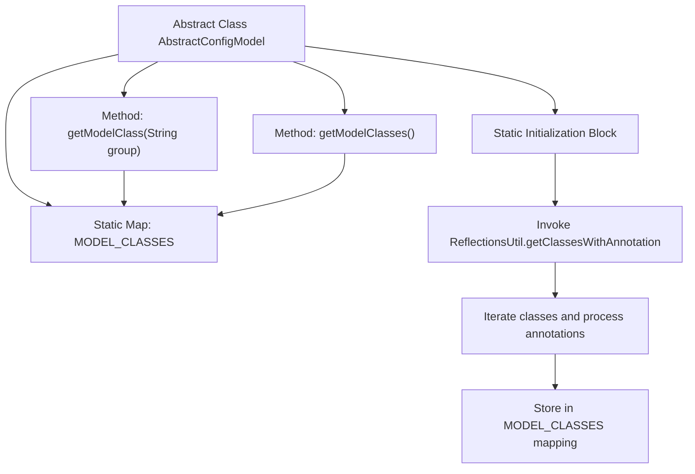

# Basic Information

|      |      |
|------|------|
| Name | AbstractConfigModel |
| Language | .java |
| Code Path | WeFe/serving/serving-service/src/main/java/com/welab/wefe/serving/service/dto/globalconfig/base/AbstractConfigModel.java |
| Package Name | com.welab.wefe.serving.service.dto.globalconfig.base |
| Dependencies | ['com.welab.wefe.common.fieldvalidate.AbstractCheckModel', 'com.welab.wefe.common.util.ReflectionsUtil', 'com.welab.wefe.serving.service.dto.globalconfig.GlobalConfigFlag', 'java.util.Collection', 'java.util.HashMap', 'java.util.List', 'java.util.Map'] |
| Brief Description | The abstract class `AbstractConfigModel` extends `AbstractCheckModel`, collects classes annotated with `@ConfigModel` via reflection, and stores them in a static Map. It provides methods to retrieve model classes either by group name or in their entirety. |

# Description

AbstractConfigModel is an abstract class that inherits from AbstractCheckModel. It uses a static code block to retrieve classes annotated with the ConfigModel annotation through reflection, storing these classes in the static Map MODEL_CLASSES according to the group value specified in the annotation. It provides two static methods: getModelClass retrieves the corresponding class based on the group, while getModelClasses returns all configuration model classes. The entire process utilizes the reflection utility class ReflectionsUtil and the custom annotations ConfigModel and GlobalConfigFlag.

# Class Summary

| Name   | Type  | Description |
|-------|------|-------------|
| AbstractConfigModel | class | The abstract class `AbstractConfigModel` extends `AbstractCheckModel`, retrieves classes annotated with `ConfigModel` through reflection and caches them in a static Map, while providing methods to obtain model classes either by group name or in their entirety. |

## Class AbstractConfigModel

|      |      |
|------|------|
| Access Modifier | public abstract |
| Type | class |
| Name | AbstractConfigModel |
| Description | The abstract class `AbstractConfigModel` extends `AbstractCheckModel`, retrieves classes annotated with `ConfigModel` through reflection and caches them in a static Map, while providing methods to obtain model classes either by group name or in their entirety. |

### UML Class Diagram

Class Diagram Description:
AbstractConfigModel is an abstract class that extends AbstractCheckModel and is used to manage configuration model classes. It utilizes the ReflectionsUtil tool in a static initialization block to scan classes annotated with ConfigModel, storing them in the static MODEL_CLASSES Map grouped by categories. It provides two static methods: one for retrieving model classes by group and another for obtaining all model classes. This class depends on the ConfigModel interface, GlobalConfigFlag class, and ReflectionsUtil utility class.

### Internal Method Call Graph

This code flowchart illustrates the core structure and workflow of the AbstractConfigModel class. The static initialization block uses reflection to fetch classes annotated with @ConfigModel, storing them into the MODEL_CLASSES map grouped by annotation values. The class provides two static methods: getModelClass retrieves the corresponding model class by group name, while getModelCollections returns all registered configuration model classes. The entire process demonstrates an auto-discovery and categorized management mechanism for configuration models, with static initialization ensuring annotation class scanning and registration during class loading.

### Field List

| Name  | Type  | Description |
|-------|-------|------|
| MODEL_CLASSES | Map<String, Class<? extends AbstractConfigModel>> | Private static map with string keys and values of subclasses of AbstractConfigModel. |

### Method List

| Name  | Type  | Description |
|-------|-------|------|
| getModelClass | Class<? extends AbstractConfigModel> | This method returns the corresponding configuration model class based on the input group name by looking it up in a predefined mapping table. |
| getModelClasses | Collection<Class<? extends AbstractConfigModel>> | Retrieve the collection of configuration model classes, returning all stored subclasses of AbstractConfigModel. |

