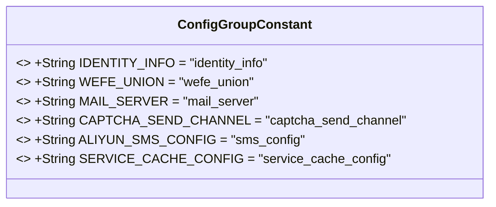
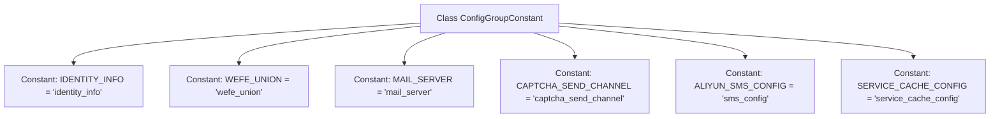

# Basic Information

|      |      |
|------|------|
| Name | ConfigGroupConstant |
| Language | .java |
| Code Path | WeFe/serving/serving-service/src/main/java/com/welab/wefe/serving/service/dto/globalconfig/base/ConfigGroupConstant.java |
| Package Name | com.welab.wefe.serving.service.dto.globalconfig.base |
| Dependencies | [] |
| Brief Description | The ConfigGroupConstant class defines constants for system settings, including identity information, alliance configurations, mail servers, verification code channels, SMS configurations, and service cache configurations. |

# Description

The code defines a public class named `ConfigGroupConstant`, which contains multiple static constant string fields used to represent system configuration group identifiers. The main fields include identity information, alliance settings, mail server, verification code sending channels, Alibaba Cloud SMS configuration, and service cache configuration. These constants are used to uniformly manage the key names of system configurations, facilitating code maintenance and referencing.

# Class Summary

| Name   | Type  | Description |
|-------|------|-------------|
| ConfigGroupConstant | class | The ConfigGroupConstant class defines system configuration constants, including identity information, alliances, mail servers, verification code channels, SMS configurations, and service cache configurations. |

## Class ConfigGroupConstant

|      |      |
|------|------|
| Access Modifier | public |
| Type | class |
| Name | ConfigGroupConstant |
| Description | The ConfigGroupConstant class defines system configuration constants, including identity information, alliances, mail servers, verification code channels, SMS configurations, and service cache configurations. |

### UML Class Diagram

This class diagram illustrates a configuration constant class `ConfigGroupConstant`, which contains six public static immutable string constants for centralized management of system configuration group identifiers. Each constant is named in uppercase and marked with `final` to ensure immutability, with values corresponding to different configuration modules (e.g., identity information, mail service, SMS verification, etc.). This design pattern is commonly used to uniformly maintain system configuration key names, avoiding hardcoding scattered throughout the codebase.

### Internal Method Call Graph

This flowchart illustrates six public static constant strings defined in the ConfigGroupConstant class, which are used to centrally manage configuration group identifiers for the system. Each constant is connected to the class body via arrows, indicating they are member variables of the class. The constants follow UPPER_SNAKE_CASE naming convention with lowercase string values, serving as keys to identify configuration groups for different system modules (e.g., identity information, mail service, captcha channels, etc.). This design pattern is commonly employed in configuration center key-value management to enhance code readability and maintainability.

### Field List

| Name  | Type  | Description |
|-------|-------|------|
| WEFE_UNION = "wefe_union" | String | A public static constant string WEFE_UNION is defined with the value "wefe_union". |
| CAPTCHA_SEND_CHANNEL = "captcha_send_channel" | String | Define the static constant CAPTCHA_SEND_CHANNEL with the value "captcha_send_channel", used to identify the captcha sending channel. |
| MAIL_SERVER = "mail_server" | String | Define the constant string MAIL_SERVER with the value "mail_server". |
| IDENTITY_INFO = "identity_info" | String | Define the static constant IDENTITY_INFO with the value "identity_info". |
| ALIYUN_SMS_CONFIG = "sms_config" | String | Defined a public static constant string ALIYUN_SMS_CONFIG with the value "sms_config". |
| SERVICE_CACHE_CONFIG = "service_cache_config" | String | Define a static constant string SERVICE_CACHE_CONFIG with the value "service_cache_config". |

### Method List

| Name  | Type  | Description |
|-------|-------|------|

