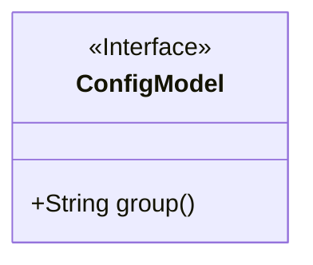
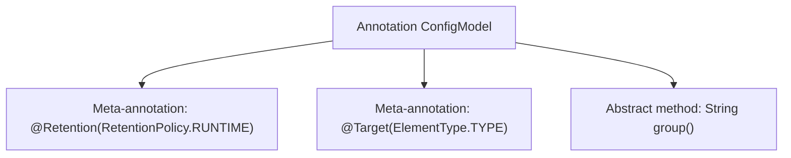

# Basic Information

|      |      |
|------|------|
| Name | ConfigModel |
| Language | .java |
| Code Path | WeFe/serving/serving-service/src/main/java/com/welab/wefe/serving/service/dto/globalconfig/base/ConfigModel.java |
| Package Name | com.welab.wefe.serving.service.dto.globalconfig.base |
| Dependencies | ['java.lang.annotation.ElementType', 'java.lang.annotation.Retention', 'java.lang.annotation.RetentionPolicy', 'java.lang.annotation.Target'] |
| Brief Description | The Java annotation `ConfigModel`, used at the class level, is retained until runtime and requires the `group` parameter to be specified. |

# Description

This is a Java annotation definition named ConfigModel. It uses the meta-annotation @Retention to specify that the annotation is retained at runtime and is restricted by @Target to be applicable only to classes or interfaces. The annotation includes a mandatory string-type attribute called group. This design is typically used to mark configuration classes, enabling grouped configuration management through the group attribute.

# Class Summary

| Name   | Type  | Description |
|-------|------|-------------|
| ConfigModel | annotation | The Java annotation `ConfigModel`, retained at runtime, applies to classes and requires the `group` attribute to be specified. |

## Class ConfigModel

|      |      |
|------|------|
| Access Modifier | @Retention(RetentionPolicy.RUNTIME);@Target(ElementType.TYPE);public |
| Type | annotation |
| Name | ConfigModel |
| Description | The Java annotation `ConfigModel`, retained at runtime, applies to classes and requires the `group` attribute to be specified. |

### UML Class Diagram

This code defines a runtime annotation interface named `ConfigModel`, which is applied at the class level (`ElementType.TYPE`) and includes a mandatory `group` string attribute. In the class diagram, it is represented as an interface marked with `<<Interface>>`, where the public method `group()` corresponds to the annotation's attribute declaration. This design is typically used to mark configuration classes, allowing runtime retrieval of grouping information via reflection mechanisms.

### Internal Method Call Graph

This flowchart illustrates the structure definition of the Java annotation `ConfigModel`. It first specifies through `@Retention` that the annotation is retained at runtime, and `@Target` restricts the annotation to class/interface types only. The core is the declaration of an abstract method named `group`, which serves as the sole configurable attribute of this annotation. The entire design complies with Java annotation syntax conventions, intended to add runtime-readable configuration grouping markers to classes.

### Field List

| Name  | Type  | Description |
|-------|-------|------|
| group | String | Get the group name of the current string. |

### Method List

| Name  | Type  | Description |
|-------|-------|------|

