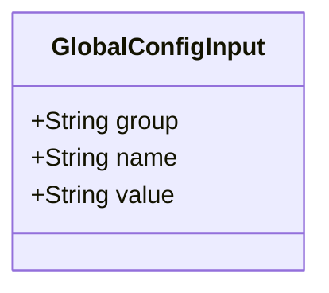
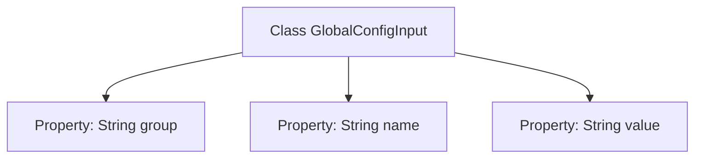

# Basic Information

|      |      |
|------|------|
| Name | GlobalConfigInput |
| Language | .java |
| Code Path | WeFe/serving/serving-service/src/main/java/com/welab/wefe/serving/service/dto/globalconfig/base/GlobalConfigInput.java |
| Package Name | com.welab.wefe.serving.service.dto.globalconfig.base |
| Dependencies | [] |
| Brief Description | The GlobalConfigInput class contains three string attributes: group, name, and value, which are used for configuration item grouping, name, and value. |

# Description

GlobalConfigInput is a public class that contains three member variables of string type: group represents the group to which the configuration belongs, name denotes the name of the configuration item, and value stores the specific value of the configuration. This class is used to encapsulate input information for global configurations.

# Class Summary

| Name   | Type  | Description |
|-------|------|-------------|
| GlobalConfigInput | class | The GlobalConfigInput class contains three string attributes: group, name, and value, which are used for configuration item grouping, name, and value. |

## Class GlobalConfigInput

|      |      |
|------|------|
| Access Modifier | public |
| Type | class |
| Name | GlobalConfigInput |
| Description | The GlobalConfigInput class contains three string attributes: group, name, and value, which are used for configuration item grouping, name, and value. |

### UML Class Diagram

This class diagram depicts a simple configuration input class GlobalConfigInput, containing three public string-type fields: group represents the configuration category, name denotes the configuration item name, and value stores the configuration value. The class defines no methods and serves solely as a data carrier, suitable for basic structures storing global configuration information. Since all fields are public with no encapsulation logic, users should be aware that direct field access may lead to data consistency issues.

### Internal Method Call Graph

This flowchart depicts the structure of the GlobalConfigInput class, which contains three public string properties: group, name, and value. The diagram clearly illustrates the hierarchical relationship between the class and its properties, with each property directly belonging to the GlobalConfigInput class. Since the class only includes property definitions without any methods, the flowchart presents a simple property-level structure without involving method calls or logical flows.

### Field List

| Name  | Type  | Description |
|-------|-------|------|
| group | String | Defined a public string variable group. |
| name | String | Declare a public string variable name. |
| value | String | The publicly accessible string variable `value` in the class. |

### Method List

| Name  | Type  | Description |
|-------|-------|------|

