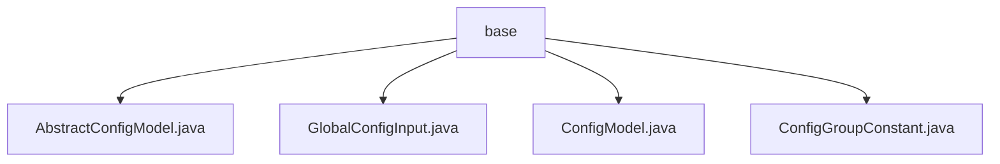

# Basic Information

|      |      |
|------|------|
| Name | base |
| Language | .java |
| Code Path | WeFe/serving/serving-service/src/main/java/com/welab/wefe/serving/service/dto/globalconfig/base |
| Package Name | docs.serving.serving-service.src.main.java.com.welab.wefe.serving.service.dto.globalconfig.base |
| Brief Description | AbstractConfigModel is an abstract class that inherits from AbstractCheckModel, which retrieves classes annotated with ConfigModel via reflection and stores them by group. GlobalConfigInput encapsulates global configuration input information. ConfigModel is a runtime annotation used to mark configuration classes. ConfigGroupConstant defines configuration group constants. |

# Description

## Overview  
This module implements global configuration management functionality, with its core responsibility being the automatic collection of configuration model classes through an annotation-driven mechanism and providing group-based retrieval capabilities. The interface specification includes static methods getModelClass(group) and getModelClasses(), supporting the retrieval of configuration classes by group or all configuration classes. Key data structures include the static Map MODEL_CLASSES for storing configuration classes, the GlobalConfigInput DTO encapsulating configuration inputs, and the grouping constant class ConfigGroupConstant. External dependencies are limited to the reflection utility class ReflectionsUtil. For example, classes marked with the ConfigModel annotation are automatically loaded into the in-memory mapping table.  

## Main Business Scenarios  
The module adopts a registry-like pattern to manage distributed configurations, with business processes covering configuration class registration, group-based queries, and value passing. The interaction mode binds configuration groups (such as identity information, email servers, etc.) through annotations, working in conjunction with constant classes to achieve type-safe access. Typical applications include dynamically loading configuration models for different business domains, such as retrieving the SMS configuration group via ConfigGroupConstant.ALIYUN_SMS. The API type focuses on configuration retrieval, with integration examples demonstrating the collaboration between GlobalConfigInput and annotation-driven configuration models.

### Package Internal Structure View

This flowchart illustrates the file structure under the globalconfig/base directory in the WeFe project. The parent node "base" contains four Java class files: AbstractConfigModel.java, GlobalConfigInput.java, ConfigModel.java, and ConfigGroupConstant.java. These files belong to the foundational DTO classes of the global configuration module, with clear hierarchical relationships and no nested subdirectories.

# File List

| Name   | Type  | Description |
|-------|------|-------------|
| [AbstractConfigModel.java](AbstractConfigModel.md) | file | The abstract class AbstractConfigModel inherits from AbstractCheckModel, collects classes annotated with @ConfigModel via reflection and stores them in a static Map, providing methods to retrieve model classes by group name or all at once. |
| [GlobalConfigInput.java](GlobalConfigInput.md) | file | The GlobalConfigInput class contains three string attributes: group, name, and value, which are used for configuration item grouping, naming, and values. |
| [ConfigModel.java](ConfigModel.md) | file | The Java annotation `ConfigModel`, used at the class level, is retained until runtime and requires the `group` parameter to be specified. |
| [ConfigGroupConstant.java](ConfigGroupConstant.md) | file | The ConfigGroupConstant class defines constants for system settings, including identity information, alliance configuration, mail server, verification code channels, SMS configuration, and service cache configuration. |

