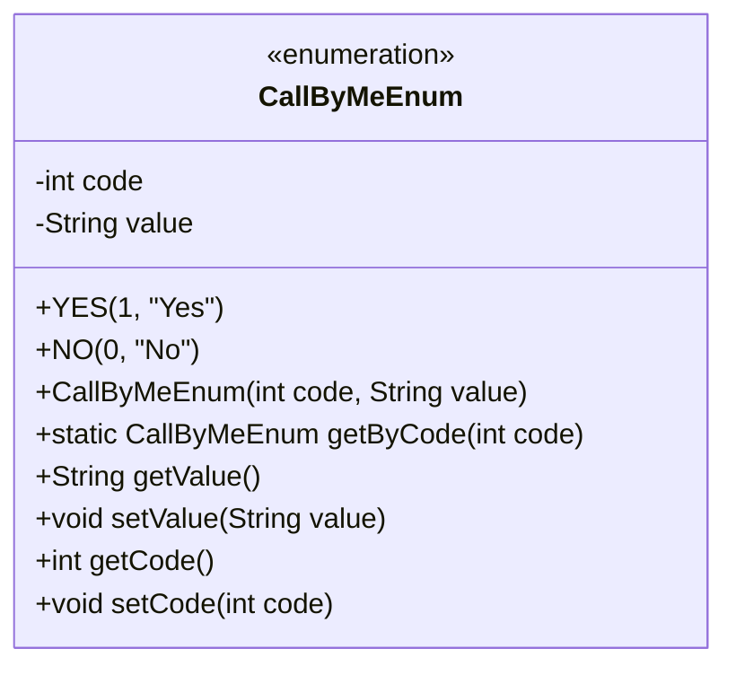
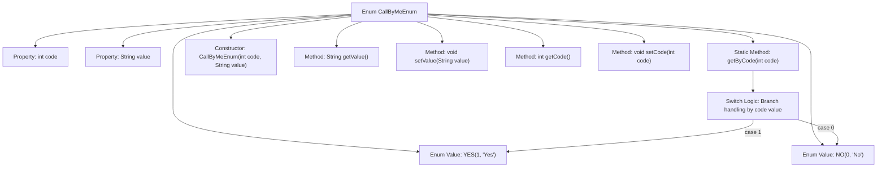

# Basic Information

|      |      |
|------|------|
| Name | CallByMeEnum |
| Language | .java |
| Code Path | WeFe/serving/serving-service/src/main/java/com/welab/wefe/serving/service/enums/CallByMeEnum.java |
| Package Name | com.welab.wefe.serving.service.enums |
| Dependencies | [] |
| Brief Description | The enumeration class CallByMeEnum defines two enum values, YES and NO, corresponding to codes 1 and 0 respectively. It provides a method to retrieve the enum value based on the code, along with functionality to get and set the code and description. |

# Description

This is an enumeration class named CallByMeEnum, containing two enum values YES and NO, corresponding to code 1 and 0 respectively, along with the Chinese descriptions "是" and "否". The enumeration class provides a method getByCode to retrieve the corresponding enum value based on the code, as well as getter and setter methods for obtaining and setting the code and description values. The constructor is used to initialize the code and description of the enum values.

# Class Summary

| Name   | Type  | Description |
|-------|------|-------------|
| CallByMeEnum | enum | The enumeration class CallByMeEnum defines two enumeration values, YES and NO, corresponding to codes 1 and 0 respectively. It provides a method to retrieve the enumeration value based on the code, and includes getter/setter methods for both code and value. |

## Class CallByMeEnum

|      |      |
|------|------|
| Access Modifier | public |
| Type | enum |
| Name | CallByMeEnum |
| Description | The enumeration class CallByMeEnum defines two enumeration values, YES and NO, corresponding to codes 1 and 0 respectively. It provides a method to retrieve the enumeration value based on the code, and includes getter/setter methods for both code and value. |

### UML Class Diagram

This code defines an enumeration type `CallByMeEnum`, which includes two enum values `YES` and `NO`, corresponding to codes 1 and 0 respectively. The enum class provides a method `getByCode` to retrieve enum values by their code, as well as related methods for getting and setting the code and value. Enum classes are commonly used to represent fixed sets of constants, such as states, types, etc.

### Internal Method Call Graph

This flowchart illustrates the structure and logical flow of the CallByMeEnum enumeration. The enum contains two values YES/NO, with code/value properties and corresponding getter/setter methods. The core is the getByCode static method, which returns the corresponding enum instance via a switch statement based on the input code. The constructor initializes enum values, while other methods provide property access and modification capabilities. The overall structure is clear, implementing bidirectional mapping functionality between enum values and numeric codes.

### Field List

| Name  | Type  | Description |
|-------|-------|------|

### Method List

| Name  | Type  | Description |
|-------|-------|------|

