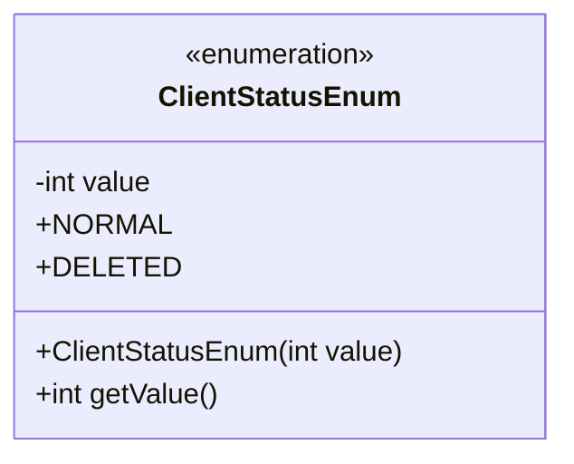
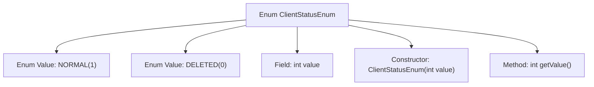

# Basic Information

|      |      |
|------|------|
| Name | ClientStatusEnum |
| Language | .java |
| Code Path | WeFe/serving/serving-service/src/main/java/com/welab/wefe/serving/service/enums/ClientStatusEnum.java |
| Package Name | com.welab.wefe.serving.service.enums |
| Dependencies | [] |
| Brief Description | The enumeration ClientStatusEnum defines two states: NORMAL(1) and DELETED(0), including a constructor and a getValue() method to retrieve the value. |

# Description

The code defines an enumeration type named `ClientStatusEnum`, which includes two enum constants: `NORMAL` and `DELETED`, corresponding to integer values 1 and 0, respectively. The enum class contains a private integer field `value`, initialized via a constructor, and provides a `getValue` method to retrieve the numerical value of the enum constant. This enumeration is used to represent client statuses, where the normal state is 1 and the deleted state is 0.

# Class Summary

| Name   | Type  | Description |
|-------|------|-------------|
| ClientStatusEnum | enum | The enumeration class ClientStatusEnum defines two states: NORMAL(1) and DELETED(0), containing a private field value and a getter method getValue(). |

## Class ClientStatusEnum

|      |      |
|------|------|
| Access Modifier | public |
| Type | enum |
| Name | ClientStatusEnum |
| Description | The enumeration class ClientStatusEnum defines two states: NORMAL(1) and DELETED(0), containing a private field value and a getter method getValue(). |

### UML Class Diagram

This code defines an enumeration type `ClientStatusEnum`, which includes two enum constants `NORMAL(1)` and `DELETED(0)`, each with an integer `value` attribute. The enum class provides a constructor to initialize `value` and contains a public method `getValue()` to retrieve the enum value. This enumeration is used to represent client statuses, where `NORMAL` with a value of 1 indicates the normal state, and `DELETED` with a value of 0 indicates the deleted state. The encapsulation of private fields and public methods in the enumeration type ensures type-safe access to the status values.

### Internal Method Call Graph

This flowchart illustrates the structure of the ClientStatusEnum, which includes two enum values NORMAL and DELETED, a private integer field value, a parameterized constructor for initializing enum values, and a getValue() method to retrieve the corresponding numerical value. The enum binds the passed numerical value to each enum constant through the constructor and provides external access via the getValue() method. This design is commonly used in scenarios requiring mapping between enums and database storage values or business logic code.

### Field List

| Name  | Type  | Description |
|-------|-------|------|

### Method List

| Name  | Type  | Description |
|-------|-------|------|

