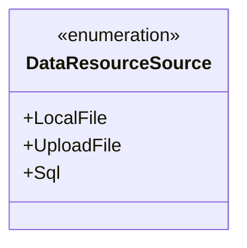
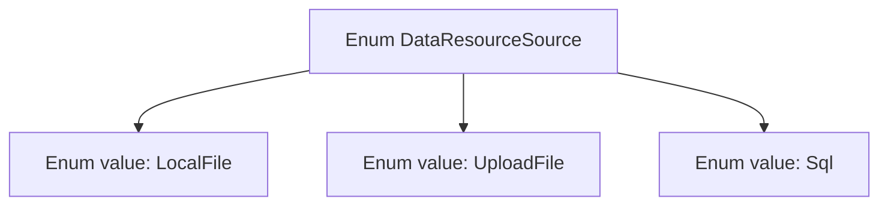

# Basic Information

|      |      |
|------|------|
| Name | DataResourceSource |
| Language | .java |
| Code Path | WeFe/serving/serving-service/src/main/java/com/welab/wefe/serving/service/enums/DataResourceSource.java |
| Package Name | com.welab.wefe.serving.service.enums |
| Dependencies | [] |
| Brief Description | Source of data resource enumeration: local file, uploaded file, SQL. |

# Description

The content defines an enumeration type named DataResourceSource, which includes three enumeration values: LocalFile represents a local file source, UploadFile represents an uploaded file source, and Sql represents a database source. The enumeration type is used to restrict the source types of data resources.

# Class Summary

| Name   | Type  | Description |
|-------|------|-------------|
| DataResourceSource | enum | The enumeration DataResourceSource defines three types of data sources: local files, uploaded files, and SQL databases. |

## Class DataResourceSource

|      |      |
|------|------|
| Access Modifier | public |
| Type | enum |
| Name | DataResourceSource |
| Description | The enumeration DataResourceSource defines three types of data sources: local files, uploaded files, and SQL databases. |

### UML Class Diagram

This code defines an enumeration type named DataResourceSource, containing three enum constants: LocalFile, UploadFile, and Sql. Enumeration types are used to represent a set of fixed constant values, here likely used to identify different types of data sources (local file, uploaded file, or SQL database). The enumeration structure is simple and clear, suitable for scenarios requiring differentiation between data sources, where the enum values can distinctly express the category of data origin.

### Internal Method Call Graph

This flowchart illustrates the structure of the DataResourceSource enum, which includes three enum values: LocalFile represents local file resources, UploadFile represents uploaded file resources, and Sql represents database resources. Enum types ensure type safety through fixed constant values and are commonly used to define limited, predefined option sets in programs, making them suitable for scenarios requiring type identification of resource sources.

### Field List

| Name  | Type  | Description |
|-------|-------|------|

### Method List

| Name  | Type  | Description |
|-------|-------|------|

