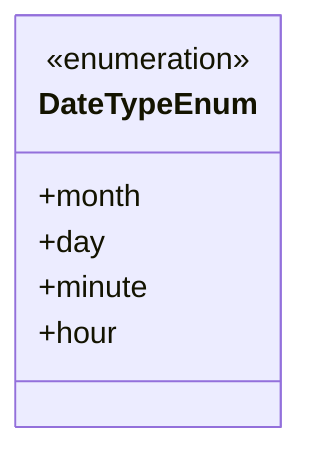
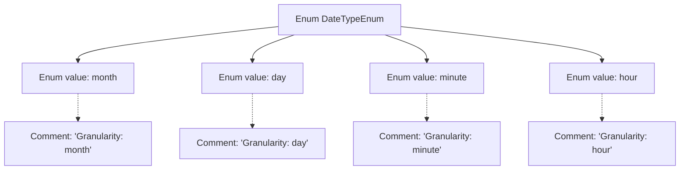

# Basic Information

|      |      |
|------|------|
| Name | DateTypeEnum |
| Language | .java |
| Code Path | WeFe/serving/serving-service/src/main/java/com/welab/wefe/serving/service/enums/DateTypeEnum.java |
| Package Name | com.welab.wefe.serving.service.enums |
| Dependencies | [] |
| Brief Description | The enumeration DateTypeEnum defines date granularity types, including four levels of precision: month, day, hour, and minute. |

# Description

This enumeration defines four types of date granularity: month, day, hour, and minute. Each type is annotated to indicate its temporal precision, with month corresponding to monthly granularity, day to daily granularity, hour to hourly granularity, and minute to minute granularity. This enumeration is used to represent time units of varying precision.

# Class Summary

| Name   | Type  | Description |
|-------|------|-------------|
| DateTypeEnum | enum | The enumeration DateTypeEnum defines four date granularity types: month, day, hour, and minute. |

## Class DateTypeEnum

|      |      |
|------|------|
| Access Modifier | public |
| Type | enum |
| Name | DateTypeEnum |
| Description | The enumeration DateTypeEnum defines four date granularity types: month, day, hour, and minute. |

### UML Class Diagram

This code defines an enumeration type named DateTypeEnum, which includes four time granularities: month, day, minute, and hour. In the class diagram, enumeration types are marked with <<enumeration>>, and each enumeration value is a public static instance of the enumeration class. This enumeration is primarily used to represent and distinguish different levels of time precision, suitable for scenarios that require data processing at varying time granularities, such as logging, statistical analysis, and time-series data processing.

### Internal Method Call Graph

This flowchart illustrates the structure of the DateTypeEnum enum, containing four enum values (month/day/minute/hour) and their corresponding comment descriptions. Each enum value is linked via a dashed arrow to its granularity-defining comment, collectively demonstrating the correspondence between enum definitions and documentation. This design is commonly used to represent time granularity classification scenarios.

### Field List

| Name  | Type  | Description |
|-------|-------|------|

### Method List

| Name  | Type  | Description |
|-------|-------|------|

