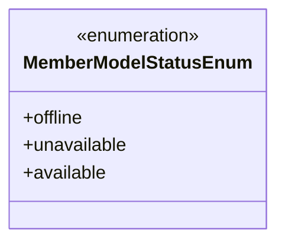
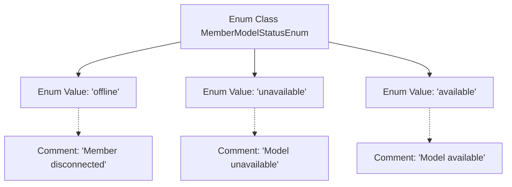

# Basic Information

|      |      |
|------|------|
| Name | MemberModelStatusEnum |
| Language | .java |
| Code Path | WeFe/serving/serving-service/src/main/java/com/welab/wefe/serving/service/enums/MemberModelStatusEnum.java |
| Package Name | com.welab.wefe.serving.service.enums |
| Dependencies | [] |
| Brief Description | Enumeration definition member model states: offline, unavailable, available. |

# Description

This is an enumeration type MemberModelStatusEnum, which defines three member model states. "offline" indicates the member disconnection state, "unavailable" indicates the model unavailable state, and "available" indicates the model available state. Each state has corresponding comments explaining its meaning.

# Class Summary

| Name   | Type  | Description |
|-------|------|-------------|
| MemberModelStatusEnum | enum | Member Model Status Enum: offline, unavailable, available. |

## Class MemberModelStatusEnum

|      |      |
|------|------|
| Access Modifier | public |
| Type | enum |
| Name | MemberModelStatusEnum |
| Description | Member Model Status Enum: offline, unavailable, available. |

### UML Class Diagram

This enumeration class defines three possible states for the member model: `offline` (member disconnected), `unavailable` (model not accessible), and `available` (model ready for use). By using an enumeration type, it ensures type safety for state values, eliminating the need for magic strings. Clear comments explicitly describe the business meaning of each enum value. This design is commonly applied in scenarios requiring fixed value sets, such as state machines or option configurations, thereby enhancing code readability and maintainability.

### Internal Method Call Graph

This flowchart illustrates the structure of the MemberModelStatusEnum enum class, containing three enum values: offline (member disconnected status), unavailable (model unavailable status), and available (model available status). Each enum value is connected via dashed lines to its corresponding comment, clearly presenting the definition and semantics of the status enumeration. This design is commonly used to represent the state machine of system member models, suitable for business scenarios requiring explicit differentiation between various availability states.

### Field List

| Name  | Type  | Description |
|-------|-------|------|

### Method List

| Name  | Type  | Description |
|-------|-------|------|

