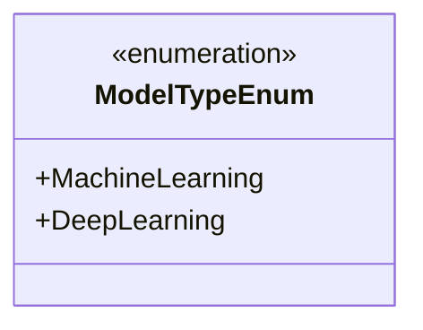
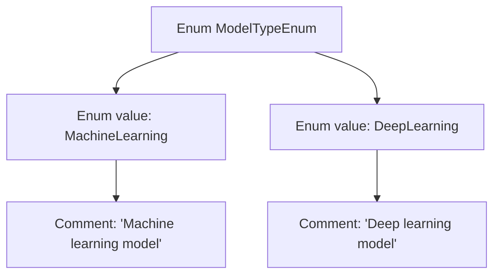

# Basic Information

|      |      |
|------|------|
| Name | ModelTypeEnum |
| Language | .java |
| Code Path | WeFe/serving/serving-service/src/main/java/com/welab/wefe/serving/service/enums/ModelTypeEnum.java |
| Package Name | com.welab.wefe.serving.service.enums |
| Dependencies | [] |
| Brief Description | The enumeration defines two types of models: machine learning and deep learning. |

# Description

The content defines an enumeration type named ModelTypeEnum, which includes two enumeration values: MachineLearning represents machine learning models, and DeepLearning represents deep learning models. The enumeration provides comments explaining the specific meaning of each value.

# Class Summary

| Name   | Type  | Description |
|-------|------|-------------|
| ModelTypeEnum | enum | The enumeration defines two model types: machine learning and deep learning. |

## Class ModelTypeEnum

|      |      |
|------|------|
| Access Modifier | public |
| Type | enum |
| Name | ModelTypeEnum |
| Description | The enumeration defines two model types: machine learning and deep learning. |

### UML Class Diagram

This code defines an enumeration class `ModelTypeEnum` containing two enum constants: `MachineLearning` (machine learning model) and `DeepLearning` (deep learning model). The enumeration class is used to represent a fixed set of constant values, here distinguishing between two different types of models. The `<<enumeration>>` tag explicitly marks its enumeration type characteristic, with public enum constants directly listed as class members, conforming to the standard representation of enumeration types.

### Internal Method Call Graph

This flowchart illustrates the structure of the ModelTypeEnum enumeration, which includes two enum values: MachineLearning and DeepLearning. Each enum value has a corresponding comment in English describing its type. MachineLearning represents a machine learning model, while DeepLearning represents a deep learning model. This enumeration design is commonly used to distinguish between different types of models, facilitating clear usage scenarios and type checking in code.

### Field List

| Name  | Type  | Description |
|-------|-------|------|

### Method List

| Name  | Type  | Description |
|-------|-------|------|

