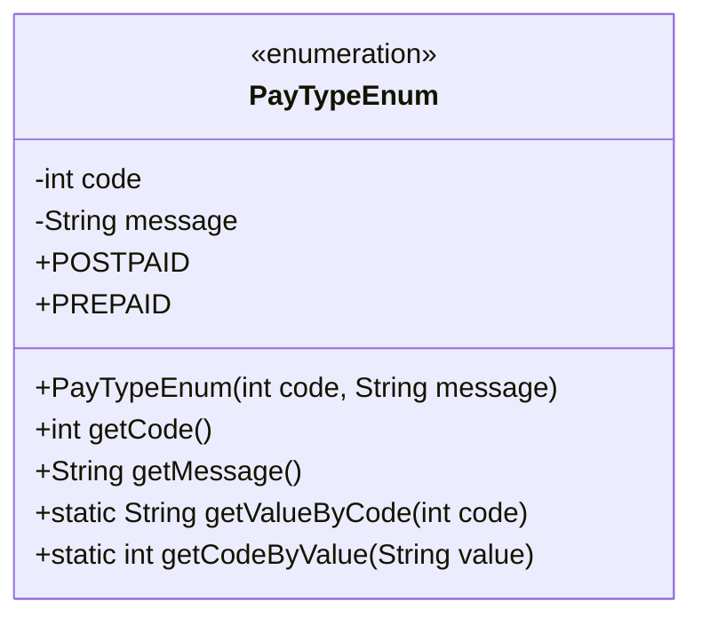
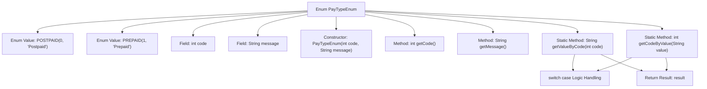

# Basic Information

|      |      |
|------|------|
| Name | PayTypeEnum |
| Language | .java |
| Code Path | WeFe/serving/serving-service/src/main/java/com/welab/wefe/serving/service/enums/PayTypeEnum.java |
| Package Name | com.welab.wefe.serving.service.enums |
| Dependencies | [] |
| Brief Description | Define the payment type enumeration, including post-paid and pre-paid types, and provide methods for converting between code and description. |

# Description

The enumeration class defines two payment types: postpaid and prepaid. Postpaid corresponds to code 0, while prepaid corresponds to code 1. The class provides methods to retrieve codes and descriptions, as well as methods to look up corresponding values by code or description. All methods are static and can be called directly.

# Class Summary

| Name   | Type  | Description |
|-------|------|-------------|
| PayTypeEnum | enum | The enumeration class PayTypeEnum defines two payment types: postpaid and prepaid, including code and description, and provides methods to retrieve the description based on the code and the code based on the description. |

## Class PayTypeEnum

|      |      |
|------|------|
| Access Modifier | public |
| Type | enum |
| Name | PayTypeEnum |
| Description | The enumeration class PayTypeEnum defines two payment types: postpaid and prepaid, including code and description, and provides methods to retrieve the description based on the code and the code based on the description. |

### UML Class Diagram

This code defines an enumeration class `PayTypeEnum` to represent payment types, including postpaid (POSTPAID) and prepaid (PREPAID). The enumeration class maintains two private attributes, `code` and `message`, which represent the payment type code and description information, respectively. It provides methods to retrieve `code` and `message`, as well as static methods to get `message` by `code` and `code` by `message`. The enumeration class initializes two enumeration constants via a constructor, each with corresponding `code` and `message` values.

### Internal Method Call Graph

This flowchart illustrates the structure and functionality of the PayTypeEnum. The enum contains two values, POSTPAID and PREPAID, each with code and message attributes. These attributes are initialized via the constructor, with getCode() and getMessage() methods provided to retrieve their values. The static methods getValueByCode() and getCodeByValue() implement bidirectional conversion between code and message using switch-case logic, ultimately returning the processed result. The entire design enables bidirectional querying between payment type codes and their descriptions.

### Field List

| Name  | Type  | Description |
|-------|-------|------|

### Method List

| Name  | Type  | Description |
|-------|-------|------|

