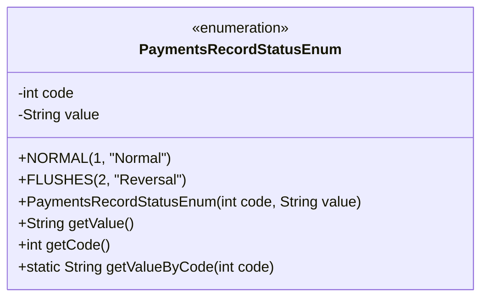
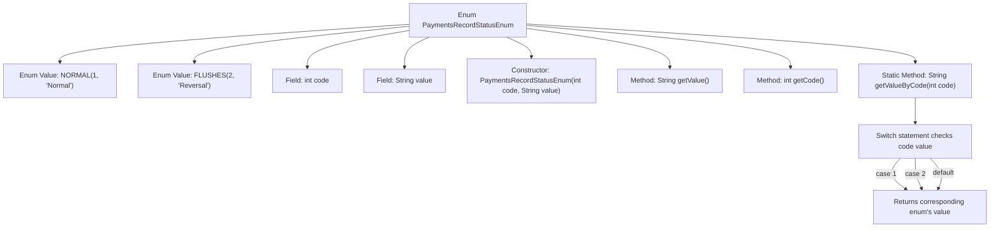

# Basic Information

|      |      |
|------|------|
| Name | PaymentsRecordStatusEnum |
| Language | .java |
| Code Path | WeFe/serving/serving-service/src/main/java/com/welab/wefe/serving/service/enums/PaymentsRecordStatusEnum.java |
| Package Name | com.welab.wefe.serving.service.enums |
| Dependencies | [] |
| Brief Description | Payment record status enumeration class, including normal and reversal statuses, corresponding to codes 1 and 2 respectively, with a method provided to retrieve status descriptions based on the code. |

# Description

This is an enumeration class named PaymentsRecordStatusEnum, used to define the status of payment records. It contains two enumeration values: NORMAL (normal) and FLUSHES (reversal), corresponding to codes 1 and 2 respectively. Each enumeration value has two attributes, code and value, initialized via the constructor. The class provides getValue and getCode methods to retrieve attribute values, as well as a static method getValueByCode to obtain the corresponding value based on the code.

# Class Summary

| Name   | Type  | Description |
|-------|------|-------------|
| PaymentsRecordStatusEnum | enum | Payment record status enumeration class, containing two statuses: normal and reversal, corresponding to codes 1 and 2 respectively, and providing a method to retrieve the status value based on the code. |

## Class PaymentsRecordStatusEnum

|      |      |
|------|------|
| Access Modifier | public |
| Type | enum |
| Name | PaymentsRecordStatusEnum |
| Description | Payment record status enumeration class, containing two statuses: normal and reversal, corresponding to codes 1 and 2 respectively, and providing a method to retrieve the status value based on the code. |

### UML Class Diagram

This code defines an enumeration class `PaymentsRecordStatusEnum` to represent payment record statuses. The enumeration includes two instances: `NORMAL` (Normal) and `FLUSHES` (Reversal), each with a corresponding status code (code) and description value (value). The class provides methods to retrieve the value and code, as well as a static method `getValueByCode` to obtain the corresponding description value based on the status code. The enumeration class initializes its internal state via a private constructor, encapsulating the mapping relationship between status codes and descriptive information.

### Internal Method Call Graph

This flowchart illustrates the structure and functionality of the PaymentsRecordStatusEnum. The enum contains two instances, NORMAL and FLUSHES, each with code and value attributes. The constructor initializes these two attributes, while the getValue() and getCode() methods return the value and code respectively. The static method getValueByCode() uses a switch statement to return the corresponding value based on the input code. The flowchart clearly depicts the complete logical path from method invocation to result return.

### Field List

| Name  | Type  | Description |
|-------|-------|------|

### Method List

| Name  | Type  | Description |
|-------|-------|------|

