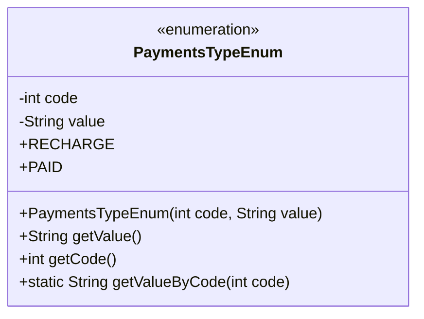
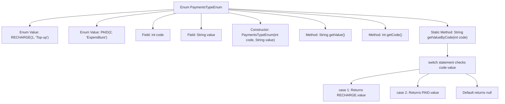

# Basic Information

|      |      |
|------|------|
| Name | PaymentsTypeEnum |
| Language | .java |
| Code Path | WeFe/serving/serving-service/src/main/java/com/welab/wefe/serving/service/enums/PaymentsTypeEnum.java |
| Package Name | com.welab.wefe.serving.service.enums |
| Dependencies | [] |
| Brief Description | The enumeration class PaymentsTypeEnum defines payment types, including recharge (RECHARGE) and expenditure (PAID), providing code-to-value mapping and query methods. |

# Description

This is an enumeration class named PaymentsTypeEnum, used to define payment types. It contains two enumeration constants: RECHARGE (top-up) and PAID (expenditure), each with an integer code and a string value. The class provides a constructor, methods to retrieve the value and code, as well as a static method getValueByCode, which returns the corresponding value based on the input code. When the code is 1, it returns "top-up"; when the code is 2, it returns "expenditure"; otherwise, it returns null.

# Class Summary

| Name   | Type  | Description |
|-------|------|-------------|
| PaymentsTypeEnum | enum | The enumeration class `PaymentsTypeEnum` defines payment types, including recharge (`RECHARGE`) and expenditure (`PAID`). It provides methods to retrieve `code` and `value`, as well as the functionality to obtain `value` through `code`. |

## Class PaymentsTypeEnum

|      |      |
|------|------|
| Access Modifier | public |
| Type | enum |
| Name | PaymentsTypeEnum |
| Description | The enumeration class `PaymentsTypeEnum` defines payment types, including recharge (`RECHARGE`) and expenditure (`PAID`). It provides methods to retrieve `code` and `value`, as well as the functionality to obtain `value` through `code`. |

### UML Class Diagram

This code defines an enumeration class `PaymentsTypeEnum`, which includes two enum constants `RECHARGE` and `PAID`, representing recharge and payment types respectively. Each enum constant has corresponding `code` and `value` attributes, initialized via the constructor. The class provides methods to retrieve `value` and `code`, as well as a static method `getValueByCode` that returns the corresponding `value` based on the input `code`. Enumeration classes are ideal for representing a fixed set of constants, offering concise and type-safe code.

### Internal Method Call Graph

This flowchart illustrates the structure and logical flow of the PaymentsTypeEnum. The enum contains two instances RECHARGE and PAID, each with code and value fields initialized via constructor. It provides getValue() and getCode() methods to retrieve field values, and a static getValueByCode() method that returns the corresponding value based on code via switch-case. The diagram clearly presents enum definition, field access, and branching logic of static methods, comprehensively covering all critical paths of the code.

### Field List

| Name  | Type  | Description |
|-------|-------|------|

### Method List

| Name  | Type  | Description |
|-------|-------|------|

