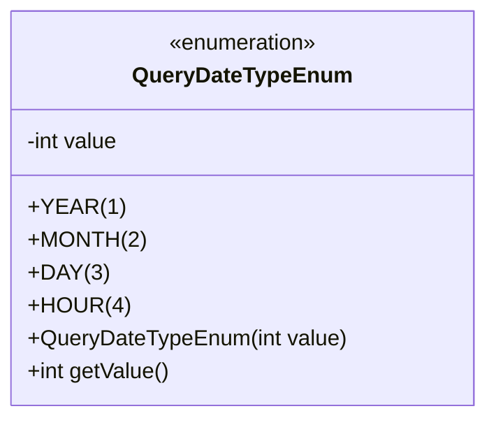
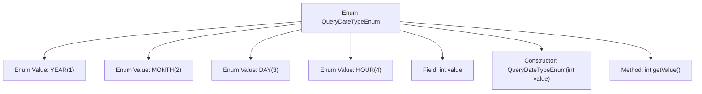

# Basic Information

|      |      |
|------|------|
| Name | QueryDateTypeEnum |
| Language | .java |
| Code Path | WeFe/serving/serving-service/src/main/java/com/welab/wefe/serving/service/enums/QueryDateTypeEnum.java |
| Package Name | com.welab.wefe.serving.service.enums |
| Dependencies | [] |
| Brief Description | The enumeration class QueryDateTypeEnum defines four date query types: YEAR(1), MONTH(2), DAY(3), HOUR(4), each corresponding to an integer value that can be retrieved via the getValue() method. |

# Description

This is an enumeration class named QueryDateTypeEnum, which defines four date query types: YEAR (value 1), MONTH (value 2), DAY (value 3), and HOUR (value 4). Each enumeration constant has a corresponding integer value initialized via the constructor and provides a getValue method to retrieve this value. This enumeration is used to represent different time granularities, facilitating date-related query operations in the program.

# Class Summary

| Name   | Type  | Description |
|-------|------|-------------|
| QueryDateTypeEnum | enum | The enumeration class QueryDateTypeEnum defines four date query types: YEAR(1), MONTH(2), DAY(3), HOUR(4). Each enumeration value corresponds to an integer value, which can be obtained through the getValue() method. |

## Class QueryDateTypeEnum

|      |      |
|------|------|
| Access Modifier | public |
| Type | enum |
| Name | QueryDateTypeEnum |
| Description | The enumeration class QueryDateTypeEnum defines four date query types: YEAR(1), MONTH(2), DAY(3), HOUR(4). Each enumeration value corresponds to an integer value, which can be obtained through the getValue() method. |

### UML Class Diagram

This code defines an enumeration type named `QueryDateTypeEnum`, containing four predefined constants (YEAR, MONTH, DAY, HOUR), each associated with an integer value. The enum class stores the numeric value via the private field `value`, initializes it through a constructor, and provides the public method `getValue()` to retrieve the value. The enumeration type is used to represent fixed time granularity types, achieving type identification through numeric mapping. It is suitable for scenarios requiring strictly defined value ranges, such as time query parameter validation or database field type tagging.

### Internal Method Call Graph

This code defines an enum type named QueryDateTypeEnum, which includes four enum values: YEAR, MONTH, DAY, and HOUR, each with a corresponding integer value. The enum class contains a private field `value`, a constructor for initializing `value`, and a public method `getValue()` to retrieve the integer value associated with the enum value. This enum is used to represent different date query types, with each type identified by an integer value.

### Field List

| Name  | Type  | Description |
|-------|-------|------|

### Method List

| Name  | Type  | Description |
|-------|-------|------|

