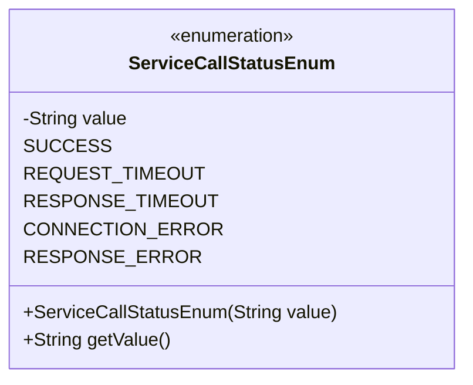
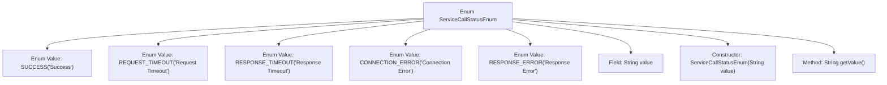

# Basic Information

|      |      |
|------|------|
| Name | ServiceCallStatusEnum |
| Language | .java |
| Code Path | WeFe/serving/serving-service/src/main/java/com/welab/wefe/serving/service/enums/ServiceCallStatusEnum.java |
| Package Name | com.welab.wefe.serving.service.enums |
| Dependencies | [] |
| Brief Description | The enumeration class defines service call statuses, including five states: success, request timeout, response timeout, request failure, and response error, with each state corresponding to a Chinese description. |

# Description

This is an enumeration class named ServiceCallStatusEnum, which defines five service call statuses: success, request timeout, response timeout, request failure, and response error. Each enum value is associated with a Chinese description string and initialized through a constructor. The class provides a getValue method to retrieve the status description. This enumeration is used to represent different result states of service calls.

# Class Summary

| Name   | Type  | Description |
|-------|------|-------------|
| ServiceCallStatusEnum | enum | The enumeration class ServiceCallStatusEnum defines the status of service calls: success, request timeout, response timeout, request failure, and response error, with each status having a corresponding descriptive value. |

## Class ServiceCallStatusEnum

|      |      |
|------|------|
| Access Modifier | public |
| Type | enum |
| Name | ServiceCallStatusEnum |
| Description | The enumeration class ServiceCallStatusEnum defines the status of service calls: success, request timeout, response timeout, request failure, and response error, with each status having a corresponding descriptive value. |

### UML Class Diagram

This class diagram describes an enumeration class named ServiceCallStatusEnum, which defines five service call statuses (SUCCESS, REQUEST_TIMEOUT, RESPONSE_TIMEOUT, CONNECTION_ERROR, and RESPONSE_ERROR). Each enumeration instance is associated with a descriptive string value. The class contains a private field 'value' for storing status descriptions, a constructor method for initializing this field, and a public method getValue() for retrieving status descriptions. The enumeration class is explicitly marked with the <<enumeration>> stereotype to identify its type.

### Internal Method Call Graph

This flowchart illustrates the structure of the ServiceCallStatusEnum, which includes five predefined enum instances (SUCCESS, REQUEST_TIMEOUT, etc.), each initialized with corresponding Chinese descriptions via the constructor. The enum class contains a private `value` field and a public `getValue()` method to retrieve the descriptive text of the enum value. This design is commonly used to standardize service call statuses, ensuring type safety through enums while providing readable status descriptions.

### Field List

| Name  | Type  | Description |
|-------|-------|------|

### Method List

| Name  | Type  | Description |
|-------|-------|------|

