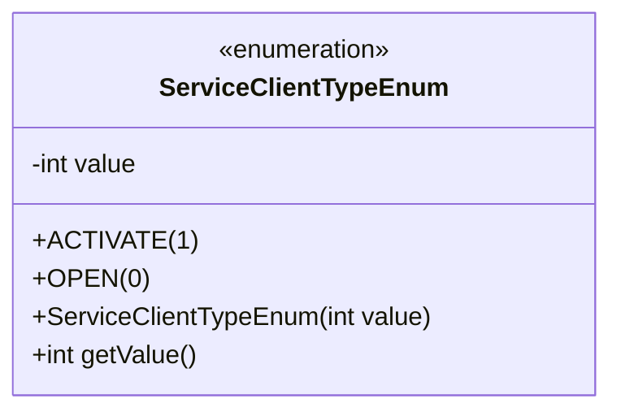
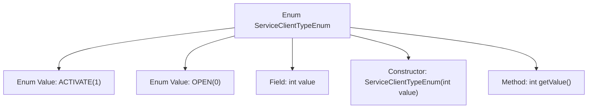

# Basic Information

|      |      |
|------|------|
| Name | ServiceClientTypeEnum |
| Language | .java |
| Code Path | WeFe/serving/serving-service/src/main/java/com/welab/wefe/serving/service/enums/ServiceClientTypeEnum.java |
| Package Name | com.welab.wefe.serving.service.enums |
| Dependencies | [] |
| Brief Description | The enumeration ServiceClientTypeEnum defines two types of service clients: ACTIVATE(1) and OPEN(0), including a constructor and a method to retrieve the value. |

# Description

This is a Java enum class named ServiceClientTypeEnum, which defines two enum constants: ACTIVATE and OPEN. ACTIVATE corresponds to the integer value 1, representing activation, while OPEN corresponds to the integer value 0, representing opening. The enum class includes a private integer field named value, initialized via a constructor, and provides a getValue method to retrieve this value. This enum is used to represent the type status of a service client.

# Class Summary

| Name   | Type  | Description |
|-------|------|-------------|
| ServiceClientTypeEnum | enum | The enumeration ServiceClientTypeEnum defines two service types: ACTIVATE(1) indicates activation, and OPEN(0) indicates opening. It includes a constructor and methods for retrieving values. |

## Class ServiceClientTypeEnum

|      |      |
|------|------|
| Access Modifier | public |
| Type | enum |
| Name | ServiceClientTypeEnum |
| Description | The enumeration ServiceClientTypeEnum defines two service types: ACTIVATE(1) indicates activation, and OPEN(0) indicates opening. It includes a constructor and methods for retrieving values. |

### UML Class Diagram

This code defines an enumeration type named ServiceClientTypeEnum, which includes two enum constants ACTIVATE and OPEN, corresponding to integer values 1 and 0 respectively. The enum class has a private field 'value' to store the numeric value, initialized via a constructor, and provides a getValue() method to retrieve the value. This design is commonly used to represent limited and fixed service client types, ensuring type safety and code readability through enum values.

### Internal Method Call Graph

This code defines an enum type named ServiceClientTypeEnum, containing two enum values ACTIVATE and OPEN, corresponding to integer values 1 and 0 respectively. The enum class has a private field 'value' to store the numeric value, initialized via a constructor, and provides a getValue() method to retrieve the value. The flowchart illustrates the hierarchical relationship between the enum structure, fields, constructor, and member methods, demonstrating the association between enum value definitions and their internal implementation.

### Field List

| Name  | Type  | Description |
|-------|-------|------|

### Method List

| Name  | Type  | Description |
|-------|-------|------|

