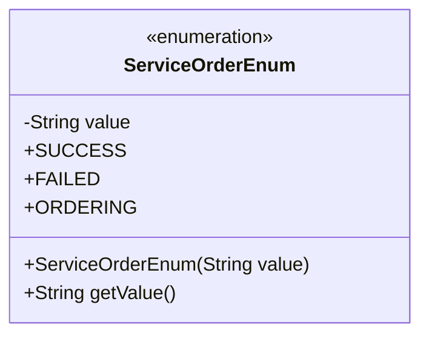
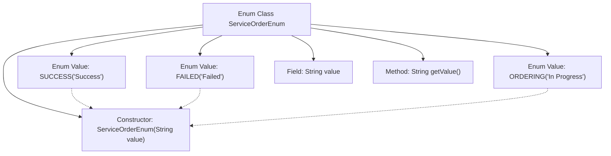

# Basic Information

|      |      |
|------|------|
| Name | ServiceOrderEnum |
| Language | .java |
| Code Path | WeFe/serving/serving-service/src/main/java/com/welab/wefe/serving/service/enums/ServiceOrderEnum.java |
| Package Name | com.welab.wefe.serving.service.enums |
| Dependencies | [] |
| Brief Description | Define the enumeration class ServiceOrderEnum, which includes three states: success, failure, and in progress. Each state corresponds to a string value and can be obtained through the getValue method. |

# Description

This is an enumeration class named ServiceOrderEnum, which defines three service order states: SUCCESS, FAILED, and ORDERING (in progress). Each enum value has a corresponding Chinese description string, initialized via the constructor, and provides a getValue method to retrieve the description value. This enumeration is used to represent different states of a service order.

# Class Summary

| Name   | Type  | Description |
|-------|------|-------------|
| ServiceOrderEnum | enum | The ServiceOrderEnum enumeration defines three order statuses: success, failure, and in progress, with each status corresponding to a descriptive value. |

## Class ServiceOrderEnum

|      |      |
|------|------|
| Access Modifier | public |
| Type | enum |
| Name | ServiceOrderEnum |
| Description | The ServiceOrderEnum enumeration defines three order statuses: success, failure, and in progress, with each status corresponding to a descriptive value. |

### UML Class Diagram

This class diagram describes an enumeration type named ServiceOrderEnum, which includes three enumeration constants: SUCCESS, FAILED, and ORDERING. Each enumeration constant is associated with a string value, stored via the private field `value` and accessed through the public method `getValue()`. The enumeration's constructor is private, used to initialize these string values. This design concisely encapsulates service order states and their descriptive information, suitable for scenarios requiring explicitly defined state values.

### Internal Method Call Graph

This flowchart illustrates the structure of the ServiceOrderEnum enum class, which includes three enum values (SUCCESS/FAILED/ORDERING), a private field 'value', a constructor, and a getValue() method. The enum values are initialized via the constructor. Arrows denote the ownership relationship between the class and its members, while dashed arrows indicate implicit constructor calls by the enum values.

### Field List

| Name  | Type  | Description |
|-------|-------|------|

### Method List

| Name  | Type  | Description |
|-------|-------|------|

