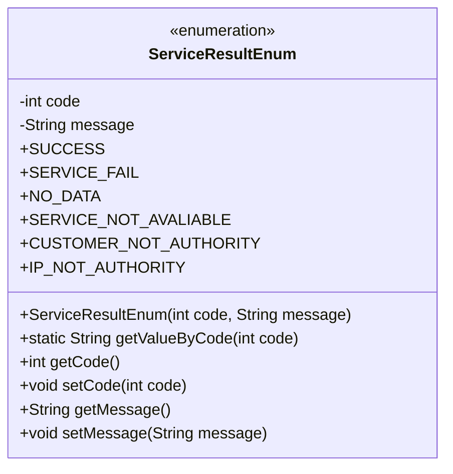
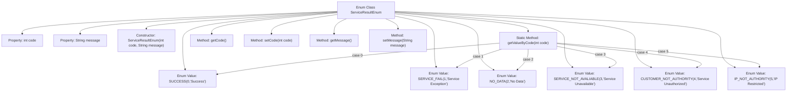

# Basic Information

|      |      |
|------|------|
| Name | ServiceResultEnum |
| Language | .java |
| Code Path | WeFe/serving/serving-service/src/main/java/com/welab/wefe/serving/service/enums/ServiceResultEnum.java |
| Package Name | com.welab.wefe.serving.service.enums |
| Dependencies | [] |
| Brief Description | The ServiceResultEnum defines six service result status codes and messages, including success, service exception, no data, etc., and provides a method to retrieve messages based on status codes. |

# Description

This is an enumeration class ServiceResultEnum, which defines 6 service result status codes and their corresponding messages. The status codes include 0 for success, 1 for service exception, 2 for no data, 3 for service unavailable, 4 for service unauthorized, and 5 for IP restricted. The class contains a constructor to initialize the status code and message, provides the getValueByCode method to retrieve the message by status code, as well as getter and setter methods for each attribute.

# Class Summary

| Name   | Type  | Description |
|-------|------|-------------|
| ServiceResultEnum | enum | Define a service result enumeration containing 6 status codes and corresponding messages: Success(0), Service Exception(1), No Data(2), Service Unavailable(3), Unauthorized(4), IP Restricted(5). Provide a method to retrieve the message by status code. |

## Class ServiceResultEnum

|      |      |
|------|------|
| Access Modifier | public |
| Type | enum |
| Name | ServiceResultEnum |
| Description | Define a service result enumeration containing 6 status codes and corresponding messages: Success(0), Service Exception(1), No Data(2), Service Unavailable(3), Unauthorized(4), IP Restricted(5). Provide a method to retrieve the message by status code. |

### UML Class Diagram

This code defines an enumeration class named `ServiceResultEnum`, which represents various result states of service calls. The enumeration includes six predefined constants (such as SUCCESS, SERVICE_FAIL, etc.), each associated with a status code and description. The class provides a method `getValueByCode()` to retrieve the description based on the status code, along with conventional getter/setter methods. The constructor of the enumeration is private, used to initialize the code and message fields for each enumeration constant. This design pattern is commonly used to standardize service response states, facilitating unified handling of result feedback across different business scenarios.

### Internal Method Call Graph

This flowchart illustrates the complete structure of the ServiceResultEnum enum class, including 6 predefined enum values, 2 private properties, 1 constructor, and 5 member methods. The core logic resides in the getValueByCode method, which employs a switch-case structure to map numeric codes to corresponding enum value descriptions. All methods revolve around the two core properties (code and message), providing standard getter/setter methods. The overall design serves to uniformly manage service invocation result status codes and descriptive messages.

### Field List

| Name  | Type  | Description |
|-------|-------|------|

### Method List

| Name  | Type  | Description |
|-------|-------|------|

