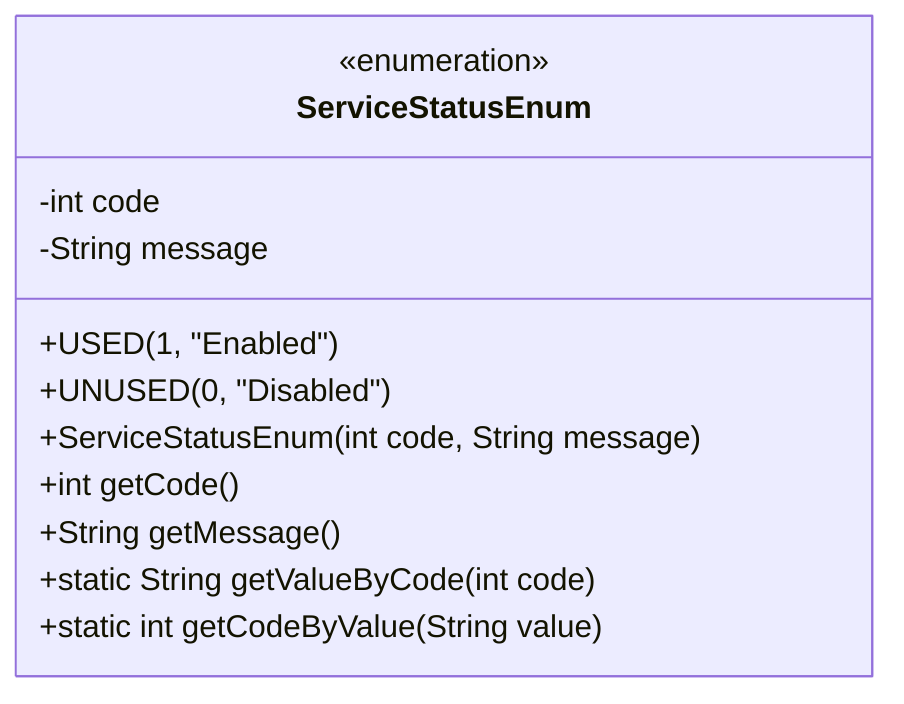
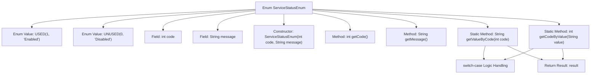

# Basic Information

|      |      |
|------|------|
| Name | ServiceStatusEnum |
| Language | .java |
| Code Path | WeFe/serving/serving-service/src/main/java/com/welab/wefe/serving/service/enums/ServiceStatusEnum.java |
| Package Name | com.welab.wefe.serving.service.enums |
| Dependencies | [] |
| Brief Description | Define a service status enumeration, including enabled and disabled states, providing status codes and descriptions, and supporting mutual queries by code or description. |

# Description

The enumeration class defines service states, including enabled and disabled, corresponding to codes 1 and 0 respectively. It provides methods to retrieve state descriptions by code and obtain codes by description, enabling bidirectional conversion between states and descriptions. The enumeration class includes a private constructor and public methods for retrieving codes and descriptions.

# Class Summary

| Name   | Type  | Description |
|-------|------|-------------|
| ServiceStatusEnum | enum | The enumeration class defines service states, including enabled and disabled, providing status codes and description information, and supports mutual querying by code or description. |

## Class ServiceStatusEnum

|      |      |
|------|------|
| Access Modifier | public |
| Type | enum |
| Name | ServiceStatusEnum |
| Description | The enumeration class defines service states, including enabled and disabled, providing status codes and description information, and supports mutual querying by code or description. |

### UML Class Diagram

This code defines an enumeration class `ServiceStatusEnum` to represent service states. The enumeration includes two instances: `USED` (Enabled) and `UNUSED` (Disabled), each associated with a status code and descriptive message. The class provides methods to retrieve the description by status code (`getValueByCode`) and to obtain the status code by description (`getCodeByValue`). This design is commonly used in system state management and status code conversion scenarios, enhancing code readability and maintainability.

### Internal Method Call Graph

This flowchart illustrates the structure and functionality of the ServiceStatusEnum. The enum contains two instances, USED and UNUSED, representing enabled and disabled states respectively. Each instance includes code and message fields initialized via the constructor. It provides getCode() and getMessage() methods to retrieve field values, along with two static methods, getValueByCode() and getCodeByValue(), for bidirectional conversion between code and message. Internally, switch-case logic handles different cases and returns results.

### Field List

| Name  | Type  | Description |
|-------|-------|------|

### Method List

| Name  | Type  | Description |
|-------|-------|------|

