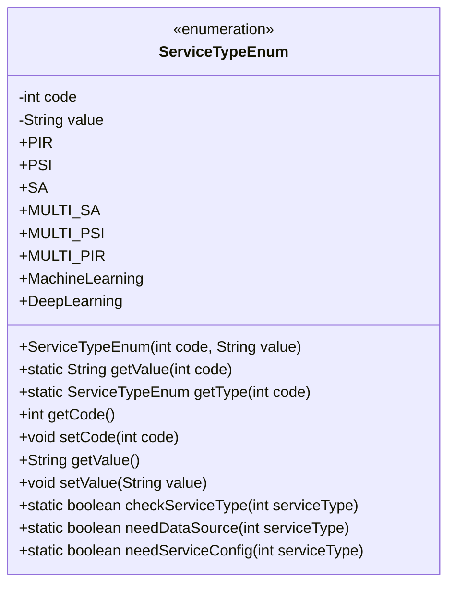

# Basic Information

|      |      |
|------|------|
| Name | ServiceTypeEnum |
| Language | .java |
| Code Path | WeFe/serving/serving-service/src/main/java/com/welab/wefe/serving/service/enums/ServiceTypeEnum.java |
| Package Name | com.welab.wefe.serving.service.enums |
| Dependencies | [] |
| Brief Description | The enumeration class ServiceTypeEnum defines 8 service types, including codes and descriptions. It provides methods to retrieve types and descriptions based on codes, validate service types, and distinguish between types requiring data sources or service configurations. |

# Description

The enumeration class defines eight service types, each with a unique code and description. It includes two-party oblivious query, two-party intersection query, multi-party secure statistics (queried party and querying party), multi-party intersection query, multi-party oblivious query, machine learning, and deep learning models. It provides methods to retrieve the type or description based on the code, as well as to validate whether a service type is valid. Additionally, it includes functional methods to determine if a specific service type requires a data source or service configuration.

# Class Summary

| Name   | Type  | Description |
|-------|------|-------------|
| ServiceTypeEnum | enum | The enumeration class ServiceTypeEnum defines 8 service types, including codes and descriptions. It provides methods to retrieve the type and description based on the code, as well as to validate the service type. It also supports determining whether a data source or service configuration is required. |

## Class ServiceTypeEnum

|      |      |
|------|------|
| Access Modifier | public |
| Type | enum |
| Name | ServiceTypeEnum |
| Description | The enumeration class ServiceTypeEnum defines 8 service types, including codes and descriptions. It provides methods to retrieve the type and description based on the code, as well as to validate the service type. It also supports determining whether a data source or service configuration is required. |

### UML Class Diagram

This code defines an enumeration class `ServiceTypeEnum` to represent different types of services. Each enumeration instance contains an integer `code` and a string `value`, representing the service type's code and description, respectively. The class provides static methods `getValue` and `getType` to retrieve the corresponding description or enumeration instance based on the code, as well as `checkServiceType` to verify whether a service type exists. Additionally, the `needDataSource` and `needServiceConfig` methods are used to determine if a specific service type requires a data source or service configuration. The enumeration class encapsulates service type-related operations, facilitating unified management and usage in the code.

### Internal Method Call Graph

```mermaid
graph TD
    A["Enum ServiceTypeEnum"]
    B["Enum Constant: PIR(1,'Two-party Private Information Retrieval')"]
    C["Enum Constant: PSI(2,'Two-party Private Set Intersection')"]
    D["Enum Constant: SA(3,'Multi-party Secure Aggregation (Data Owner)')"]
    E["Enum Constant: MULTI_SA(4,'Multi-party Secure Aggregation (Query Initiator)')"]
    F["Enum Constant: MULTI_PSI(5,'Multi-party Private Set Intersection')"]
    G["Enum Constant: MULTI_PIR(6,'Multi-party Private Information Retrieval')"]
    H["Enum Constant: MachineLearning(7,'Machine Learning Model')"]
    I["Enum Constant: DeepLearning(8,'Deep Learning Model')"]
    J["Property: int code"]
    K["Property: String value"]
    L["Constructor: ServiceTypeEnum(int code, String value)"]
    M["Static Method: getValue(int code)"]
    N["Static Method: getType(int code)"]
    O["Method: getCode()/setCode(int)"]
    P["Method: getValue()/setValue(String)"]
    Q["Static Method: checkServiceType(int)"]
    R["Static Method: needDataSource(int)"]
    S["Static Method: needServiceConfig(int)"]

    A --> B
    A --> C
    A --> D
    A --> E
    A --> F
    A --> G
    A --> H
    A --> I
    A --> J
    A --> K
    A --> L
    A --> M
    A --> N
    A --> O
    A --> P
    A --> Q
    A --> R
    A --> S
```

This flowchart illustrates the complete structure of the ServiceTypeEnum enum class, including 8 predefined service type constants, core properties, and methods. The enum stores service type information via code-value key-value pairs, provides static methods for converting codes to values/enum instances, and includes business validation methods such as checkServiceType() and needDataSource(). All methods operate around the code-value properties, forming a comprehensive service type management utility.

### Field List

| Name  | Type  | Description |
|-------|-------|------|

### Method List

| Name  | Type  | Description |
|-------|-------|------|

