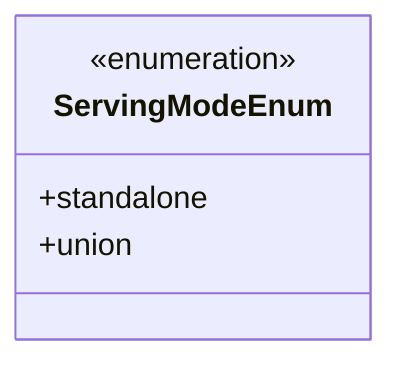
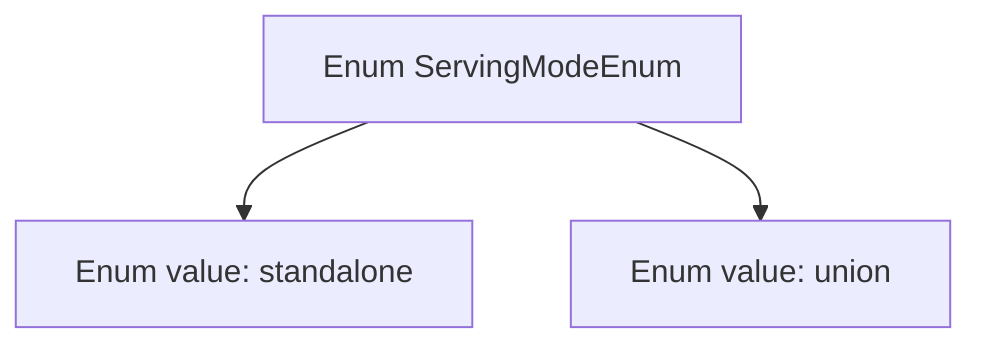

# Basic Information

|      |      |
|------|------|
| Name | ServingModeEnum |
| Language | .java |
| Code Path | WeFe/serving/serving-service/src/main/java/com/welab/wefe/serving/service/enums/ServingModeEnum.java |
| Package Name | com.welab.wefe.serving.service.enums |
| Dependencies | [] |
| Brief Description | The enumeration defines two service modes: standalone and union. |

# Description

The content defines a public enumeration type named ServingModeEnum, which includes two enumeration values: standalone represents the independent mode, and union represents the federated mode. The enumeration is used to indicate two different configuration states during service runtime.

# Class Summary

| Name   | Type  | Description |
|-------|------|-------------|
| ServingModeEnum | enum | The enumeration defines two service modes: standalone operation and union operation. |

## Class ServingModeEnum

|      |      |
|------|------|
| Access Modifier | public |
| Type | enum |
| Name | ServingModeEnum |
| Description | The enumeration defines two service modes: standalone operation and union operation. |

### UML Class Diagram

This code defines an enumeration type named `ServingModeEnum`, containing two enum constants: `standalone` and `union`. Enumeration types are used to represent a fixed set of constant values, here likely indicating two different operational modes of a service. The class diagram uses the `<<enumeration>>` stereotype to explicitly denote this as an enumeration type, listing all its public enum values. This simple enumeration structure is suitable for scenarios requiring clear distinction between service modes.

### Internal Method Call Graph

This code defines an enumeration type named ServingModeEnum, containing two enum values: standalone and union. Enumerations are commonly used to represent a fixed set of constants, here likely used to identify two operational modes of a service. The flowchart clearly illustrates the hierarchical relationship between the enumeration type and its values, with standalone and union existing as direct members of ServingModeEnum without additional methods or attributes. This structure is suitable for scenarios requiring strictly limited value ranges, such as configuring service deployment modes.

### Field List

| Name  | Type  | Description |
|-------|-------|------|

### Method List

| Name  | Type  | Description |
|-------|-------|------|

