# Basic Information

|      |      |
|------|------|
| Name | enums |
| Language | .java |
| Code Path | WeFe/serving/serving-service/src/main/java/com/welab/wefe/serving/service/enums |
| Package Name | docs.serving.serving-service.src.main.java.com.welab.wefe.serving.service.enums |
| Brief Description | The DataResourceSource enum defines data source types: local file, uploaded file, database. The ServiceTypeEnum enum defines eight service types, including query statistics and model services. The MemberModelStatusEnum enum defines member model states: offline, unavailable, available. The DateTypeEnum enum defines four date granularities: month, day, hour, minute. The ServiceOrderEnum enum defines three order statuses: success, failure, in progress. The CallByMeEnum enum defines whether to call: yes, no. The ModelTypeEnum enum defines model types: machine learning, deep learning. The ServiceResultEnum enum defines six service result status codes. The PaymentsRecordStatusEnum enum defines payment statuses: normal, reversal. The PayTypeEnum enum defines two payment types: postpaid, prepaid. The QueryDateTypeEnum enum defines four date query types. The ServingModeEnum enum defines service modes: independent, joint. The ServiceClientTypeEnum enum defines client types: activated, opened. The ServiceStatusEnum enum defines service statuses: enabled, disabled. The ClientStatusEnum enum defines client statuses: normal, deleted. The ServiceCallStatusEnum enum defines five call statuses. The PaymentsTypeEnum enum defines payment types: recharge, expenditure. |

# Description

## Overview  
This module systematically defines core states and types in the field of service governance through enumerated types, managing the lifecycle of business entities in a unified manner similar to a state machine pattern. It includes three key data structures: service types (e.g., two-party privacy-preserving queries), state enumerations (e.g., order status), and configuration types (e.g., payment methods). External dependencies are limited to the basic Java environment, with no third-party libraries. For example, `ServiceTypeEnum` defines 8 service types, while `PayTypeEnum` distinguishes between prepaid and postpaid billing.  

## Key Business Scenarios  
The module supports end-to-end management of federated learning services, including service invocation (e.g., `ServiceCallStatusEnum` tracks 5 call states), payment settlement (e.g., `PaymentsTypeEnum` differentiates between deposits and expenditures), and resource scheduling (e.g., `DataResourceSource` restricts data sources). A typical interaction pattern involves bidirectional lookup of enumerated values, such as `ServiceStatusEnum` enabling conversion between status codes and descriptions. When integrated, it forms a complete workflow: service configuration → invocation execution → status tracking → payment settlement. For instance, `ServiceOrderEnum` monitors changes in order status.

### Package Internal Structure View

```mermaid
graph TD
    enums --> DataResourceSource.java
    enums --> ServiceTypeEnum.java
    enums --> MemberModelStatusEnum.java
    enums --> DateTypeEnum.java
    enums --> ServiceOrderEnum.java
    enums --> CallByMeEnum.java
    enums --> ModelTypeEnum.java
    enums --> ServiceResultEnum.java
    enums --> PaymentsRecordStatusEnum.java
    enums --> PayTypeEnum.java
    enums --> QueryDateTypeEnum.java
    enums --> ServingModeEnum.java
    enums --> ServiceClientTypeEnum.java
    enums --> ServiceStatusEnum.java
    enums --> ClientStatusEnum.java
    enums --> ServiceCallStatusEnum.java
    enums --> PaymentsTypeEnum.java
```

This flowchart illustrates the hierarchical structure of enumeration classes in the WeFe service module. The root node is the "enums" directory, which contains 18 specific enumeration class files covering various business enumeration types such as data resource sources, service types, member model statuses, and date types. It fully presents the organizational structure of enumeration classes within this service module.

# File List

| Name   | Type  | Description |
|-------|------|-------------|
| [DataResourceSource.java](DataResourceSource.md) | file | Source of data resources enumeration: local file, uploaded file, SQL. |
| [ServiceTypeEnum.java](ServiceTypeEnum.md) | file | The enumeration class ServiceTypeEnum defines 8 service types, including codes and descriptions. It provides methods to retrieve types and descriptions based on codes, as well as to validate service types, distinguishing between those requiring data sources or service configurations. |
| [MemberModelStatusEnum.java](MemberModelStatusEnum.md) | file | Enumeration definition member model states: offline, unavailable, available. |
| [DateTypeEnum.java](DateTypeEnum.md) | file | The enumeration DateTypeEnum defines date granularity types, including four levels of precision: month, day, hour, and minute. |
| [ServiceOrderEnum.java](ServiceOrderEnum.md) | file | Define the enumeration class ServiceOrderEnum, which includes three states: success, failure, and in progress. Each state corresponds to a string value and can be retrieved via the getValue method. |
| [CallByMeEnum.java](CallByMeEnum.md) | file | The enumeration class CallByMeEnum defines two enum values, YES and NO, corresponding to codes 1 and 0 respectively. It provides a method to retrieve the enum value based on the code, along with functionalities to get and set the code and description. |
| [ModelTypeEnum.java](ModelTypeEnum.md) | file | The enumeration defines two types of models: machine learning and deep learning. |
| [ServiceResultEnum.java](ServiceResultEnum.md) | file | ServiceResultEnum defines 6 service result status codes and messages, including success, service exception, no data, etc., and provides a method to retrieve messages based on status codes. |
| [PaymentsRecordStatusEnum.java](PaymentsRecordStatusEnum.md) | file | Payment Record Status Enumeration Class, containing two statuses: Normal and Reversal, corresponding to codes 1 and 2 respectively, with a method provided to retrieve the status description based on the code. |
| [PayTypeEnum.java](PayTypeEnum.md) | file | Define the payment type enumeration, including post-paid and pre-paid types, and provide methods for converting between code and description. |
| [QueryDateTypeEnum.java](QueryDateTypeEnum.md) | file | The enumeration class QueryDateTypeEnum defines four date query types: YEAR(1), MONTH(2), DAY(3), HOUR(4). Each type corresponds to an integer value, which can be obtained via the getValue() method. |
| [ServingModeEnum.java](ServingModeEnum.md) | file | The enumeration defines two service modes: standalone and union. |
| [ServiceClientTypeEnum.java](ServiceClientTypeEnum.md) | file | The enumeration ServiceClientTypeEnum defines two types of service clients: ACTIVATE(1) and OPEN(0), including a constructor and a method to retrieve the value. |
| [ServiceStatusEnum.java](ServiceStatusEnum.md) | file | Define a service status enumeration, including two states: enabled and disabled, providing status codes and description information, supporting mutual query by code or description. |
| [ClientStatusEnum.java](ClientStatusEnum.md) | file | The enumeration ClientStatusEnum defines two states: NORMAL(1) and DELETED(0), including a constructor and a getValue() method to retrieve the value. |
| [ServiceCallStatusEnum.java](ServiceCallStatusEnum.md) | file | The enumeration class defines service call statuses, including five states: Success, Request Timeout, Response Timeout, Request Failure, and Response Error, with each state corresponding to a Chinese description. |
| [PaymentsTypeEnum.java](PaymentsTypeEnum.md) | file | The enumeration class PaymentsTypeEnum defines payment types, including recharge (RECHARGE) and expenditure (PAID), providing code-to-value mapping and query methods. |

