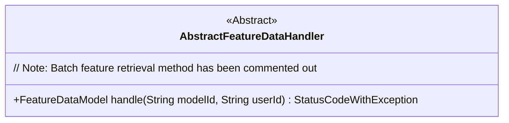
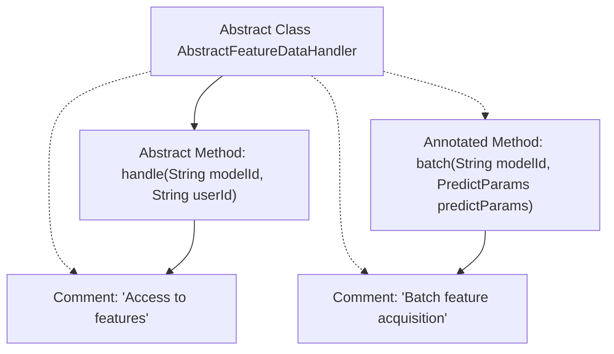

# Basic Information

|      |      |
|------|------|
| Name | AbstractFeatureDataHandler |
| Language | .java |
| Code Path | WeFe/serving/serving-service/src/main/java/com/welab/wefe/serving/service/feature/AbstractFeatureDataHandler.java |
| Package Name | com.welab.wefe.serving.service.feature |
| Dependencies | ['com.welab.wefe.common.exception.StatusCodeWithException', 'com.welab.wefe.serving.sdk.dto.PredictParams', 'com.welab.wefe.serving.sdk.model.FeatureDataModel', 'java.util.Map'] |
| Brief Description | The abstract class `AbstractFeatureDataHandler` defines methods for processing feature data, including single feature retrieval `handle` and batch retrieval `batch` (in commented state), which may throw a `StatusCodeWithException` exception. |

# Description

AbstractFeatureDataHandler is an abstract class that provides abstract methods for processing feature data. It includes an abstract method `handle`, which is used to retrieve feature data based on model ID and user ID, potentially throwing a `StatusCodeWithException`. The class also annotates an unimplemented `batch` method for batch retrieval of feature data, though it is currently commented out. Both methods involve the model ID parameter and return feature data.

# Class Summary

| Name   | Type  | Description |
|-------|------|-------------|
| AbstractFeatureDataHandler | class | The abstract class AbstractFeatureDataHandler defines two methods: handle for retrieving single feature data, and batch for batch feature data retrieval (currently commented). Both methods require a modelId parameter and may throw a StatusCodeWithException. |

## Class AbstractFeatureDataHandler

|      |      |
|------|------|
| Access Modifier | public abstract |
| Type | class |
| Name | AbstractFeatureDataHandler |
| Description | The abstract class AbstractFeatureDataHandler defines two methods: handle for retrieving single feature data, and batch for batch feature data retrieval (currently commented). Both methods require a modelId parameter and may throw a StatusCodeWithException. |

### UML Class Diagram

This class diagram describes an abstract class AbstractFeatureDataHandler, which defines an abstract method handle for processing feature data. The method takes model ID and user ID as parameters, returns a FeatureDataModel object, and may throw a StatusCodeWithException. The diagram clearly marks this as an abstract class (<<Abstract>>) and retains the commented-out batch processing method as a design trace, reflecting the class's core responsibility of handling feature data retrieval logic.

### Internal Method Call Graph

This flowchart illustrates the structure of the abstract class AbstractFeatureDataHandler, which contains one implemented abstract method handle() and two comment annotations. The handle() method includes detailed comments indicating its functionality as "Access to features," while the commented-out batch() method is labeled with the "Batch feature acquisition" capability. Solid lines connect the class and methods, while dashed lines associate the comments, clearly presenting the abstract nature of the class and the logical relationships between methods.

### Field List

| Name  | Type  | Description |
|-------|-------|------|

### Method List

| Name  | Type  | Description |
|-------|-------|------|
| handle | FeatureDataModel | Abstract method `handle`, which takes `modelId` and `userId` as parameters, returns `FeatureDataModel`, and may throw a `StatusCodeWithException`. |

