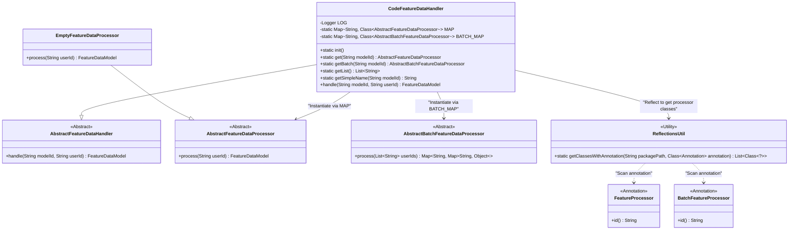

# Basic Information

|      |      |
|------|------|
| Name | CodeFeatureDataHandler |
| Language | .java |
| Code Path | WeFe/serving/serving-service/src/main/java/com/welab/wefe/serving/service/feature/CodeFeatureDataHandler.java |
| Package Name | com.welab.wefe.serving.service.feature |
| Dependencies | ['com.welab.wefe.common.StatusCode', 'com.welab.wefe.common.exception.StatusCodeWithException', 'com.welab.wefe.common.util.ReflectionsUtil', 'com.welab.wefe.common.web.Launcher', 'com.welab.wefe.serving.sdk.model.FeatureDataModel', 'com.welab.wefe.serving.service.feature.code', 'org.slf4j.Logger', 'org.slf4j.LoggerFactory', 'java.util.ArrayList', 'java.util.HashMap', 'java.util.List', 'java.util.Map'] |
| Brief Description | The CodeFeatureDataHandler class inherits from AbstractFeatureDataHandler, initializes processor mappings via reflection, and provides singleton and batch processor retrieval functionalities to handle feature data requests. |

# Description

CodeFeatureDataHandler is a class that inherits from AbstractFeatureDataHandler, designed to manage the initialization and invocation of feature data processors. It contains two static mappings, MAP and BATCH_MAP, which store the class information of feature processors and batch feature processors, respectively. Through reflection mechanism, the static initialization block scans classes with specific annotations and populates the mappings. The get and getBatch methods are provided to retrieve corresponding processor instances based on model IDs, returning an empty processor if none is found. Additionally, it includes methods to obtain processor lists and class names. The handle method processes feature data for individual users, while the commented-out batch method demonstrates the logic for batch processing. The entire class ensures the processor mappings are populated during class loading via static initialization.

# Class Summary

| Name   | Type  | Description |
|-------|------|-------------|
| CodeFeatureDataHandler | class | The CodeFeatureDataHandler class initializes processor mappings via reflection, providing singleton and batch processor retrieval functionalities, with support for exception handling and null processor returns. |

## Class CodeFeatureDataHandler

|      |      |
|------|------|
| Access Modifier | public |
| Type | class |
| Name | CodeFeatureDataHandler |
| Description | The CodeFeatureDataHandler class initializes processor mappings via reflection, providing singleton and batch processor retrieval functionalities, with support for exception handling and null processor returns. |

### UML Class Diagram

This diagram illustrates CodeFeatureDataHandler as the core implementation of feature data processor, which maintains processor class mappings through static MAP and BATCH_MAP, and dynamically loads processor classes annotated with FeatureProcessor/BatchFeatureProcessor via reflection. Processors are categorized into single-record (AbstractFeatureDataProcessor) and batch (AbstractBatchFeatureDataProcessor) types, with instances created on-demand through factory pattern. EmptyFeatureDataProcessor serves as the default processor for fallback capability. The overall architecture adopts strategy pattern to decouple processing logic for different types of feature data.

### Internal Method Call Graph

```mermaid
graph TD
    A["Class CodeFeatureDataHandler"]
    B["Static Property: Logger LOG"]
    C["Static Constant: MAP<String, Class>"]
    D["Static Constant: BATCH_MAP<String, Class>"]
    E["Static Method: init()"]
    F["Static Initialization Block"]
    G["Static Method: get(String modelId)"]
    H["Static Method: getBatch(String modelId)"]
    I["Static Method: getList()"]
    J["Static Method: getSimpleName(String modelId)"]
    K["Instance Method: handle(String modelId, String userId)"]

    A --> B
    A --> C
    A --> D
    A --> E
    A --> F
    A --> G
    A --> H
    A --> I
    A --> J
    A --> K

    F --> F1["Scan FeatureProcessor annotated classes"]
    F --> F2["Populate MAP"]
    F --> F3["Scan BatchFeatureProcessor annotated classes"]
    F --> F4["Populate BATCH_MAP"]

    G --> G1["Retrieve processor class from MAP"]
    G --> G2["Return EmptyFeatureDataProcessor or instance"]
    
    H --> H1["Retrieve processor class from BATCH_MAP"]
    H --> H2["Return null or instance"]

    I --> I1["Iterate MAP to generate processor list"]
    
    J --> J1["Retrieve class name from MAP"]
    J --> J2["Return default or actual class name"]

    K --> K1["Call get() to obtain processor"]
    K --> K2["Handle exceptions or invoke process()"]
```

This code demonstrates the implementation of a feature data processor, with core functionalities including: automatically scanning and registering processor classes with specific annotations through static initialization blocks, providing methods to retrieve corresponding processor instances based on model IDs, and handling the core logic of feature data requests. The class maintains two static mapping tables (MAP and BATCH_MAP) to store different types of processor classes, dynamically loads processors via reflection mechanisms, and implements robust exception handling. The flowchart clearly illustrates the class structure, initialization process, and method call relationships, particularly highlighting the critical steps of populating mapping tables through reflection in the static initialization block.

### Field List

| Name  | Type  | Description |
|-------|-------|------|
| BATCH_MAP = new HashMap<>() | Map<String, Class<? extends AbstractBatchFeatureDataProcessor>> | Define a static constant BATCH_MAP that stores the mapping from strings to subclasses of AbstractBatchFeatureDataProcessor. |
| LOG = LoggerFactory.getLogger(CodeFeatureDataHandler.class) | Logger | Define the static log object LOG for the CodeFeatureDataHandler class. |
| MAP = new HashMap<>() | Map<String, Class<? extends AbstractFeatureDataProcessor>> | Define a static constant MAP, which stores a mapping from strings to AbstractFeatureDataProcessor subclass types. |

### Method List

| Name  | Type  | Description |
|-------|-------|------|
| handle | FeatureDataModel | Java method processes feature data, retrieves the processor based on modelId, throws an exception if not found, and if found, invokes the processor to handle the userId and returns the result. |
| init | void | Initialize the class processor and log the information. |
| getSimpleName | String | Get the processor class name based on the model ID, or return an empty processor class name if none exists. |
| get | AbstractFeatureDataProcessor | Retrieve the corresponding data processor class based on the model ID. Return an empty processor if not found, instantiate and return it if found, or return null in case of exceptions. |
| getBatch | AbstractBatchFeatureDataProcessor | Retrieve the batch data processor based on the model ID. Returns null if not found or if instance creation fails. |
| getList | List<String> | The method returns a list of strings by iterating through the MAP and adding the simple class name of each value to the list, ultimately returning this list. |

