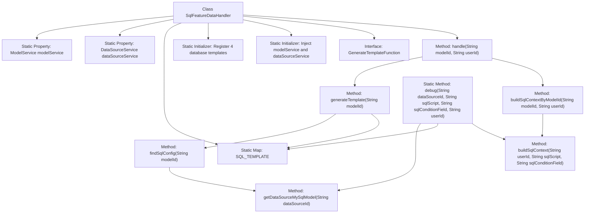

# Basic Information

|      |      |
|------|------|
| Name | SqlFeatureDataHandler |
| Language | .java |
| Code Path | WeFe/serving/serving-service/src/main/java/com/welab/wefe/serving/service/feature/SqlFeatureDataHandler.java |
| Package Name | com.welab.wefe.serving.service.feature |
| Dependencies | ['com.welab.wefe.common.StatusCode', 'com.welab.wefe.common.exception.StatusCodeWithException', 'com.welab.wefe.common.jdbc.base.DatabaseType', 'com.welab.wefe.common.web.Launcher', 'com.welab.wefe.serving.sdk.model.FeatureDataModel', 'com.welab.wefe.serving.service.database.entity.DataSourceMySqlModel', 'com.welab.wefe.serving.service.database.entity.TableModelMySqlModel', 'com.welab.wefe.serving.service.feature.sql.AbstractTemplate', 'com.welab.wefe.serving.service.feature.sql.SqlRuleUtil', 'com.welab.wefe.serving.service.feature.sql.hive.HiveTemplate', 'com.welab.wefe.serving.service.feature.sql.impala.ImpalaTemplate', 'com.welab.wefe.serving.service.feature.sql.mysql.MySqlTemplate', 'com.welab.wefe.serving.service.feature.sql.pg.PgSqlTemplate', 'com.welab.wefe.serving.service.service.DataSourceService', 'com.welab.wefe.serving.service.service.ModelService', 'java.util.HashMap', 'java.util.Map'] |
| Brief Description | The `SqlFeatureDataHandler` class inherits from `AbstractFeatureDataHandler` and uses a static Map to store template generation functions for different database types. It processes model IDs and user IDs to generate SQL queries and returns feature data models. It supports MySQL, PgSQL, Hive, and Impala databases. |

# Description

SqlFeatureDataHandler is a concrete implementation of an abstract feature data processing class, supporting template generation for multiple database types (MySql, PgSql, Hive, Impala) through the static mapping SQL_TEMPLATE. The class contains two static service instances, modelService and dataSourceService, used to retrieve model configurations and data source information. The core method handle generates the corresponding database template based on the model ID, constructs the SQL query statement, and returns the feature data model. The private method generateTemplate selects the appropriate template generator according to the data source type, while buildSqlContext concatenates the SQL statement with user conditions. The debug method allows directly passing parameters to obtain feature data. The entire process includes parameter validation and exception handling.

# Class Summary

| Name   | Type  | Description |
|-------|------|-------------|
| SqlFeatureDataHandler | class | The SqlFeatureDataHandler class inherits from AbstractFeatureDataHandler and supports multiple database template generation through the static mapping SQL_TEMPLATE. It provides the handle method to process feature data queries, including SQL construction, template generation, and data source configuration validation. |

## Class SqlFeatureDataHandler

|      |      |
|------|------|
| Access Modifier | public |
| Type | class |
| Name | SqlFeatureDataHandler |
| Description | The SqlFeatureDataHandler class inherits from AbstractFeatureDataHandler and supports multiple database template generation through the static mapping SQL_TEMPLATE. It provides the handle method to process feature data queries, including SQL construction, template generation, and data source configuration validation. |

### UML Class Diagram

```mermaid
classDiagram
    class AbstractFeatureDataHandler {
        <<abstract>>
    }

    class SqlFeatureDataHandler {
        -ModelService modelService
        -DataSourceService dataSourceService
        -Map~DatabaseType, GenerateTemplateFunction~ SQL_TEMPLATE
        +FeatureDataModel handle(String modelId, String userId)
        -String buildSqlContextByModelId(String modelId, String userId)
        -static String buildSqlContext(String userId, String sqlScript, String sqlConditionField)
        -AbstractTemplate generateTemplate(String modelId)
        -DataSourceMySqlModel findSqlConfig(String modelId)
        -static DataSourceMySqlModel getDataSourceMySqlModel(String dataSourceId)
        +static FeatureDataModel debug(String dataSourceId, String sqlScript, String sqlConditionField, String userId)
    }

    class GenerateTemplateFunction {
        <<Interface>>
        +AbstractTemplate generate(DatabaseType databaseType, String host, int port, String database, String username, String password)
    }

    class AbstractTemplate {
        <<abstract>>
        +Object handle(String sql)
    }

    class MySqlTemplate {
        +MySqlTemplate(DatabaseType databaseType, String host, int port, String database, String username, String password)
    }

    class PgSqlTemplate {
        +PgSqlTemplate(DatabaseType databaseType, String host, int port, String database, String username, String password)
    }

    class HiveTemplate {
        +HiveTemplate(DatabaseType databaseType, String host, int port, String database, String username, String password)
    }

    class ImpalaTemplate {
        +ImpalaTemplate(DatabaseType databaseType, String host, int port, String database, String username, String password)
    }

    class ModelService {
        +TableModelMySqlModel findOne(String modelId)
    }

    class DataSourceService {
        +DataSourceMySqlModel findById(String dataSourceId)
    }

    class TableModelMySqlModel {
        -String sqlScript
        -String sqlConditionField
        -String dataSourceId
        +String getSqlScript()
        +String getSqlConditionField()
        +String getDataSourceId()
    }

    class DataSourceMySqlModel {
        -DatabaseType databaseType
        -String host
        -int port
        -String databaseName
        -String userName
        -String password
        +DatabaseType getDatabaseType()
        +String getHost()
        +int getPort()
        +String getDatabaseName()
        +String getUserName()
        +String getPassword()
    }

    class FeatureDataModel {
        +static FeatureDataModel of(Object data)
    }

    SqlFeatureDataHandler --|> AbstractFeatureDataHandler
    SqlFeatureDataHandler --> GenerateTemplateFunction : uses
    SqlFeatureDataHandler --> ModelService : depends
    SqlFeatureDataHandler --> DataSourceService : depends
    GenerateTemplateFunction ..> AbstractTemplate : creates
    AbstractTemplate <|-- MySqlTemplate
    AbstractTemplate <|-- PgSqlTemplate
    AbstractTemplate <|-- HiveTemplate
    AbstractTemplate <|-- ImpalaTemplate
    SqlFeatureDataHandler --> TableModelMySqlModel : depends
    SqlFeatureDataHandler --> DataSourceMySqlModel : depends
    SqlFeatureDataHandler --> FeatureDataModel : returns
```

This code describes an SQL feature data processing system where SqlFeatureDataHandler inherits from the abstract base class AbstractFeatureDataHandler. Through a static initialization block, it registers four database template generation functions (MySQL/PostgreSQL/Hive/Impala). The main functionality of this class is to obtain data source configurations via model IDs, dynamically generate SQL templates for the corresponding databases, construct query statements, execute them, and ultimately return a feature data model. The system relies on ModelService and DataSourceService to retrieve model configurations and data source information, uses the functional interface GenerateTemplateFunction to achieve multi-database support, and performs SQL security checks via SqlRuleUtil.

### Internal Method Call Graph

This flowchart illustrates the core structure and invocation relationships of the SqlFeatureDataHandler class. The class includes static service injection, initialization of a database template registry, and main data processing flows. The handle() method retrieves database connection templates via generateTemplate(), calls buildSqlContextByModelId() to construct SQL statements, and ultimately returns feature data models. The debug() method provides a direct debugging entry point, reusing the same processing logic but with different parameter sources. All database operations are dynamically dispatched to specific database implementations through SQL_TEMPLATE.

### Field List

| Name  | Type  | Description |
|-------|-------|------|
| SQL_TEMPLATE = new HashMap<>() | Map<DatabaseType, GenerateTemplateFunction> | Define a static Map variable SQL_TEMPLATE with DatabaseType as the key and GenerateTemplateFunction as the value. |
| dataSourceService | DataSourceService | Private static data source service instance. |
| modelService | ModelService | Private static model service instance. |

### Method List

| Name  | Type  | Description |
|-------|-------|------|
| buildSqlContextByModelId | String | The method constructs SQL context based on model ID and user ID: after querying the model configuration, it calls the generic construction method, passing in the user ID, SQL script, and condition fields. A StatusCodeWithException is thrown in case of exceptions. |
| getDataSourceMySqlModel | DataSourceMySqlModel | Static method queries MySQL data source model by ID, throws an invalid parameter exception if it does not exist. |
| generateTemplate | AbstractTemplate | Generate a template based on the model ID, check whether the database type is supported, and if supported, call the corresponding function to generate the template and return it; otherwise, throw an exception. |
| findSqlConfig | DataSourceMySqlModel | Retrieve the MySQL data source configuration for the specified modelId: first obtain the model configuration, then return the corresponding data source model based on the data source ID. Throw StatusCodeWithException in case of exceptions. |
| buildSqlContext | String | This method constructs an SQL query based on the user ID, SQL script, and conditional fields, adds conditional constraints, checks for validity, and finally returns the SQL statement. |
| handle | FeatureDataModel | Method override, generates a template based on the model ID, constructs an SQL query, and returns the processed result. |
| debug | FeatureDataModel | The static method `debug` debugs database queries based on the data source ID, SQL script, condition fields, and user ID. After validating the data source type, it generates an SQL template, executes the query, and returns the result data model. |

