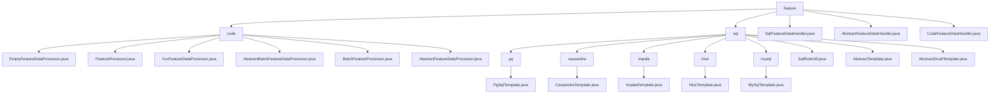

# Basic Information

|      |      |
|------|------|
| Name | feature |
| Language | .java |
| Code Path | WeFe/serving/serving-service/src/main/java/com/welab/wefe/serving/service/feature |
| Package Name | docs.serving.serving-service.src.main.java.com.welab.wefe.serving.service.feature |
| Brief Description | The feature processing framework provides single/batch modes, including abstract classes and annotation registration mechanisms, supporting null handling and extensions. The database module encapsulates multi-database JDBC operations, including connection pool management and SQL validation. SqlFeatureDataHandler implements multi-database queries, while CodeFeatureDataHandler manages processor mappings through reflection. |

# Description

## Overview  
The core responsibility of this module is to establish a unified framework for processing multi-source feature data, incorporating two implementation approaches: code-level processors (annotation-driven) and SQL queries (templated). The interface specification follows a layered design: top-level abstract classes define the contract for the `handle` method, the middle layer registers processors via annotations (`@FeatureProcessor`), and the underlying SQL template classes encapsulate cross-database queries. Key data structures include `FeatureDataModel` (single-result), `Map<String, Object>` (SQL query results), and connection pool configuration maps. External dependencies involve the Druid connection pool, multi-database drivers (e.g., PostgreSQL/Hive), SQL parsers, and Java reflection mechanisms. For example, `EmptyFeatureDataProcessor` implements null-value fallback, while `PgSqlTemplate` handles PostgreSQL protocol differences.  

## Primary Business Scenarios  
The module adopts a layered strategy pattern, supporting hybrid processing from in-memory computation to database queries. A typical workflow involves: `CodeFeatureDataHandler` discovering processors (e.g., `XxxFeatureDataProcessor`) via annotations, or `SqlFeatureDataHandler` dynamically selecting database templates (e.g., `HiveTemplate`) to execute queries. The interaction mode resembles a responsibility chain, where empty processors ensure robustness, and SQL templates enable multi-source aggregation. Functional completeness is reflected in annotation extensibility, SQL security validation (disabling comments), and connection pool reuse. Typical applications include real-time feature extraction (single-item processing) and cross-database batch analysis (nested Map returns), such as `MySqlTemplate` executing aggregate queries and mapping results to feature models. API types encompass processor retrieval (`get`), query execution (`execute`), and condition construction (`buildSqlContext`).

### Package Internal Structure View

This flowchart illustrates the complete hierarchical structure of the feature directory in the WeFe service module, which includes two main subdirectories: code and sql. The code subdirectory contains 7 feature processor-related class files, while the sql subdirectory is further divided into 5 subdirectories (pg/cassandra/impala/hive/mysql) based on database types, each containing corresponding template class files. Additionally, the sql directory includes 3 abstract classes and utility classes. The top-level feature directory directly contains 3 data handler class files.

# File List

| Name   | Type  | Description |
|-------|------|-------------|
| [SqlFeatureDataHandler.java](SqlFeatureDataHandler.md) | file | The `SqlFeatureDataHandler` class inherits from `AbstractFeatureDataHandler` and utilizes a static Map to store template generation functions for different database types. It processes model IDs and user IDs to generate SQL queries and returns feature data models. It supports MySQL, PgSQL, Hive, and Impala databases. |
| [AbstractFeatureDataHandler.java](AbstractFeatureDataHandler.md) | file | The abstract class `AbstractFeatureDataHandler` defines methods for processing feature data, including single feature retrieval `handle` and batch retrieval `batch` (in commented state), which may throw a `StatusCodeWithException` exception. |
| [CodeFeatureDataHandler.java](CodeFeatureDataHandler.md) | file | The CodeFeatureDataHandler class inherits from AbstractFeatureDataHandler, initializes processor mappings via reflection, and provides singleton and batch processor retrieval functionality to handle feature data requests. |
| [sql](sql/_module.md) | package | PgSqlTemplate is used for PostgreSQL connections, overriding the driver and url methods. ImpalaTemplate connects to Impala using the Hive driver and Hive2 protocol. HiveTemplate connects to Hive, overriding the driver and url. MySqlTemplate is specifically designed for MySQL, overriding the driver and url. SqlRuleUtil checks the validity of SQL scripts. AbstractTemplate serves as the base class for database operations. AbstractDruidTemplate manages the Druid connection pool, requiring subclasses to implement the driver and url. |
| [code](code/_module.md) | package | EmptyFeatureDataProcessor returns empty feature data. FeatureProcessor is a runtime annotation containing a mandatory id. XxxFeatureDataProcessor inherits from the abstract class but returns null. AbstractBatchFeatureDataProcessor processes batch feature data and requires subclass implementation. BatchFeatureProcessor is a batch processing runtime annotation containing an id. AbstractFeatureDataProcessor defines a feature processing framework that requires subclass implementation. |

