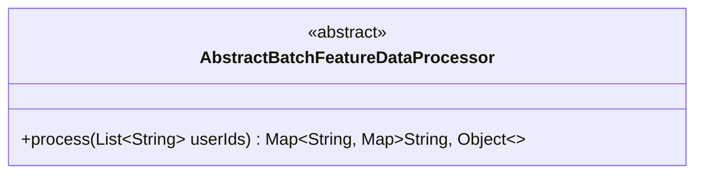
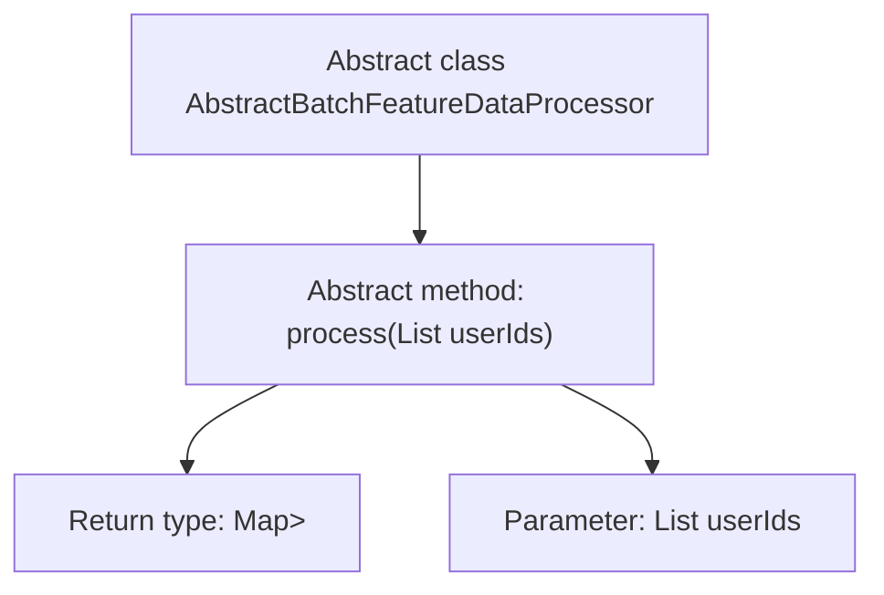

# Basic Information

|      |      |
|------|------|
| Name | AbstractBatchFeatureDataProcessor |
| Language | .java |
| Code Path | WeFe/serving/serving-service/src/main/java/com/welab/wefe/serving/service/feature/code/AbstractBatchFeatureDataProcessor.java |
| Package Name | com.welab.wefe.serving.service.feature.code |
| Dependencies | ['java.util.List', 'java.util.Map'] |
| Brief Description | The abstract class AbstractBatchFeatureDataProcessor defines an abstract method process, which is used to process a list of user IDs and return a feature data map. |

# Description

This is an abstract class named AbstractBatchFeatureDataProcessor, which defines an abstract method for processing batch feature data. The method takes a list of user IDs as parameters and returns a nested map structure, where the outer map has string-type keys and the inner map contains string keys with object values. This abstract method requires subclasses to implement specific logic for processing user feature data and returning the result map.

# Class Summary

| Name   | Type  | Description |
|-------|------|-------------|
| AbstractBatchFeatureDataProcessor | class | The abstract class `AbstractBatchFeatureDataProcessor` defines an abstract method `process` for handling user feature data, which takes a list of user IDs as input and returns a feature data mapping. |

## Class AbstractBatchFeatureDataProcessor

|      |      |
|------|------|
| Access Modifier | public abstract |
| Type | class |
| Name | AbstractBatchFeatureDataProcessor |
| Description | The abstract class `AbstractBatchFeatureDataProcessor` defines an abstract method `process` for handling user feature data, which takes a list of user IDs as input and returns a feature data mapping. |

### UML Class Diagram

This class diagram describes an abstract class named AbstractBatchFeatureDataProcessor, which defines an abstract method `process` for handling batch feature data. The method takes a list of user IDs (of String type) as input and returns a nested map structure where the outer map's keys are Strings and values are another map (with String keys and Object-type values). This abstract class provides a unified processing interface for subsequent concrete implementations, suitable for scenarios requiring batch processing of user feature data.

### Internal Method Call Graph

This flowchart illustrates the structure of the abstract class AbstractBatchFeatureDataProcessor, with its core being an abstract method named process. The method takes a list of user IDs as input and returns a nested map structure. The diagram clearly shows the hierarchical relationship between the class and its method, along with the method's input and output type definitions, reflecting the design intent of this abstract class as a base class for feature data processors. It provides standardized interface specifications for concrete implementation classes.

### Field List

| Name  | Type  | Description |
|-------|-------|------|

### Method List

| Name  | Type  | Description |
|-------|-------|------|
| process | Map<String, Map<String, Object>> | Abstract method `process`, takes a list of user IDs as input and returns a nested map structure where keys are strings and values are map objects. |

