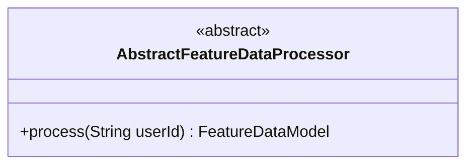
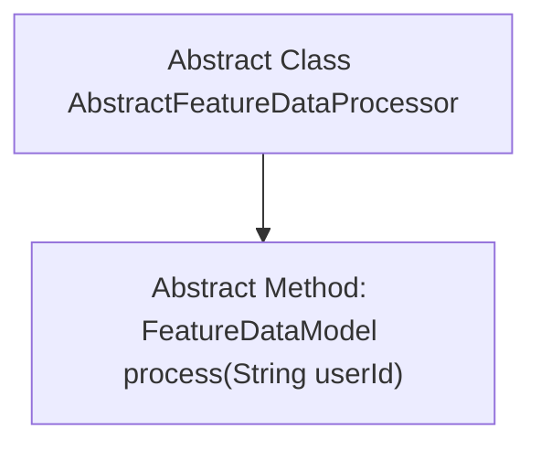

# Basic Information

|      |      |
|------|------|
| Name | AbstractFeatureDataProcessor |
| Language | .java |
| Code Path | WeFe/serving/serving-service/src/main/java/com/welab/wefe/serving/service/feature/code/AbstractFeatureDataProcessor.java |
| Package Name | com.welab.wefe.serving.service.feature.code |
| Dependencies | ['com.welab.wefe.serving.sdk.model.FeatureDataModel', 'java.util.Map'] |
| Brief Description | The abstract class AbstractFeatureDataProcessor defines an abstract method process, which takes a userId parameter and returns a FeatureDataModel object. |

# Description

This is an abstract class named AbstractFeatureDataProcessor, which defines an abstract method for processing feature data. The class includes an abstract method named process that takes a userId parameter of type String and returns a FeatureDataModel object. The method's annotation indicates it is used to obtain the feature processing result, returning a feature data map. This abstract class provides a foundational framework for feature data processing, with concrete implementations to be completed by subclasses.

# Class Summary

| Name   | Type  | Description |
|-------|------|-------------|
| AbstractFeatureDataProcessor | class | The abstract class AbstractFeatureDataProcessor defines an abstract method process, which takes a userId parameter and returns a FeatureDataModel object. |

## Class AbstractFeatureDataProcessor

|      |      |
|------|------|
| Access Modifier | public abstract |
| Type | class |
| Name | AbstractFeatureDataProcessor |
| Description | The abstract class AbstractFeatureDataProcessor defines an abstract method process, which takes a userId parameter and returns a FeatureDataModel object. |

### UML Class Diagram

This code defines an abstract class named `AbstractFeatureDataProcessor`, which contains an abstract method `process`. The method takes a `String` parameter `userId` and returns a `FeatureDataModel` object. The abstract class serves to define a common interface for processing feature data, with specific implementations to be completed by subclasses. The class diagram clearly illustrates the structure of this abstract class, providing a foundational template for subsequent concrete processor implementations.

### Internal Method Call Graph

This code defines an abstract class named `AbstractFeatureDataProcessor`, which contains an abstract method `process`. The method takes a `userId` string parameter and returns a `FeatureDataModel` object. The flowchart clearly illustrates the hierarchical relationship between the class and its method, with the abstract class as the parent node and the abstract method as its child node. This design enforces subclasses to implement specific data processing logic, reflecting the abstraction characteristics of object-oriented programming.

### Field List

| Name  | Type  | Description |
|-------|-------|------|

### Method List

| Name  | Type  | Description |
|-------|-------|------|
| process | FeatureDataModel | Abstract method process, which takes the userId parameter and returns data of type FeatureDataModel. |

