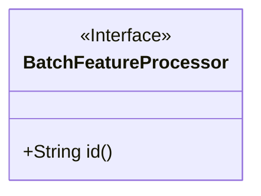
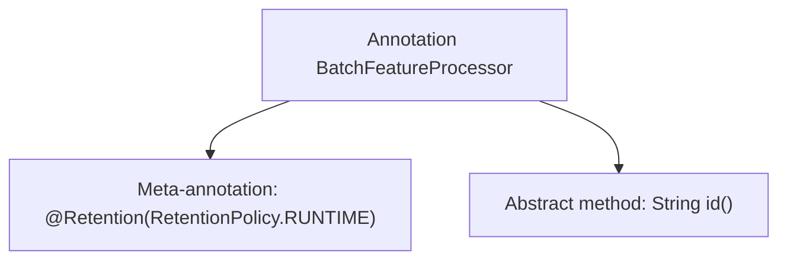

# Basic Information

|      |      |
|------|------|
| Name | BatchFeatureProcessor |
| Language | .java |
| Code Path | WeFe/serving/serving-service/src/main/java/com/welab/wefe/serving/service/feature/code/BatchFeatureProcessor.java |
| Package Name | com.welab.wefe.serving.service.feature.code |
| Dependencies | ['java.lang.annotation.Retention', 'java.lang.annotation.RetentionPolicy'] |
| Brief Description | The Java annotation `@BatchFeatureProcessor`, retained at runtime, requires a unique identifier `id` to be specified. |

# Description

The content defines a Java annotation named `BatchFeatureProcessor`, specified with `@Retention(RetentionPolicy.RUNTIME)` to indicate that the annotation is retained at runtime. The annotation includes a mandatory string-type attribute named `id`. This annotation is applicable to batch processing scenarios that require runtime handling.

# Class Summary

| Name   | Type  | Description |
|-------|------|-------------|
| BatchFeatureProcessor | annotation | The Java annotation `@BatchFeatureProcessor`, retained until runtime, requires a unique identifier `id` to be specified. |

## Class BatchFeatureProcessor

|      |      |
|------|------|
| Access Modifier | @Retention(RetentionPolicy.RUNTIME);public |
| Type | annotation |
| Name | BatchFeatureProcessor |
| Description | The Java annotation `@BatchFeatureProcessor`, retained until runtime, requires a unique identifier `id` to be specified. |

### UML Class Diagram

This code defines a runtime annotation interface named `BatchFeatureProcessor`, which contains a string-type method called `id`. The annotation is marked with the `@Retention(RetentionPolicy.RUNTIME)` meta-annotation, indicating that it can be read at runtime via reflection. In the class diagram, the `<<Interface>>` notation signifies that this is an annotation interface, and the public method `id()` represents the configurable attribute of the annotation. This annotation is typically used to mark batch feature processors, with the ID attribute serving to identify or configure processor instances.

### Internal Method Call Graph

This flowchart illustrates the structure of the `BatchFeatureProcessor` annotation, which consists of two main components: the `@Retention` meta-annotation specifying runtime retention, and an abstract method definition named `id()`. This annotation is typically used to mark batch feature processors, with the `id()` method providing a unique identifier. The overall structure is concise and clear, adhering to the basic syntax conventions of Java annotations.

### Field List

| Name  | Type  | Description |
|-------|-------|------|
| id | String | The method id() returns a string-type identifier. |

### Method List

| Name  | Type  | Description |
|-------|-------|------|

